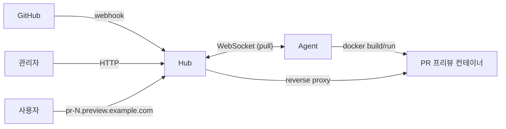

# Preview

GitHub PR을 열면 자동으로 프리뷰 환경을 띄우고, PR이 닫히면 정리하는 Go 기반 셀프호스팅 서비스.

## 아키텍처

두 컴포넌트로 구성된다. Agent가 Hub에 outbound로 연결하므로 Agent 머신에는 inbound 포트가 필요 없다.



- **Hub (Control Plane)**: GitHub 웹훅 수신, 관리자 API/UI, Agent WebSocket 서버, Job 큐, 리버스 프록시.
- **Agent (Data Plane)**: Hub에 outbound WebSocket 연결, pull 방식으로 Job 수신, git clone / docker build / docker run, 포트 동적 할당, PR 종료 시 정리.

## 설계 결정 요약

- **Pull 방식 디스패치** — Agent가 capacity 있을 때만 일을 가져가 자연스러운 백프레셔.
- **Agent -> Hub outbound 연결** — NAT/방화벽 뒤 머신도 Agent로 쓸 수 있다.
- **토큰 기반 Agent 인증** — GitHub Actions self-hosted runner 방식. bcrypt 해시만 DB에 저장.
- **SQLite로 시작, Postgres로 이식 가능** — `internal/store` 인터페이스가 경계면.
- **웹 프레임워크 없음** — `net/http` 1.22+의 `ServeMux`만 사용.
- **Hub와 Agent는 분리된 두 바이너리** — 배포 타깃·의존성이 다르다.

## 요구사항

- Go 1.22 이상
- (선택) `golangci-lint` — lint 실행에 필요:
  ```
  go install github.com/golangci/golangci-lint/cmd/golangci-lint@latest
  ```
- (선택) `sqlc` — sqlc generate 재실행 시:
  ```
  go install github.com/sqlc-dev/sqlc/cmd/sqlc@latest
  ```
- (선택) `make` — 직접 `go run` 명령으로 대체 가능

## 로컬 실행

Phase 1 기준 검증 플로우. 기본 Hub 포트는 `:3000`.

```
# 1) 마이그레이션 적용
go run ./cmd/hub migrate up

# 2) Hub 기동 (:3000)
go run ./cmd/hub
# 또는
make run-hub

# 3) 다른 터미널에서 health 확인
curl -s http://localhost:3000/health
# 출력: {"status":"ok"}

# 4) Agent 등록 및 토큰 발급
curl -s -X POST http://localhost:3000/admin/agents \
  -H 'Content-Type: application/json' \
  -d '{"name":"agent-1","labels":{"env":"local"}}'
# 응답 body 의 token 을 보관 (재조회 불가).

# 5) Agent 기동
go run ./cmd/agent start \
  --hub-url ws://localhost:3000/agent/ws \
  --token agt_XXXXXXX \
  --label env=local

# 6) 상태 확인
curl -s http://localhost:3000/admin/agents
# 또는
go run ./cmd/hub agents list

# 빌드 / 검사
go build ./...
make fmt
make vet
make lint
make test
```

## Phase 1 검증

| 항목 | 명령 |
|---|---|
| 마이그레이션 up | `go run ./cmd/hub migrate up` |
| Agent 등록 | `POST /admin/agents` |
| Agent 조회 | `GET /admin/agents` 또는 `go run ./cmd/hub agents list` |
| WebSocket 연결 | `go run ./cmd/agent start ...` |
| Agent kill 후 offline 전환 | SIGTERM/SIGKILL 후 10초 이내 상태가 `offline` |
| Hub graceful shutdown | SIGINT 후 5초 이내 close frame(1001) 송신 |

## Phase 2 검증

Hub 포트는 기본 `:3000`. GitHub 웹훅 시뮬레이션에 `openssl` 또는 미리 계산한 HMAC 을 사용한다.

### S1 — Webhook → DB

```bash
export PORT=3000
export SECRET=testsecret

# Hub 기동
GITHUB_WEBHOOK_SECRET=$SECRET go run ./cmd/hub &

# 웹훅 HMAC 계산 후 전송 (opened)
PAYLOAD='{"action":"opened","pull_request":{"number":1,"head":{"sha":"abc","ref":"feat"},"labels":[]},"repository":{"full_name":"owner/repo"}}'
SIG=$(printf '%s' "$PAYLOAD" | openssl dgst -sha256 -hmac "$SECRET" -hex | sed 's/^.* //')
curl -s -X POST http://localhost:$PORT/webhooks/github \
  -H "Content-Type: application/json" \
  -H "X-GitHub-Event: pull_request" \
  -H "X-Hub-Signature-256: sha256=$SIG" \
  -d "$PAYLOAD"
# 응답: {"preview_id":"...","status":"queued"}

# DB 확인
go run ./cmd/hub previews list | jq .
```

### S2 — Dispatcher + Agent Job 실행

```bash
# Agent 등록 + 토큰 발급
TOKEN=$(curl -s -X POST http://localhost:$PORT/admin/agents \
  -H 'Content-Type: application/json' \
  -d '{"name":"local-agent","labels":{"env":"local"}}' | jq -r .token)

# Agent 기동 (Docker 필요)
go run ./cmd/agent start \
  --hub-url ws://localhost:$PORT/agent/ws \
  --token "$TOKEN" \
  --label env=local \
  --repo-url https://github.com/owner/repo.git \
  --advertise-host 127.0.0.1

# 상태 확인: building → running
go run ./cmd/hub previews list | jq '.[].status'
```

### S3 — Reverse Proxy + Teardown

```bash
# running 상태 preview 에 프록시 접근
PREVIEW_ID=$(go run ./cmd/hub previews list | jq -r '.[0].id')
curl --resolve "pr-1.preview.localhost:$PORT:127.0.0.1" \
  http://pr-1.preview.localhost:$PORT/

# PR closed → JOB_TEARDOWN 전송 + Agent 컨테이너 정리
PAYLOAD_CLOSE='{"action":"closed","pull_request":{"number":1,"head":{"sha":"abc","ref":"feat"},"labels":[]},"repository":{"full_name":"owner/repo"}}'
SIG_CLOSE=$(printf '%s' "$PAYLOAD_CLOSE" | openssl dgst -sha256 -hmac "$SECRET" -hex | sed 's/^.* //')
curl -s -X POST http://localhost:$PORT/webhooks/github \
  -H "Content-Type: application/json" \
  -H "X-GitHub-Event: pull_request" \
  -H "X-Hub-Signature-256: sha256=$SIG_CLOSE" \
  -d "$PAYLOAD_CLOSE"
# 응답: {"preview_id":"...","status":"teardown"}

# Reconciliation 단축 테스트
go run ./cmd/hub previews seed-stale --pr=99
GITHUB_WEBHOOK_SECRET=$SECRET go run ./cmd/hub \
  --reconcile-interval=2s --stale-assigned-after=3s &
sleep 5
go run ./cmd/hub previews list | jq '.[] | select(.pr_number==99) | .status'
# 출력: "queued"
```

## 왜 SQLite로 시작하는가

- 단일 파일, 별도 서버 프로세스 없음 → 셀프호스팅 도입 장벽이 낮다.
- `modernc.org/sqlite` 덕분에 **CGO 없이 순수 Go**로 빌드되어 크로스컴파일이 쉽다.
- 단일 노드 Hub 운영에서 쓰기 경합이 심하지 않다.
- 이식성 원칙을 코드 수준에서 강제하므로 미래 전환 비용이 크지 않다.

## 언제 Postgres로 옮길 것인가

다음 중 하나라도 해당되면 이전을 검토한다.

- Hub를 수평 확장해 여러 인스턴스가 동일 DB를 공유해야 할 때 (SQLite는 단일 라이터).
- 동시 쓰기 경합이 커져 `database is locked` 오류가 관측될 때.
- 장기 보관·분석 쿼리가 무거워져 백업/리플리카/읽기 전용 노드가 필요할 때.
- 운영팀이 이미 표준화된 Postgres 운영 스택을 가지고 있어 단일 파일 운영이 오히려 부담이 될 때.

이식 경로는 다음과 같다.
1. `DATABASE_URL`을 `postgres://...`로 전환.
2. `internal/db/postgres/` 아래 sqlc를 새로 생성.
3. `internal/store` 인터페이스를 만족하는 Postgres 구현체 추가.
4. 비즈니스 로직(`internal/hub`, `internal/agent`)은 인터페이스에만 의존하므로 **변경 불필요**.
5. 금지어(`AUTOINCREMENT`, `INSERT OR REPLACE`, `jsonb` 전용 연산자 등)를 쓰지 않았는지 스키마를 재검증.

## 프로젝트 구조

```
cmd/hub, cmd/agent            진입점 (얇게)
internal/hub                  Hub HTTP/WS 핸들러, 서비스, 서버
internal/agent                Agent WS 클라이언트, 재연결 백오프
internal/store                Repository 인터페이스 (이식성 경계면)
internal/db/sqlite            sqlc 생성 코드 + AgentStore 구현체 + 마이그레이션 임베드
internal/protocol             Hub<->Agent 메시지 타입
db/migrations, db/queries, db/schema   SQL 자산
docs/specs, docs/reports      Phase 기획서와 검증 보고서
```

## 라이선스

TBD.
