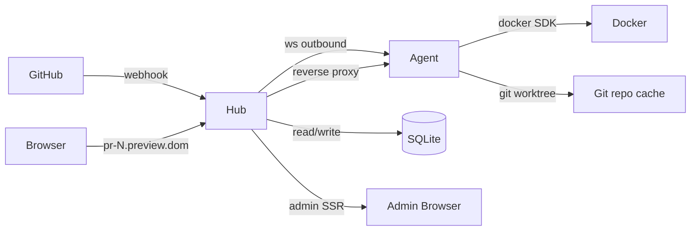

# Preview — Self-hosted Vercel-style PR previews

> GitHub PR opens → preview environment lives → PR closes → cleaned up. Self-hosted in Go.

 <!-- demo placeholder -->

## Why we built this

Vercel and Netlify make per-PR preview environments effortless, but they are
SaaS — you trade your build infrastructure, your auth surface, and a recurring
bill for the convenience. For projects that already own a few machines (a
home lab, an idle workstation, a corporate VM), the same idea is reachable
with a much smaller footprint: a control-plane HTTP service, a workhorse that
runs Docker, a thin protocol between them, and a webhook from GitHub. We
wanted to see how close we could get with a single Go binary on each side and
nothing else.

The result is **Preview** — a two-binary system (`hub` and `agent`) that
takes a `pull_request` webhook, builds the PR's `Dockerfile` on whichever
agent matches the requested labels, exposes the running container at
`pr-<n>.preview.<domain>`, and tears it down when the PR closes. The hub
also serves a server-rendered admin dashboard so an operator can see what is
running, force a rebuild, or delete an agent — all without a JavaScript
framework.

## Architecture



Two binaries, one protocol. The agent dials *out* to the hub, so an agent
machine never needs an inbound port — handy for laptops behind NAT or office
machines behind a corporate firewall. The hub keeps the source of truth in
SQLite, dispatches jobs over the WebSocket when an agent reports `READY`, and
proxies user traffic to the agent's host:port once the container is running.

## Design Decisions FAQ

### 1. Why Go?

A Go binary is one self-contained artifact. The same `go build` produces a
hub for Linux, macOS, and Windows; the same agent runs anywhere Docker runs.
The standard library covers HTTP, WebSocket-adjacent primitives, JSON,
templating, signal handling, and SQL — we avoid pulling in a framework
specifically because we want to keep the dependency surface small enough to
read end to end. Go's `slog` and `context` give us structured logs and
cancellation without ceremony.

### 2. Why pull-based dispatch?

A push model (hub picks an agent, sends a job) needs a queue and a healthcheck
loop to know which agent has spare capacity. The pull model — agent sends
`READY` when it has a slot — turns the agent's local capacity into the
backpressure signal automatically. If an agent is busy, it does not say
`READY`; the hub does not have to know how busy it is. This is the same
pattern GitHub Actions self-hosted runners use, and it matches the rest of
our "agent owns its state" decisions.

### 3. Why agent → hub direction?

If the hub had to dial agents, every agent host would need an open inbound
port, a public DNS name, or a reverse tunnel — all painful for the home-lab
audience. By making the agent dial out over WebSocket, we accept exactly the
same firewall posture as a browser opening Slack: outbound TCP is universally
allowed. The hub is the only host that needs an inbound port, and most
production deployments already terminate TLS in front of it.

### 4. Why SQLite (with portability constraints)?

For a single-hub MVP, SQLite is zero-configuration: one file, no daemon, easy
to back up (`cp hub.db hub.db.bak`). We treat it as the storage layer behind
a `store.PreviewStore` / `store.AgentStore` interface, and the SQL we write
deliberately avoids `AUTOINCREMENT`, `INSERT OR REPLACE`, JSON operators, and
other SQLite-isms that would not port cleanly to Postgres. When (not if) we
need horizontal scale-out, the migration target is already implied by the
interface and the SQL conventions.

### 5. Why html/template + no JS framework?

The admin dashboard is four pages — dashboard, agents list, previews list,
preview detail — connected by form POSTs and 303 redirects. None of that
needs a JS framework. `html/template` ships with Go, gives contextual
auto-escape (HTML / URL / JS / CSS), and lets us embed the templates in the
binary with `embed.FS`. The whole UI is a single CSS link to Pico.css and
semantic HTML. If we ever need richer interactivity, the bar to add it is
high — and the cost of *not* having a build step is paid every day.

### 6. Why git worktree?

When the same agent serves several PRs of the same repo, cloning `N` times
costs `N x repo size`. `git worktree add` shares the object database and
gives each preview its own working tree for the cost of a checkout. The
agent keeps a single bare-ish clone in `~/.hub-agent/repos/<slug>/.git` and
spawns one worktree per `preview_id`. Cleaning up a preview is `git worktree
remove`, which is fast and atomic.

### 7. Why Docker SDK over os/exec?

`exec.Command("docker", ...)` returns lines of human-formatted text; the
Docker SDK returns typed structs and JSON streams we can decode. That makes
unit-testing the agent realistic — we expose a narrow `DockerClient`
interface (`ImageBuild`, `ContainerCreate`, `ContainerStart`, etc.), let the
SDK adapter live in `cmd/agent`, and inject a fake in tests. The SDK is also
better at surfacing build errors: `jsonmessage.DisplayJSONMessagesStream`
gives us the actual error code, not just a non-zero exit.

### 8. Why label-based routing?

A typical home setup mixes hosts: a quiet always-on Raspberry Pi (good for
small services), a beefy desktop (good for builds with native deps), maybe a
laptop that comes and goes. Label-based routing turns that physical reality
into a config: each agent advertises labels (`env=home,arch=arm64`), each
preview can require labels (parsed from the PR's GitHub labels), and the
hub's dispatcher only assigns previews whose label set is a subset of an
agent's. The match is computed in Go, not in SQL — keeping that policy
portable was one of the reasons we kept the SQL boring.

## Local Run

Prerequisites: Go 1.22+, Docker, `make`.

```bash
# 1. Clone, copy env template, set required values.
cp .env.example .env
# edit .env: set GITHUB_WEBHOOK_SECRET=test-secret and ADMIN_PASSWORD=test-pass

# 2. Run migrations.
go run ./cmd/hub migrate up

# 3. Start the hub. The admin dashboard will be at http://localhost:3000/admin.
ADMIN_PASSWORD=test-pass GITHUB_WEBHOOK_SECRET=test-secret go run ./cmd/hub

# 4. In another terminal, register an agent via the admin UI or the JSON API:
curl -u admin:test-pass -H 'Content-Type: application/json' \
     -X POST http://localhost:3000/admin/agents \
     -d '{"name":"home","labels":{"env":"home"}}'
# Copy the token field of the response.

# 5. Start an agent. PREVIEW_REPO_URL is the git URL the agent will clone.
go run ./cmd/agent start \
  --hub-url=ws://localhost:3000/agent/ws \
  --token=<TOKEN_FROM_STEP_4> \
  --repo-url=<YOUR_REPO_URL> \
  --label env=home

# 6. Trigger the webhook flow (tests/scripts/ has a fixture sender), or open
#    a real PR in the configured repo. Watch /admin/previews for the new row.
```

## Production Deployment

- **TLS termination via fronting proxy.** Place caddy or nginx in front of
  the hub. The hub itself listens on plain HTTP and trusts the proxy to
  forward client headers correctly.
- **`ADMIN_PASSWORD` is mandatory.** When unset, the hub opens `/admin/*`
  unauthenticated and emits a `WARN admin_unauthenticated` log on startup.
  This is a development convenience, not a production posture. Set it.
- **Backups.** SQLite is one file; `cp hub.db hub.db.bak` (or
  `sqlite3 hub.db ".backup hub.db.bak"` for a hot copy) is the whole story.
- **Reverse proxy host matching.** Set `PREVIEW_BASE_DOMAIN` to your
  production domain (e.g. `preview.example.com`) and add a wildcard DNS
  record `*.preview.example.com` pointing at the hub.
- **CSRF.** The admin dashboard uses HTTP Basic Auth and form POST. Behind
  a public reverse proxy you should add a CSRF gate (caddy plugin, oauth2-
  proxy, or your SSO of choice) before trusting authenticated browser
  sessions.
- **Token rotation.** Rotation is on the roadmap; for now, deleting and
  re-creating an agent generates a fresh token. The old token is then
  unusable.

## Roadmap

- LOG message wiring (Docker logs streaming → admin UI tail)
- Multi-repo routing (one hub fronting multiple git repos)
- Build cache + image registry push
- Old done/failed cleanup policy (scheduled pruning of terminal previews)
- Token rotation, audit log
- Postgres backend (the `store` interface is already shaped for it)
- Container hardening (read-only fs, non-root)
- WebSocket reverse proxy upgrade
- Scheduled cleanup of old preview rows

## Tech Stack

- **Go 1.22+** — `net/http` ServeMux with method routes, `slog`,
  `signal.NotifyContext`, `embed.FS`.
- **modernc.org/sqlite** — CGO-free SQLite driver; the binary builds and
  runs the same on every platform without a C toolchain.
- **coder/websocket** — minimal, RFC-compliant WebSocket library.
- **html/template** — standard library templating with contextual escape.
- **github.com/docker/docker/client** — Docker Engine SDK, isolated to
  `cmd/agent` only.
- **golang-migrate/migrate, sqlc** — schema migrations and typed query
  generation.
