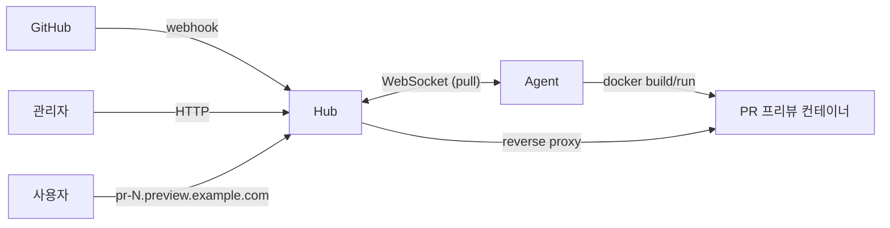

# Preview

GitHub PR을 열면 자동으로 프리뷰 환경을 띄우고, PR이 닫히면 정리하는 Go 기반 셀프호스팅 서비스.

## 아키텍처

두 컴포넌트로 구성된다. Agent가 Hub에 outbound로 연결하므로 Agent 머신에는 inbound 포트가 필요 없다.



- **Hub (Control Plane)**: GitHub 웹훅 수신, 관리자 API/UI, Agent WebSocket 서버, Job 큐, 리버스 프록시.
- **Agent (Data Plane)**: Hub에 outbound WebSocket 연결, pull 방식으로 Job 수신, git clone / docker build / docker run, 포트 동적 할당, PR 종료 시 정리.

## 설계 결정 요약

- **Pull 방식 디스패치** — Agent가 capacity 있을 때만 일을 가져가 자연스러운 백프레셔.
- **Agent -> Hub outbound 연결** — NAT/방화벽 뒤 머신도 Agent로 쓸 수 있다.
- **토큰 기반 Agent 인증** — GitHub Actions self-hosted runner 방식.
- **SQLite로 시작, Postgres로 이식 가능** — `internal/store` 인터페이스가 경계면.
- **웹 프레임워크 없음** — `net/http` 1.22+의 `ServeMux`만 사용.
- **Hub와 Agent는 분리된 두 바이너리** — 배포 타깃·의존성이 다르다.

## 요구사항

- Go 1.22 이상
- (선택) `golangci-lint` — lint 실행에 필요:
  ```
  go install github.com/golangci/golangci-lint/cmd/golangci-lint@latest
  ```
- (선택) `make` — 직접 `go run` 명령으로 대체 가능 (아래 참조)

## 로컬 실행

Phase 0 범위에서 동작하는 명령은 다음과 같다. `make`가 없어도 `go` 명령만으로 실행할 수 있다.

```
# Hub 기동 (:8080)
go run ./cmd/hub
# 또는
make run-hub

# 다른 터미널에서 확인
curl -s http://localhost:8080/
# 출력: Hello Hub

# Agent 기동 (Phase 0: 한 줄 로그 후 종료)
go run ./cmd/agent
# 또는
make run-agent

# 빌드
go build ./...
# 또는
make build

# 포맷 / 정적 검사
make fmt
make vet
make lint   # golangci-lint 설치 필요
```

`make sqlc`, `make migrate-up`, `make migrate-down`은 타겟만 존재하며 실제 실행은 Phase 1부터 가능하다 (쿼리·마이그레이션 파일이 아직 없음).

## 왜 SQLite로 시작하는가

- 단일 파일, 별도 서버 프로세스 없음 → 셀프호스팅 도입 장벽이 낮다.
- `modernc.org/sqlite` 덕분에 **CGO 없이 순수 Go**로 빌드되어 크로스컴파일이 쉽다.
- 단일 노드 Hub 운영에서 쓰기 경합이 심하지 않다 (웹훅 수신 + 관리자 조작 빈도).
- 이식성 원칙을 코드 수준에서 강제하므로 (아래 참조) 미래 전환 비용이 크지 않다.

## 언제 Postgres로 옮길 것인가

다음 중 하나라도 해당되면 이전을 검토한다.

- Hub를 수평 확장해 여러 인스턴스가 동일 DB를 공유해야 할 때 (SQLite는 단일 라이터).
- 동시 쓰기 경합이 커져 `database is locked` 오류가 관측될 때.
- 장기 보관·분석 쿼리가 무거워져 백업/리플리카/읽기 전용 노드가 필요할 때.
- 운영팀이 이미 표준화된 Postgres 운영 스택을 가지고 있어 단일 파일 운영이 오히려 부담이 될 때.

이식 경로는 다음과 같다.
1. `DATABASE_URL`을 `postgres://...`로 전환.
2. `internal/db/postgres/` 아래 sqlc를 새로 생성.
3. `internal/store` 인터페이스를 만족하는 Postgres 구현체 추가.
4. 비즈니스 로직(`internal/hub`, `internal/agent`)은 인터페이스에만 의존하므로 **변경 불필요**.
5. 금지어(`AUTOINCREMENT`, `INSERT OR REPLACE`, `jsonb` 전용 연산자 등)를 쓰지 않았는지 스키마를 재검증.

## 프로젝트 구조

```
cmd/hub, cmd/agent        진입점 (얇게)
internal/hub, internal/agent  도메인 로직 (Phase 1+)
internal/store            Repository 인터페이스 (이식성 경계면)
internal/db/sqlite        sqlc 생성 코드 + 구현체 (Phase 1+)
internal/protocol         Hub<->Agent 메시지 타입 (Phase 2+)
db/migrations, db/queries, db/schema  SQL 자산 (Phase 1+)
docs/specs, docs/reports  Phase 기획서와 검증 보고서
```

## 라이선스

TBD.
