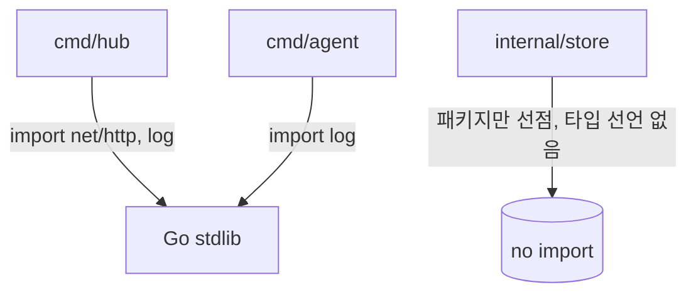

# Phase 0: 스캐폴딩 (Scaffolding)

작성일: 2026-04-24
작성자: planner
상태: APPROVED

## 1. Phase 개요

Preview 프로젝트의 Go 모노레포 골격을 세우고, 이후 Phase에서 기능(웹훅 수신, DB 스키마, WebSocket 핸들러, Docker 제어 등)을 "붙이기만 하면 되는" 상태로 만드는 것이 목표다. 이 Phase는 **동작하는 최소 진입점**(Hub HTTP "Hello", Agent 로그 출력)과 **의사결정이 굳어진 프로젝트 레이아웃**(cmd/internal/db/docs, `internal/store` 패키지 자리만 선점, `sqlc.yaml`, Makefile, `.golangci.yml`, README, `.env.example`)을 제공한다. 이 Phase 종료 시 `go build ./...`가 성공하고, `go vet ./...`가 경고 0으로 통과하며, `go run ./cmd/hub`로 로컬 8080 포트에서 "Hello Hub"를 받아볼 수 있고, `go run ./cmd/agent`는 "Hello Agent"를 로그로 남긴 뒤 종료한다.

### 1-1. Evaluator 실행 환경 가정

이 기획서의 모든 검증 명령은 다음 환경을 전제로 한다. 다른 환경에서 재현할 땐 동등 명령으로 치환한다.

- Shell: **bash on Linux/macOS/WSL/Git Bash** (POSIX sh 호환). PowerShell/cmd.exe 네이티브는 대상 아님.
- Go 툴체인: **Go 1.22 이상** (`go version`으로 확인).
- Lint: **`golangci-lint` 로컬 설치 필요**. 미설치 시 NF-Lint-1은 실패로 간주. 설치 명령은 README "요구사항" 섹션에 박아둔다 (예: `go install github.com/golangci/golangci-lint/cmd/golangci-lint@latest`).
- 검색 도구: `grep`(GNU 호환), `find`, `awk`, `wc`가 PATH에 존재.

## 2. 범위와 비범위

### 범위 (In Scope)

- Go 모듈 초기화: `go mod init github.com/lnyarl/preview` (Go 1.22+ 타깃)
- 디렉토리 트리 생성: `/cmd/hub`, `/cmd/agent`, `/internal/hub`, `/internal/agent`, `/internal/store`, `/internal/db/sqlite`, `/internal/protocol`, `/db/migrations`, `/db/queries`, `/db/schema`, `/docs/specs`, `/docs/reports`
- **최소** 진입점 2개:
  - `cmd/hub/main.go`: `net/http`로 `/` 경로에 평문 "Hello Hub"를 응답 (기본 포트 8080, 하드코딩 허용 — 환경변수 분기는 Phase 1)
  - `cmd/agent/main.go`: 표준 로그 패키지(`log`)로 "Hello Agent"를 출력하고 exit code 0 반환
- `sqlc.yaml` 초기 설정 파일: engine=sqlite, schema=`db/schema`, queries=`db/queries`, out=`internal/db/sqlite` (지금 단계에서 `make sqlc`를 돌리지는 않음)
- `.env.example`: 향후 사용 예정 변수 나열만 (`DATABASE_URL`, `HUB_ADDR`, `GITHUB_WEBHOOK_SECRET`, `AGENT_TOKEN`, `PREVIEW_BASE_DOMAIN`). 각 변수에 한 줄 주석.
- `Makefile` 타겟: `run-hub`, `run-agent`, `sqlc`, `migrate-up`, `migrate-down`, `build`, `fmt`, `vet`, `lint`
- `.golangci.yml`: 최소 린터 셋 (`govet`, `errcheck`, `staticcheck`, `gofmt`, `ineffassign`, `unused`)
- `README.md` 초안: 한 줄 소개 / Mermaid 아키텍처 다이어그램 / 설계 결정 요약(Pull, outbound WS, SQLite) / 로컬 실행 방법 / "요구사항(Go 1.22+, golangci-lint 설치 명령)" / "왜 SQLite로 시작하는가" / "언제 Postgres로 옮길 것인가" 섹션 (후자는 정확한 헤더 문자열 `## 언제 Postgres로 옮길 것인가`)
- `internal/store/store.go`: **타입 선언 없이** `package store` + 파일 상단 docstring 주석만. 주석은 "이 패키지는 이식성 경계면이며, Phase 1에서 `AgentStore`·`PreviewStore` 인터페이스가 **메서드와 함께** 처음 도입된다"는 취지를 명시.

### 비범위 (Out of Scope — 이번 Phase에 하지 않음)

- 실제 GitHub 웹훅 수신/검증 로직 → Phase 1
- WebSocket 핸들러, Agent 등록, 토큰 발급 → Phase 2 이후
- Docker 제어, 리버스 프록시, 컨테이너 라이프사이클 → Phase 3 이후
- 관리자 웹 UI, Playwright e2e → Phase 3 이후 (UI가 생긴 다음)
- 실제 DB 마이그레이션 SQL 파일 내용 (디렉토리만 존재, `.gitkeep` 또는 `README.md`만)
- `sqlc generate` 실제 실행 (쿼리 파일이 아직 없으므로 Phase 1에서 스키마 생긴 뒤). F-8 검증도 "Makefile에 `sqlc` 타겟 라인이 존재"만 확인하며, **`make sqlc`를 evaluator가 실제로 호출하지 않는다** (§5-6 각주 참조).
- **`AgentStore`·`PreviewStore` 인터페이스 타입 선언 자체** → Phase 1에서 메서드와 함께 처음 도입. Phase 0의 `internal/store/store.go`에는 타입 선언이 없다.
- 의존성 추가: `coder/websocket`, `docker/docker`, `modernc.org/sqlite`, `golang-migrate/migrate`, `sqlc` — **go.mod에 넣지 않는다**. 표준 라이브러리만 사용
- `/docs/adr` 디렉토리 (필요해지는 Phase에서 추가)
- `docker-compose.yml`, Dockerfile (Phase 3 이후)
- 환경변수 기반 설정 로딩 코드 (Phase 1)

## 3. 설계 결정 및 근거

### 결정 1: Hub와 Agent를 **분리된 바이너리 2개**로 만든다 (단일 바이너리 아님)

- **결정**: `cmd/hub`와 `cmd/agent` 각각 독립 `main.go`. 공유 코드는 `internal/protocol`, `internal/store` 등에 둔다.
- **근거**:
  1. 배포 타깃이 완전히 다르다 — Hub는 공개 네트워크의 서버, Agent는 NAT 뒤 개인 머신. 의존성도 다르다(Agent만 Docker SDK).
  2. CLAUDE.md 아키텍처 문서가 명시적으로 두 컴포넌트를 분리 서술.
  3. Go 관용 모노레포 패턴(`/cmd/<bin>`)과 일치.
- **버려진 대안**: **단일 바이너리 + 서브커맨드** (`preview hub`, `preview agent`). 이 방식은 공유 초기화 코드가 많을 때 유리하나, Hub는 Docker SDK가 전혀 필요 없는데 같은 바이너리에 들어가면 Agent용 의존성까지 Hub 측 빌드에 끌려들어와 바이너리 크기와 보안 표면이 커진다. 또한 Hub/Agent의 배포 빈도·업그레이드 주기가 다를 수 있는데 단일 바이너리면 함께 갱신해야 한다.
- **되돌림 비용**: 낮음. `cmd/preview/main.go` 하나 만들어 기존 `cmd/hub`, `cmd/agent`의 `main` 함수를 서브커맨드 디스패처로 감싸면 됨. 라이브러리 코드(`internal/*`)는 그대로.

### 결정 2: 웹 프레임워크 없이 `net/http` 표준 라이브러리만 사용

- **결정**: Hub의 HTTP 서버는 `net/http.ServeMux`로 구성. `chi`, `gin`, `echo` 등 외부 라우터 금지.
- **근거**:
  1. Go 1.22부터 `ServeMux`가 `{id}` 와일드카드, 메서드별 라우팅을 네이티브 지원 → 외부 라우터 의존할 이유가 대폭 줄었다.
  2. 의존성 최소화는 CLAUDE.md의 "단일 바이너리 철학"과 맞닿아 있다. 표준 라이브러리 친화적인 코드가 감사·유지보수에 유리.
  3. 이 프로젝트의 HTTP 엔드포인트 수는 많지 않다(웹훅 1개, 에이전트 WS 1개, 관리자 API 소수, 리버스 프록시). 라우터 프레임워크의 편의 이득이 작음.
- **버려진 대안**: **`chi`** — 미들웨어 체이닝과 URL 파라미터 편의가 훌륭. 하지만 `net/http` 1.22+의 개선으로 그 격차가 좁아졌고, 외부 의존 추가는 "표준 라이브러리만" 원칙 위반.
- **되돌림 비용**: 중간. 핸들러 시그니처는 `http.HandlerFunc`로 같지만 라우팅 등록 코드를 `chi.NewRouter()` 스타일로 고쳐야 함. 도메인 로직은 영향 없음.

### 결정 3: DB는 SQLite로 시작, `internal/store` **패키지**를 미리 선점해 이식성 경계면을 각인

- **결정**: 이 Phase에선 DB 코드가 아예 없다. `internal/store/store.go`에는 **패키지 선언과 docstring 주석만** 둔다. `AgentStore`·`PreviewStore` 인터페이스 **타입 선언은 Phase 1로 이월** — 메서드와 함께 처음 도입한다. 구현체 자리는 `internal/db/sqlite/` 아래로 예약 (빈 디렉토리 `.gitkeep`).
- **근거**:
  1. Go에서 `type X interface{}`는 빈 인터페이스 = `any`이므로 모든 타입을 만족시켜 경계면 역할을 전혀 하지 못한다. 오히려 Phase 1에서 "어? 이미 인터페이스 있으니 그냥 `any`로 쓰자"는 우회 경로를 제공한다. 빈 껍데기는 해악이다.
  2. Phase 0의 스코프 선언("구조만")과 정합: 타입 선언은 의미 있는 메서드와 한 번에 등장하는 게 자연스럽다.
  3. `internal/store` **패키지**(디렉토리+파일+docstring)는 그대로 만들어두므로 Phase 1 에이전트가 "어디에 추가해야 하는가"는 자명하다 — 파일 최상단 주석이 가이드 역할.
  4. CLAUDE.md 이식성 원칙: 비즈니스 로직은 인터페이스에만 의존. 이를 Phase 1 도입 시점에 의미 있는 시그니처와 함께 각인한다.
  5. SQLite는 단일 파일, CGO 불필요(`modernc.org/sqlite`), 로컬 개발·단일 노드 운영에 충분. 초기 운영 복잡도를 낮춘다.
- **버려진 대안 A**: **처음부터 Postgres 사용** — 장기적으로 쓸 거라면 일찍 붙이는 게 맞다는 관점. 하지만 (a) 로컬 개발 시 컨테이너 띄워야 해서 `go run` 1줄 철학에 어긋나고, (b) "셀프호스팅" 타깃 사용자에게 Postgres 의존을 초기부터 강제하면 도입 장벽이 높다. 이식성을 코드 수준에서 담보하면 미래 전환 비용이 낮으므로 SQLite 시작이 타당.
- **버려진 대안 B**: **Phase 0에서 빈 `interface{}`만 선언하기** — 경계면을 "일찍 각인"한다는 의도였으나, 위 근거 1번대로 `interface{}` = `any`라 타입 수준의 보호력이 0이고 오히려 우회 경로를 만든다. 패키지만 선점하고 타입 선언은 Phase 1에서 의미 있는 메서드와 함께 도입하는 편이 더 강력한 각인이다.
- **되돌림 비용**: 이 Phase에선 거의 0 (아직 구현 코드 없음). Phase 1 이후엔 `internal/db/postgres/` 추가 + 구현체 교체로 중간 수준.

### 결정 4: `go.mod`에 당장 쓰지 않는 의존성을 **미리 넣지 않는다**

- **결정**: `go mod init`만 실행. 이 Phase의 코드는 표준 라이브러리만 import. `coder/websocket`, `docker/docker`, `modernc.org/sqlite`, `golang-migrate/migrate`, `sqlc`는 **필요해지는 Phase에서** 추가.
- **근거**:
  1. `go.mod`가 실제 사용 코드와 일치해야 `go mod tidy`가 의미 있는 피드백을 준다.
  2. "쓰지 않는 의존"이 있으면 CVE 경보·버전 업 부담만 생기고 빌드 표면이 넓어진다.
  3. Phase별 추가 원칙은 의존성 그래프의 역사가 곧 아키텍처 진화 기록이 된다 — 커밋 로그로 "언제 WebSocket이 들어왔는가"가 읽힌다.
- **버려진 대안**: 로드맵에 있는 의존성을 **처음부터 모두 `go.mod`에 넣어두기** — 이후 import할 때 `go get` 번거로움이 줄긴 하지만 `go mod tidy`가 미사용 의존을 삭제하므로 실효성 없음.
- **되돌림 비용**: 거의 없음. 필요 시점에 `go get` 1줄.

### 결정 5: Makefile을 단순 래퍼로 유지 (복잡한 로직 금지)

- **결정**: Makefile 각 타겟은 1~3줄의 shell 호출만. 조건 분기·루프 없음. Windows에서도 동작해야 하므로 POSIX-sh 전제 없이 단순 명령만.
- **근거**:
  1. Windows/macOS/Linux 개발자가 모두 쓰므로 shell 이식성 부담을 Makefile에 지우지 않음.
  2. 로직이 필요하면 Go로 작성해 `go run ./cmd/...` 형태로 호출 (Go의 크로스플랫폼성 활용).
- **버려진 대안**: **Task 러너**(`Taskfile.yml`, `just`) — 더 선언적이나 신규 도구 설치 강제. Makefile은 대부분 개발 환경에 있거나 쉽게 설치됨(Windows는 `mingw32-make` 또는 WSL).
- **되돌림 비용**: 낮음. 타겟 목록은 짧고 Taskfile 전환 시 1:1 이식 가능.

### 결정 6: 린트 설정은 "시작이 부담 없는" 최소 셋

- **결정**: `.golangci.yml`에 `govet`, `errcheck`, `staticcheck`, `gofmt`, `ineffassign`, `unused` 6개만 활성화. 나머지는 기본값. **evaluator는 `golangci-lint`를 로컬에 설치한 상태를 전제**로 하며 설치 명령은 README에 박는다 (§1-1, NF-Lint-1 참조).
- **근거**:
  1. 엄격한 린터(`revive`, `gocyclo`, `gocritic`)를 초기부터 켜면 스캐폴딩 단계 코드조차 경고에 걸려 의미 없는 리팩토링 시간이 들어감.
  2. 선택한 6개는 **정확성**(버그·미사용 코드·에러 무시) 중심이며 스타일 다툼을 유발하지 않음.
  3. CI는 비범위이므로 lint 실행 주체는 "evaluator의 로컬 환경"이다. 설치 명령을 README에 명시해 결정성을 확보한다.
- **버려진 대안**: **golangci-lint 기본 셋(`-E all`)** — 과도한 경고로 신호/소음 비율이 낮아짐.
- **되돌림 비용**: 매우 낮음. YAML 한 줄 추가만으로 린터 켬.

## 4. 아키텍처 / 구조

### 4-1. 디렉토리 트리 (Phase 0 종료 후)

```
/
├── cmd/
│   ├── hub/
│   │   └── main.go              # net/http "Hello Hub" 서버
│   └── agent/
│       └── main.go              # log.Println("Hello Agent") 후 종료
├── internal/
│   ├── hub/                     # (빈 디렉토리, .gitkeep)
│   ├── agent/                   # (빈 디렉토리, .gitkeep)
│   ├── store/
│   │   └── store.go             # package store + docstring 주석만 (타입 선언 없음)
│   ├── db/
│   │   └── sqlite/              # (빈 디렉토리, .gitkeep — sqlc 출력 예정지)
│   └── protocol/                # (빈 디렉토리, .gitkeep)
├── db/
│   ├── migrations/              # (빈 디렉토리, .gitkeep)
│   ├── queries/                 # (빈 디렉토리, .gitkeep)
│   └── schema/                  # (빈 디렉토리, .gitkeep)
├── docs/
│   ├── specs/
│   │   └── phase-0-scaffolding.md  # 이 문서
│   └── reports/                 # evaluator 출력 예정지
├── go.mod
├── sqlc.yaml
├── Makefile
├── README.md
├── .env.example
└── .golangci.yml
```

> 비고: `.gitkeep`를 쓰는 이유는 Git이 빈 디렉토리를 추적하지 않기 때문. Phase 1에서 실제 파일이 들어오면 `.gitkeep`은 같은 커밋에서 제거한다.

### 4-2. 모듈 의존 관계 (이 Phase에서)



- 실제 import 관계는 `cmd/hub → stdlib`, `cmd/agent → stdlib` 뿐. `internal/store`는 패키지 선언만 있고 아직 누구도 import하지 않는다 (Phase 1에서 인터페이스 타입이 도입되고 Hub 도메인 로직이 import 시작).
- `internal/hub`, `internal/agent`, `internal/protocol`, `internal/db/sqlite`는 빈 디렉토리 — 다음 Phase 예약석.

### 4-3. 실행 시퀀스

```
# Hub
$ go run ./cmd/hub
  → log "listening on :8080"
  → (HTTP GET / → "Hello Hub")
  → Ctrl-C → 즉시 종료 (graceful shutdown은 Phase 1)

# Agent
$ go run ./cmd/agent
  → log "Hello Agent"
  → exit 0
```

## 5. 인터페이스 계약

### 5-1. 함수/메서드 시그니처

| 대상 | 시그니처 | 설명 |
|---|---|---|
| `cmd/hub/main.go` | `func main()` | 8080 포트에서 `http.ListenAndServe` 호출 |
| `cmd/hub/main.go` | `func helloHandler(w http.ResponseWriter, r *http.Request)` | "Hello Hub"를 `text/plain`으로 응답 |
| `cmd/agent/main.go` | `func main()` | `log.Println("Hello Agent")` 후 반환 |
| `internal/store/store.go` | *(타입 선언 없음)* | Phase 0은 `package store` + docstring만. `AgentStore`·`PreviewStore`는 Phase 1에서 메서드와 함께 처음 도입 |

### 5-2. 메시지·DTO 타입

적용 불가. 이번 Phase는 네트워크 프로토콜이나 메시지 타입을 도입하지 않음 (HTTP 응답도 평문 한 줄).

### 5-3. HTTP 엔드포인트

| 메서드 | 경로 | 요청 | 응답 본문 | Content-Type | 상태코드 |
|---|---|---|---|---|---|
| GET | `/` | (없음) | `Hello Hub\n` | `text/plain; charset=utf-8` | 200 |
| (기타 경로) | `/anything-else` | (없음) | `404 page not found\n` (stdlib 기본) | `text/plain` | 404 |

### 5-4. DB 스키마

적용 불가. 이 Phase는 DB 스키마를 도입하지 않음.

### 5-5. 환경변수 (`.env.example` 선언만, 이 Phase에서 읽지 않음)

| 변수 | 용도 (미래 Phase) | 기본값 예시 |
|---|---|---|
| `DATABASE_URL` | DB 드라이버 분기 (Phase 1~) | `sqlite://./hub.db` |
| `HUB_ADDR` | Hub 바인딩 주소 (Phase 1~) | `:8080` |
| `GITHUB_WEBHOOK_SECRET` | 웹훅 HMAC 검증 (Phase 1) | (비워둠) |
| `AGENT_TOKEN` | Agent 인증 토큰 (Phase 2) | (비워둠) |
| `PREVIEW_BASE_DOMAIN` | 리버스 프록시 호스트 매칭 (Phase 3~) | `preview.example.com` |

### 5-6. Makefile 타겟

| 타겟 | 명령 | 이 Phase에서 동작? |
|---|---|---|
| `make run-hub` | `go run ./cmd/hub` | 동작 (Hello Hub) |
| `make run-agent` | `go run ./cmd/agent` | 동작 (Hello Agent 후 종료) |
| `make build` | `go build ./...` | 동작 (두 바이너리 생성) |
| `make fmt` | `go fmt ./...` | 동작 |
| `make vet` | `go vet ./...` | 동작 (경고 0) |
| `make lint` | `golangci-lint run` | golangci-lint 설치 시 동작 |
| `make sqlc` | `sqlc generate` | **실행 금지 (evaluator 호출하지 않음)** — 쿼리 파일이 없어 실패하기 때문. F-8은 "타겟 라인이 Makefile에 존재함"만 검증한다. Phase 1에서 첫 쿼리 추가 후 실행 성공하도록 만든다. |
| `make migrate-up` | `migrate -path db/migrations -database "$$DATABASE_URL" up` | 위와 동일: 타겟 존재만 확인, 실행은 Phase 1에서 |
| `make migrate-down` | `migrate -path db/migrations -database "$$DATABASE_URL" down 1` | 위와 동일 |

> **각주 (F-8과 링크)**: `make sqlc`, `make migrate-up`, `make migrate-down`은 이 Phase에서 **타겟 라인이 Makefile에 존재하는 것만** 요구한다. evaluator는 이 타겟들을 **실행하지 않는다**. 실행 성공은 Phase 1의 완료 조건.

## 6. 기능 요구사항 체크리스트

- [ ] **F-1**: `go mod init github.com/lnyarl/preview`로 생성된 `go.mod`가 존재하고 module path가 정확하다 — **검증 방법**: `head -1 go.mod`의 출력이 정확히 `module github.com/lnyarl/preview`
- [ ] **F-2**: 디렉토리 트리가 섹션 4-1과 완전히 일치한다 — **검증 방법** (bash/Git Bash/WSL 가정): 12개 디렉토리 각각에 대해 `test -d <path> && echo OK`가 `OK`를 출력. 대상: `cmd/hub`, `cmd/agent`, `internal/hub`, `internal/agent`, `internal/store`, `internal/db/sqlite`, `internal/protocol`, `db/migrations`, `db/queries`, `db/schema`, `docs/specs`, `docs/reports`. 대안 재현: `go list ./...`가 최소 `github.com/lnyarl/preview/cmd/hub`, `github.com/lnyarl/preview/cmd/agent`, `github.com/lnyarl/preview/internal/store` 3개를 포함 (Go 툴체인 기반, 셸 독립적).
- [ ] **F-3**: `cmd/hub/main.go`가 `net/http`만 import하고 외부 의존이 없다 — **검증 방법**: `grep -E '^import|^\t"' cmd/hub/main.go`가 표준 라이브러리 경로(슬래시 없거나 `net/http`, `log`)만 포함
- [ ] **F-4**: `go run ./cmd/hub`를 띄우면 5초 이내 8080 포트에서 GET /에 200 OK + 본문 `Hello Hub`를 반환 — **검증 방법**: `go run ./cmd/hub &` 후 2초 대기, `curl -s http://localhost:8080/`의 출력이 `Hello Hub` (trailing newline 허용), 상태코드는 `curl -o /dev/null -w "%{http_code}" http://localhost:8080/`가 `200`
- [ ] **F-5**: `go run ./cmd/agent`가 stdout/stderr에 "Hello Agent" 문자열을 출력하고 exit 0으로 종료 — **검증 방법**: `go run ./cmd/agent 2>&1 | grep -q 'Hello Agent' && echo "$?"`의 출력이 `0`. 전체 프로세스 exit code도 `0`
- [ ] **F-6**: `sqlc.yaml`이 존재하고 engine=sqlite, out=internal/db/sqlite로 설정되어 있다 — **검증 방법**: `grep -E 'engine:\s*"sqlite"' sqlc.yaml`과 `grep -E 'out:\s*"internal/db/sqlite"' sqlc.yaml` 모두 매치. **파일 존재만 확인하며 `sqlc generate`는 호출하지 않는다** (쿼리 파일이 없어 실패가 정상).
- [ ] **F-7**: `.env.example`에 5개 변수(`DATABASE_URL`, `HUB_ADDR`, `GITHUB_WEBHOOK_SECRET`, `AGENT_TOKEN`, `PREVIEW_BASE_DOMAIN`)가 각 한 줄씩 존재 — **검증 방법**: 5개 변수명 각각에 대해 `grep -q '^<VAR>=' .env.example`이 성공
- [ ] **F-8**: `Makefile`에 `run-hub`, `run-agent`, `sqlc`, `migrate-up`, `migrate-down`, `build` 타겟이 **라인 단위로 존재**한다 — **검증 방법**: 6개 타겟 각각에 대해 `grep -qE '^<target>:' Makefile`이 성공. **evaluator는 `make sqlc`/`make migrate-up`/`make migrate-down`을 실행하지 않는다** — §5-6 각주와 §2 비범위가 이를 명시 (Phase 1에서 첫 실행 성공). 타겟 문자열 존재 외 다른 조건은 요구하지 않음.
- [ ] **F-9**: `README.md`에 "아키텍처", "로컬 실행", "왜 SQLite로 시작하는가" 섹션이 존재 — **검증 방법**: `grep -qE '^##\s+.*[Aa]rchitecture|아키텍처' README.md` 등 3개 헤더 매치
- [ ] **F-10**: `.golangci.yml`이 존재하고 최소 6개 린터(govet, errcheck, staticcheck, gofmt, ineffassign, unused)가 enable되어 있다 — **검증 방법**: 6개 린터명 각각에 대해 `grep -q '<linter>' .golangci.yml`이 성공
- [ ] **F-11**: `internal/store/store.go`가 존재하고 **패키지 선언과 docstring 주석만** 포함하며 **타입 선언은 없다** (인터페이스 타입은 Phase 1에서 메서드와 함께 도입) — **검증 방법**:
  1. 파일 존재: `test -f internal/store/store.go && echo OK`가 `OK`.
  2. 패키지 선언: `grep -qE '^package\s+store\s*$' internal/store/store.go`가 성공.
  3. 타입 선언 없음: `grep -cE '^\s*type\s+[A-Z]\w*\s+(interface|struct)' internal/store/store.go`의 출력이 `0`.
  4. docstring 주석 존재: 패키지 선언 직전에 `//`로 시작하는 주석 라인이 2줄 이상: `awk '/^package store/{exit} /^\/\//{c++} END{exit !(c>=2)}' internal/store/store.go`의 exit code가 `0`.

## 7. 비기능 요구사항 체크리스트

- [ ] **NF-Build-1**: `go build ./...`가 0으로 종료하고 바이너리 2개(`hub`, `agent` 또는 `cmd/hub`, `cmd/agent` 경로에 산출)가 생성 — **검증 방법**: `go build ./...; echo $?`가 `0`. `go build -o /tmp/hub ./cmd/hub && go build -o /tmp/agent ./cmd/agent`도 0으로 종료
- [ ] **NF-Vet-1**: `go vet ./...`가 경고 0으로 종료 — **검증 방법**: `go vet ./... 2>&1 | wc -l`의 출력이 `0`이고 exit code `0`
- [ ] **NF-Fmt-1**: 모든 Go 파일이 `gofmt` 준수 — **검증 방법**: `gofmt -l .`의 출력이 비어 있음 (stdout 0바이트)
- [ ] **NF-Deps-1**: `go.mod`의 `require` 블록에 외부 의존이 0건이고 `go.sum`은 존재하지 않는다 — **검증 방법**:
  1. `go list -m all | wc -l`의 출력이 `1` (자기 모듈 1줄만).
  2. 보조 확인: `awk '/^require \(/,/^\)/' go.mod | grep -cE '[a-z].*\s+v[0-9]'`의 출력이 `0` (블록 형태 require가 있더라도 버전 붙은 의존 0건).
  3. `test ! -e go.sum && echo OK`가 `OK` (파일 자체가 존재하지 않음).
- [ ] **NF-Deps-2**: `go.mod`에 `coder/websocket`, `docker/docker`, `modernc.org/sqlite`, `golang-migrate/migrate`, `sqlc` 중 하나도 등장하지 않음 — **검증 방법**: 5개 문자열 각각에 대해 `grep -c '<dep>' go.mod`가 `0`
- [ ] **NF-Portability-1**: SQL이 SQLite·Postgres 양쪽에서 파싱된다 — **검증 방법** (두 조건 모두 만족):
  1. Phase 0 스냅샷 조건: `find db -name '*.sql' | wc -l`의 출력이 `0` (SQL 파일이 아예 없음). 이 경우 grep 단계는 skip.
  2. Phase 1 이후에 SQL 파일이 추가되면 활성화: `[ "$(find db -name '*.sql' | wc -l)" -gt 0 ]` 이면 `grep -riE '(AUTOINCREMENT|INSERT OR REPLACE|::jsonb|ON CONFLICT DO UPDATE SET.*EXCLUDED)' db/`의 매치 수가 `0`이어야 함. 즉 "SQL 파일 0개"와 "존재 시 금지어 0"의 AND.
- [ ] **NF-Portability-2**: DB 접근은 `internal/store` 인터페이스 경유 — **검증 방법**: 이 Phase엔 DB 접근 코드가 없고 `internal/store`에는 타입도 없으므로 `grep -rE 'internal/db/sqlite' internal/hub internal/agent cmd/`가 매치 0. Phase 1 이후에도 이 grep 결과는 0이어야 함 (인터페이스 타입이 Phase 1에 도입되면서 이 규칙이 처음 실효성을 가진다).
- [ ] **NF-Port-1**: Hub가 바인딩할 포트는 8080으로 하드코딩(이번 Phase만) — **검증 방법**: `grep -E ':8080' cmd/hub/main.go`가 1개 이상 매치. Phase 1에서 `HUB_ADDR` 환경변수로 분기되면 이 조항 대체
- [ ] **NF-Lint-1**: **evaluator가 golangci-lint를 로컬에 설치한 상태에서** `golangci-lint run ./...`이 경고 0 — **검증 방법**: `command -v golangci-lint >/dev/null || { echo "설치 필요: README 명령 참조"; exit 1; }` 이후 `golangci-lint run ./...; echo $?`가 `0`. 설치 명령은 README "요구사항" 섹션에 박혀 있어야 하며, 미설치 시 이 체크는 **실패**로 처리한다 (skip 아님). CI 구축은 Phase 1+ 비범위.
- [ ] **NF-Doc-1**: README에 Mermaid 또는 ASCII 아키텍처 다이어그램이 1개 이상 존재 — **검증 방법**: `grep -qE '\`\`\`mermaid|graph\s+(TD|LR)' README.md` 또는 `grep -qE '\+---' README.md` (ASCII 박스)
- [ ] **NF-Doc-2**: README에 **정확한 헤더 문자열** `## 언제 Postgres로 옮길 것인가` 섹션이 존재 — **검증 방법**: `grep -qxF '## 언제 Postgres로 옮길 것인가' README.md`가 성공 (`-x`는 라인 전체 일치, `-F`는 고정 문자열). 사람 눈 판단 제거.
- [ ] **NF-Commit-1**: 커밋이 작은 단위로 나눠져 있다 — **검증 방법**: Phase 0은 프로젝트 **첫 Phase**이므로 전체 커밋 수 자체가 Phase 0의 커밋 수다. `git rev-list --count HEAD`의 출력이 `3` 이상 `10` 이하 범위. (Phase 1부터는 `phase-0-end` 태그를 앵커로 삼아 `git rev-list --count phase-0-end..HEAD`로 측정.) 앵커 태그 규칙: 각 Phase 종료 시점에 `phase-{N}-end` 태그를 찍어 다음 Phase가 참조 가능하게 한다.

## 8. 리스크와 완화책

### 리스크 1: Windows 개발자에서 Makefile 동작 불가

- **원인**: Windows는 기본 `make`가 없고, Git Bash / WSL / mingw32-make 설치 필요.
- **영향**: README "로컬 실행" 섹션에 있는 `make run-hub`가 일부 사용자에게 실패 → 첫인상 악화 및 트러블슈팅 비용.
- **완화책**:
  1. README "로컬 실행"에 `go run ./cmd/hub` 명령을 **Makefile보다 먼저** 명시해 make 미설치 환경에서도 시작 가능하게 한다.
  2. Makefile 타겟은 단순 shell 1줄이므로 사용자가 직접 재현 가능.
  3. evaluator 실행 환경은 §1-1에서 bash(Linux/macOS/WSL/Git Bash)로 고정되므로 검증 단계에서의 셸 이식성 문제는 범위 밖 — 최종 사용자 경험 측면 리스크만 남는다.
  4. (선택) Phase 3 이후 `cmd/preview-cli` 또는 `go run ./cmd/dev` 같은 Go 기반 태스크 러너 검토.
- **트리거 지표**: evaluator가 Windows Git Bash 환경에서 실행할 때 `make run-hub`가 실패하는데 `go run ./cmd/hub`는 성공하면, "완화책 1"이 적용된 상태. 두 명령 모두 실패하면 완화 실패로 판정.

### 리스크 2: `internal/store` 패키지가 "실수로 잊힘"

- **원인**: 타입 선언이 없는 `package store` 파일은 아무도 import하지 않으므로, Phase 1에서 `go-implementer`가 "일단 sqlc 코드 직접 import하고 나중에 감싸자"고 결정할 유혹에 빠질 수 있음. (결정 3에서 빈 `interface{}` 선언을 제거한 이유도 이 유혹을 **더 강화**하지 않기 위함 — 빈 인터페이스는 오히려 `any`로 우회 가능해 리스크였다.)
- **영향**: 이식성 원칙(NF-Portability-2) 파괴. `internal/hub`가 `internal/db/sqlite` 직접 import 시 Postgres 이전 시 대공사.
- **완화책**:
  1. `internal/store/store.go` 파일 상단 docstring에 **"이 패키지는 이식성 경계면이다. Phase 1에서 `AgentStore`·`PreviewStore` 인터페이스가 메서드와 함께 도입된다. `internal/hub`·`internal/agent`는 반드시 이 패키지의 인터페이스에만 의존해야 하며, `internal/db/sqlite`를 직접 import해서는 안 된다"** 를 명시.
  2. 기획서(본 문서) 및 Phase 1 기획서의 체크리스트 NF-Portability-2가 이를 검증.
  3. `.golangci.yml`에 `depguard` 린터 추가 고려(Phase 1에서) — `internal/hub`, `internal/agent`가 `internal/db/sqlite`를 import하면 에러.
- **트리거 지표**: Phase 1 이후 `grep -r 'internal/db/sqlite' internal/hub internal/agent cmd/`가 1건이라도 매치되면 완화 실패.

### 리스크 3: Makefile의 `make sqlc`, `make migrate-up/down`이 이 Phase에서 실행 실패

- **원인**: 쿼리·마이그레이션 파일이 아직 없으므로 명령 실행 시 도구가 에러를 냄. 초보자가 README의 Makefile 타겟 목록을 보고 무턱대고 실행했다가 혼란.
- **영향**: "뭔가 깨진 프로젝트" 인상. 온보딩 저해. 또한 evaluator가 실수로 `make sqlc`를 호출하면 F-8이 거짓 실패로 떨어짐.
- **완화책**:
  1. Makefile 각 타겟 상단 `## ` 주석으로 "Phase 1부터 동작" 명시.
  2. README "로컬 실행" 섹션에서 Phase 0 범위에서 동작하는 명령(`run-hub`, `run-agent`, `build`, `fmt`, `vet`)만 예시로 제시. 나머지는 "향후 Phase에서" 표현.
  3. 기능 체크리스트 F-8과 §5-6 각주가 "타겟 라인 존재만" 검증하고 **evaluator는 `make sqlc`/`make migrate-*`을 호출하지 않음**을 명문화.
- **트리거 지표**: README에 `make sqlc` 실행 예시가 Phase 0 섹션에 나오거나, F-8 검증 스크립트가 `make sqlc`를 실제 호출하면 완화 실패.

### 리스크 4: Go 1.22 기능 의존으로 구버전 환경에서 빌드 실패

- **원인**: Go 1.22의 `ServeMux` 강화 기능을 이번 Phase에선 딱히 안 써도 되지만, 이후 Phase에서 쓰게 되면 `go.mod`의 `go 1.22` 디렉티브가 구버전 환경에서 빌드 실패를 유발.
- **영향**: 개발자 환경 요구사항이 README에 누락되면 온보딩 장애.
- **완화책**:
  1. `go.mod`에 `go 1.22` 명시 (go mod init 기본값이 현재 설치 버전이므로 1.22+ 환경에서만 init 해야 함).
  2. README "요구사항" 섹션에 "Go 1.22 이상" 표기.
  3. `.golangci.yml`에 `go: "1.22"` 설정.
- **트리거 지표 (Phase 0 범위 내 관측 가능)**: `grep -qE '^go\s+1\.(2[2-9]|[3-9][0-9])' go.mod`이 실패하거나, `grep -qE 'Go\s+1\.22' README.md`이 실패하면 완화 실패. (CI 기반 트리거는 Phase 0 시점 CI가 없으므로 발화 불가 → 이 Phase에서는 "파일 기반 정적 검증"만 사용. CI 빌드 실패는 Phase 1+ CI 구축 후 재도입.)

## 9. 다음 Phase 연결점

### Phase 1(예상 주제: Webhook 수신 + DB 스키마 초안 + Agent 테이블)에서 이 Phase 산출물 사용

- `cmd/hub/main.go`: 기존 `helloHandler`는 유지하거나 `/health`로 이름 변경. `/webhook/github` 라우트 추가.
- `internal/store/store.go`: **`AgentStore` 및 `PreviewStore` 인터페이스 타입을 Phase 1에서 처음 도입한다** (Phase 0에서는 타입 선언 자체를 두지 않았음 — 결정 3의 빈 인터페이스 회피 사유). 인터페이스에 `CreateAgent`, `GetAgent`, `ListAgents` 등 실제 메서드 시그니처가 함께 등장한다. `PreviewStore`는 Phase 2에서 메서드 확장.
- `internal/db/sqlite/`: sqlc가 생성한 `queries.sql.go`, `db.go`, `models.go` 배치. 이 디렉토리를 감싸는 `sqliteAgentStore` 구현체 추가 (Phase 1에서 새로 도입된 `AgentStore` 인터페이스 만족).
- `db/schema/schema.sql`, `db/migrations/0001_create_agents.up.sql` + `.down.sql`, `db/queries/agents.sql` 신규 생성.
- `.env.example`에 선언만 해둔 `DATABASE_URL`, `HUB_ADDR`을 Hub가 실제로 읽어 사용.
- Makefile의 `make sqlc`, `make migrate-up`이 이제 실행 성공 (Phase 0의 F-8은 타겟 존재만 검증했음).
- Phase 0 종료 시점에 `phase-0-end` 태그를 찍는다 (NF-Commit-1 앵커 규칙).

### Phase 1이 채울 TODO

1. `internal/store/store.go`에 `AgentStore`, `PreviewStore` 인터페이스 **타입을 처음 선언**하고 실제 메서드 시그니처 추가. (Phase 0 docstring 주석이 이 작업의 가이드 역할.)
2. `internal/db/sqlite/` 구현체 추가 + `internal/store` 인터페이스 만족 검증.
3. `cmd/hub/main.go`를 `main` → `run` 분리 패턴으로 리팩터 (테스트 가능성 확보).
4. 환경변수 로딩 유틸(`internal/hub/config.go`) 추가.
5. `.golangci.yml`에 `depguard` 규칙 추가로 `internal/hub`·`internal/agent` → `internal/db/sqlite` 직접 import 금지.
6. CI 구축 검토 (Phase 0에서 비범위였음) — Go 1.22+ 매트릭스, `golangci-lint` 설치 및 실행.

---

## 리뷰 이력

- 2026-04-24 — planner: DRAFT 최초 작성. plan-reviewer 리뷰 대기.
- 2026-04-24 plan-reviewer: 1차 REQUEST_CHANGES (10건) → 반영 완료
