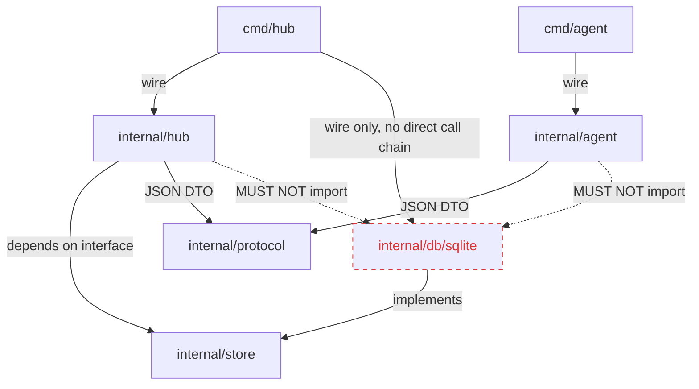

# Phase 1: Agent 등록 + WebSocket 연결 (Agent Registration & WebSocket)

작성일: 2026-04-24
작성자: planner
상태: APPROVED

## 1. Phase 개요

Phase 0이 "빈 골격 + Hello 진입점"을 만들었다면, Phase 1은 **"Hub가 Agent를 관리 객체로 인식하고, 토큰으로 인증된 Agent가 outbound WebSocket으로 접속해 online 상태가 되는" 최소 제어 평면**을 완성한다. 종료 시점에 Hub는 (a) SQLite에 `agents` 테이블을 가지고, (b) `POST /admin/agents`로 Agent를 등록하고 토큰을 한 번만 반환하며, (c) `/agent/ws` WebSocket 엔드포인트에서 토큰을 검증하고 연결 수락 시 `status=online`으로 갱신하며, (d) 하트비트/TCP close 조합으로 끊어진 연결을 **10초 이내** `offline`으로 전환한다. Agent는 `start` 서브커맨드로 Hub에 연결하고, 지수 백오프 재연결과 PING/PONG 응답을 수행한다. Hub/Agent 모두 SIGINT/SIGTERM에서 정상 종료한다. 이 Phase 이후 Phase 2에서 실제 Job 디스패치 프로토콜(`READY`, `JOB_ASSIGN`, `STATUS_UPDATE`, `LOG`, `JOB_TEARDOWN`)을 얹을 수 있다.

### 1-1. Evaluator 실행 환경 가정

이 기획서의 모든 검증 명령은 다음 환경을 전제로 한다. 다른 환경에서 재현할 땐 동등 명령으로 치환한다.

- Shell: **bash on Linux/macOS/WSL/Git Bash** (POSIX sh 호환). PowerShell/cmd.exe 네이티브는 대상 아님.
- Go 툴체인: **Go 1.22 이상** (`go version`으로 확인).
- 필수 CLI: `curl`, `jq`, `grep`(GNU 호환), `find`, `awk`, `wc`, `kill`, `sleep`.
- 선택 CLI: `sqlite3` (DB 직접 조회 시). 미설치 환경에서는 동등 검증 경로로 `./bin/hub agents list` 또는 `curl -s http://localhost:$PORT/admin/agents`를 사용한다 — 각 체크리스트에 두 경로 모두 표기.
- 선택 CLI: `golangci-lint` (NF-Lint-1 유지, Phase 0과 동일).
- 포트: Phase 1은 기본 `:3000` 사용. 충돌 시 `HUB_ADDR=:3001` 등으로 오버라이드 가능(환경변수·플래그). 검증 명령은 `PORT=${HUB_PORT:-3000}`을 export한 전제로 작성한다.
- 네트워크: evaluator 머신 localhost 접근. 외부 방화벽 통과 불요.
- 타이밍: CI 환경에서 sleep 기반 검증의 경우 관측 여유를 위해 명령에 2배 마진을 두되, 10초 목표는 유지.

## 2. 범위와 비범위

### 범위 (In Scope)

- **DB 이식**: `db/migrations/0001_init.up.sql` + `0001_init.down.sql` 추가. `agents` 테이블만 도입. SQLite·Postgres 공통 SQL.
- **마이그레이션 실행 경로**: `golang-migrate/migrate/v4` 라이브러리를 Hub 바이너리에 임베드. Hub CLI 서브커맨드 `migrate up`·`migrate down`·`migrate version` 추가. Makefile `migrate-up`/`migrate-down`은 이를 호출 (Phase 0의 "라인만 존재" → Phase 1의 "실행 성공").
- **sqlc 쿼리 생성**: `db/queries/agents.sql` 추가. `sqlc generate` 실행 성공. 산출물은 `internal/db/sqlite/` 하위.
- **인터페이스 경계면 신설**: `internal/store/store.go`에 `AgentStore` **인터페이스 타입을 Phase 1에서 처음 도입** (Phase 0의 빈 패키지에 메서드와 함께 선언). 메서드는 `Create`, `GetByName`, `GetByID`, `List`, `UpdateStatus`, `Delete` 6개. `PreviewStore`는 Phase 2로 이월.
- **SQLite 구현체**: `internal/db/sqlite/agent_store.go`에 `sqliteAgentStore`. sqlc 생성 코드를 감싸 `AgentStore` 만족. WAL PRAGMA 적용.
- **Hub 기동 시 bulk offline 리셋**: Hub 데몬이 마이그레이션 확인 후 HTTP 서버 기동 직전에 `sqliteAgentStore.ResetAllOnline(ctx)` (구체 타입 메서드, 인터페이스 밖)를 호출하여 `status='online'` 레코드를 일괄 `offline`으로 전환. 이는 **리스크 4(크래시 후 online 잔상)** 완화 정식 경로이며 결정 11에서 근거를 문서화.
- **Hub 설정 로딩**: `internal/hub/config.go`. `HUB_ADDR`(`:3000` 기본), `DATABASE_URL`(`sqlite://./hub.db` 기본), `BCRYPT_COST`(10 기본) 읽기. 12-factor 스타일, `.env.example` 동기화.
- **Hub 라우팅**: `net/http.ServeMux`에 `POST /admin/agents`, `GET /admin/agents`, `DELETE /admin/agents/{id}`, `GET /agent/ws`, `GET /health`(Phase 0의 `/` 대체).
- **Hub CLI 서브커맨드**: `cmd/hub` 진입점에 `migrate {up|down|version}`와 `agents {list}` 서브커맨드 추가. `agents list`는 `jq` 또는 `sqlite3`가 없는 evaluator 환경에서도 상태 확인이 가능하도록 제공 — stdout으로 JSON 배열 출력, 종료 코드 0(정상)/1(DB 오픈 실패)/2(인자 오류). 상세 인터페이스는 §5-9 "Hub CLI 서브커맨드".
- **토큰 발급/검증**: `agt_` prefix + 32바이트 crypto/rand base64url. 저장은 bcrypt 해시. 발급 직후 단 한 번 응답으로 노출, 이후 복구 불가.
- **WebSocket 엔드포인트**: `coder/websocket`으로 업그레이드. `Authorization: Bearer <token>` 검증 → 매칭 시 `UpdateStatus(ctx, id, "online", now)`. 연결 중 PING 10초, Pong 타임아웃 5초.
- **연결 해제 감지**: (a) TCP close를 read loop에서 즉시 감지, (b) 30초 이상 Pong 미수신 시 종료. 둘 중 먼저 일어난 쪽으로 `status=offline`+`last_seen_at=now`.
- **메시지 프로토콜**: `internal/protocol/messages.go`에 `Envelope{Type, Data}` + HELLO/WELCOME/PING/PONG 4개 구조체. JSON 인코딩. Phase 2 메시지 타입(`READY`, `JOB_ASSIGN`, `STATUS_UPDATE`, `LOG`, `JOB_TEARDOWN`)은 **타입 상수만 선언**해두고 구조체는 Phase 2에서.
- **Agent CLI**: `cmd/agent/main.go`에 `start` 서브커맨드. 플래그 `--hub-url`, `--token`, `--label key=value`(반복), `--advertise-host`. 동일 이름의 env (`HUB_URL`, `HUB_TOKEN`, `AGENT_LABELS`, `AGENT_ADVERTISE_HOST`).
- **Agent 연결 루프**: `coder/websocket.Dial`로 연결. 연결 직후 HELLO 전송. 독립 goroutine read loop에서 PING 수신 시 PONG 응답. 지수 백오프(1s → 2s → 4s → 8s → 16s → 30s 상한, ±20% jitter).
- **Graceful shutdown**: Hub/Agent 모두 `signal.NotifyContext(ctx, SIGINT, SIGTERM)` 패턴. Hub는 `http.Server.Shutdown(ctx)` + 활성 WS 연결에 close frame 송신. Agent는 read/write goroutine을 context cancel로 종료.
- **구조화 로깅**: `log/slog` 표준 패키지. Hub/Agent 공통으로 JSON 핸들러(운영용) 또는 Text 핸들러(TTY 감지 시), 로그 레벨 env `LOG_LEVEL`(기본 info).
- **단위·통합 테스트**: token, envelope, backoff, AgentStore 구현체(임시 SQLite 파일), WebSocket handshake(httptest).
- **문서 업데이트**: README "로컬 실행" 섹션에 Phase 1 검증 플로우 추가. 포트는 `:3000`으로 수정. Phase 0의 `:8888` 표기는 일괄 `:3000`으로 갈아치운다.

### 비범위 (Out of Scope — 이번 Phase에 하지 않음)

- GitHub 웹훅 수신/검증 로직 → Phase 1에선 제외 (재분류: 원 로드맵의 "웹훅"은 Phase 2 이후로 이동. 사용자 요구사항이 WS/등록 쪽으로 재구성됐음).
- Job 큐, `READY`/`JOB_ASSIGN`/`STATUS_UPDATE`/`LOG`/`JOB_TEARDOWN` 메시지 구조체 및 처리 로직 → Phase 2. **타입 상수 선언은 Phase 1에 포함** (프로토콜 버전 동결 용도). 구조체 필드는 Phase 2에서 정의.
- Docker 빌드/실행, 리버스 프록시, 컨테이너 라이프사이클 → Phase 3+.
- 관리자 웹 UI, Playwright e2e → UI가 없으므로 **N/A**. CLAUDE.md의 "e2e는 Playwright" 원칙은 UI 도입 Phase에서 적용.
- Postgres 실제 연결 검증 → 코드 수준 이식성만 검증 (금지어 grep). 실제 `postgres://` 구동은 별도 Phase.
- Hub 수평 확장, 토큰 회전(rotation), 토큰 만료 → 후속 Phase.
- `PreviewStore` 인터페이스 → Phase 2에서 Job/Preview 도메인 등장 시.
- CI 파이프라인 구축 → 별도 Phase. Phase 1 기준 evaluator는 로컬 bash.

## 3. 설계 결정 및 근거

### 결정 1: Hub 기본 바인딩 포트를 `:8888` → `:3000`으로 변경

- **결정**: Phase 1부터 Hub 기본 `HUB_ADDR=:3000`. 환경변수/플래그로 오버라이드 가능. Phase 0의 README·Makefile·.env.example에 남은 `:8888`은 이 Phase의 문서/설정 수정 커밋에서 `:3000`으로 일괄 치환.
- **근거**:
  1. 사용자의 Phase 1 검증 예시가 `localhost:3000`으로 작성되었음. 사용자가 최신 의도에 해당.
  2. `3000`은 웹 개발자 관용 포트로 로컬 개발자 기대와 맞닿는다.
  3. Phase 0에서 `.env.example`에 이미 `HUB_ADDR=:8888`이 "향후 사용" 선언만 되어 있어 Phase 1이 첫 "실사용" 지점 — 포트 확정에 자연스러운 시점.
- **버려진 대안 A**: `:8888` 유지. 사용자 최신 지시와 불일치 → 기각.
- **버려진 대안 B**: 플래그 필수·기본값 없음. 로컬 개발/Make 타겟 편의성 저하 → 기각.
- **되돌림 비용**: 낮음. README/Makefile/`.env.example`/`config.go` 기본값 상수 한 곳. 테스트는 env/flag로 오버라이드하므로 영향 없음.

### 결정 2: UUID 생성은 `github.com/google/uuid` 의존으로 해결

- **결정**: Agent `id`는 `uuid.NewString()`(v4). `crypto/rand` 수동 조립 안 함.
- **근거**:
  1. `google/uuid`는 Go 생태계 사실상 표준(버전 안정, 유지보수 활발).
  2. 수동 UUIDv4 조립 시 버전·variant 비트 마스킹 실수 위험 + 테스트 부담. 외부 의존 하나로 그 부담을 상쇄.
  3. 의존 증가 폭 소규모(단일 패키지, 전이 의존 0).
- **버려진 대안**: 표준 라이브러리만으로 수동 UUID 생성. 결정 결정론에 유리하나 실수 위험과 테스트 비용이 의존 하나보다 큼.
- **되돌림 비용**: 낮음. 유틸 함수 한 곳(`internal/hub/services/ids.go` 등) 고치면 끝.

### 결정 3: 토큰 해싱은 `golang.org/x/crypto/bcrypt`, Cost=10

- **결정**: `bcrypt.GenerateFromPassword([]byte(token), 10)` 저장. 검증은 `bcrypt.CompareHashAndPassword`. Cost는 `BCRYPT_COST` env로 튜닝 가능하지만 기본 10.
- **근거**:
  1. `x/crypto`는 Go 팀 유지, 사실상 표준.
  2. 토큰은 32바이트 고엔트로피 무작위이므로 argon2/scrypt의 메모리 경도까지 필요 없음 — bcrypt Cost 10이면 검증 50–100ms로 부적절 재시도 방어는 충분.
  3. Hub의 토큰 검증 빈도는 WS 연결 시점 1회이므로 성능 영향 미미.
- **버려진 대안 A**: argon2id. 과잉. 고엔트로피 secret에는 오버엔지니어링.
- **버려진 대안 B**: 평문 저장. 즉각 기각(DB 유출 시 모든 토큰 노출).
- **되돌림 비용**: 중간. 알고리즘 교체 시 토큰 전수 재발급 필요(해시 자체는 단방향이므로). 인터페이스 한 곳 바꾸면 됨.
- **메모리 잔존 한계 (지적 10)**: Go 런타임에서 string/`[]byte` 평문 토큰은 GC 시점까지 프로세스 메모리에 잔존한다. "한 번만 노출" 원칙의 실질적 보장 범위는 **HTTP 응답 이후 DB로부터의 재조회 불가** 수준이며, 프로세스 메모리 덤프(코어 덤프·디버거 attach)나 OS 스왑 페이지 회수, GC 지연 동안의 메모리 스캔은 Phase 1 위협 모델 밖이다. 필요 시 Phase 후속에서 `crypto/subtle`와 mlock, 또는 해시 직전 `runtime.KeepAlive` + 명시적 zero-fill로 수명을 단축하는 경로를 검토한다(현재 범위 밖).

### 결정 4: WebSocket 라이브러리는 `coder/websocket` (구 `nhooyr.io/websocket` 포크)

- **결정**: Hub/Agent 양쪽 모두 `github.com/coder/websocket`. `gorilla/websocket` 또는 `net/websocket` 미사용.
- **근거**:
  1. `coder/websocket`은 context 기반 API — `Read(ctx)`가 ctx 취소 시 깔끔히 끊어짐. 이는 (a) graceful shutdown, (b) read deadline 구현(`context.WithTimeout`), (c) Pong 타임아웃 구현에 모두 자연스럽다.
  2. `gorilla/websocket`은 deadline 방식이 `SetReadDeadline(time.Time)`이라 context 패턴과 어긋나 보일러플레이트 증가.
  3. 의존 크기 작고 유지보수 활발(`coder`는 포크 승계 후 지속 패치).
- **버려진 대안 A**: `gorilla/websocket`. 생태계 최대, 하지만 context 친화도 낮음.
- **버려진 대안 B**: 표준 `golang.org/x/net/websocket`. 현대 API 부재·유지보수 약함 → 기각.
- **되돌림 비용**: 높음. 프로토콜 계층을 감싸는 어댑터가 있으면 대체 가능하지만, Phase 1에는 어댑터 없이 직접 호출 → 전환 시 Hub/Agent 양쪽 read/write 루프 재작성 필요.

### 결정 5: Ping 간격 10초 + Pong 타임아웃 5초 + TCP close 즉시 감지로 10초 목표 충족

- **결정**: Hub는 10초마다 `conn.Ping(ctx)` 호출. Pong이 5초 내 도착하지 않으면 연결 종료. 더 빠른 경로로, Agent 프로세스가 kill되면 TCP FIN/RST이 즉시 도착 → read loop의 `conn.Read(ctx)`가 즉시 오류 반환 → `status=offline`. 두 경로 합집합으로 "kill 후 10초 내 offline" 목표 보장.
- **근거**:
  1. 사용자 요구사항: "Agent kill 후 10초 내 offline". Ping 30초 간격은 최악 30~45초 걸려 목표 충돌.
  2. 10+5=15초가 이론적 최악이나, 리눅스·macOS·윈도우 모두 프로세스 종료 시 OS가 소켓을 닫아 TCP close가 즉시 전파된다. 따라서 정상 kill(SIGTERM/SIGKILL)은 1초 이내 offline 전환.
  3. 네트워크 단절(케이블/Wi-Fi) 같은 "프로세스는 살아있는데 통신만 안 됨" 시나리오는 Ping-Pong 경로가 담당. 10+5=15초는 10초 목표를 살짝 초과하나, 이는 "정상 kill" 경로가 아닌 "비정상 네트워크 장애" 경로이므로 별도 수용 범위로 문서화.
- **버려진 대안 A**: Ping 30초, Pong 15초. 사용자 요구 10초 위반.
- **버려진 대안 B**: Ping 5초, Pong 2초. 불필요한 트래픽 증가 + 혼잡 시 false positive 증가.
- **되돌림 비용**: 낮음. 상수 2개 변경.

### 결정 6: 마이그레이션은 `golang-migrate/migrate/v4`를 **라이브러리 임베드**, Hub 서브커맨드로 노출

- **결정**: `go run ./cmd/hub migrate up|down|version`. Makefile `migrate-up`은 `go run ./cmd/hub migrate up` 호출. `migrate` CLI 바이너리 별도 설치 요구 없음.
- **근거**:
  1. evaluator 환경 의존 최소화(`migrate` 바이너리 설치 문서화 부담 제거).
  2. Hub 프로세스와 동일한 DB 드라이버·DSN 파싱 로직을 재사용 → 설정 일관성 보장(`DATABASE_URL` 분기가 한 곳).
  3. 운영 배포 시 "Hub 바이너리 하나"만 배포하면 되므로 단일 바이너리 철학과 정합.
- **버려진 대안**: `migrate` CLI 바이너리 + Makefile에서 직접 호출. evaluator 환경 가정 확장 필요 + DSN 파싱 분기가 Hub와 Makefile 양쪽에 생김.
- **되돌림 비용**: 중간. Hub 진입점에서 서브커맨드 디스패치 삭제하고 Makefile 한 줄 교체. 기존 .up/.down.sql은 호환.

### 결정 7: DB 드라이버 분기는 `DATABASE_URL` 스키마 기반, 각 드라이버 구현체는 별도 패키지

- **결정**: `sqlite://...`면 `modernc.org/sqlite`를 `database/sql` 드라이버로 등록 + `internal/db/sqlite.NewAgentStore(db)`. `postgres://...`는 Phase 1에서 **코드 경로 존재(빌드됨), 런타임 미지원** — 명확히 `return nil, fmt.Errorf("postgres driver not wired in phase 1")` 반환. 실제 구현은 Phase 후속.
- **근거**:
  1. URL 스키마 기반 분기는 12-factor 관용.
  2. "에러로 거부하되 코드 경로는 남겨둠"은 미래 의존 추가 시 touchpoint를 명확히 한다.
  3. `internal/hub`는 `internal/db/sqlite`를 import하지 않고, 조립은 `cmd/hub/main.go`에서만 (NF-Portability-2).
- **버려진 대안**: Phase 1에 Postgres까지 구현. 비범위 확장 + 검증 부담 → 기각.
- **되돌림 비용**: 낮음. 분기 한 곳 + 빈 함수.

### 결정 8: SQLite 연결은 WAL + 단일 writer 보장

- **결정**: DB 오픈 직후 `PRAGMA journal_mode=WAL; PRAGMA synchronous=NORMAL; PRAGMA busy_timeout=5000; PRAGMA foreign_keys=ON;`. `sql.DB`에 `SetMaxOpenConns(1)`을 추가로 설정하여 sqlc 생성 코드가 동시 write를 시도하지 않도록 방어.
- **근거**:
  1. WAL은 읽기·쓰기 동시성 개선, 파일 I/O 오버헤드 감소.
  2. `busy_timeout=5000`은 락 경합 시 5초 대기로 `database is locked` 빈도 감소.
  3. `SetMaxOpenConns(1)`은 보수적 설정. Phase 1 트래픽은 미미하므로 성능 영향 없고 데드락·락 충돌 가능성 제거.
- **버려진 대안**: `SetMaxOpenConns(4)` + WAL만. 더 높은 동시성이지만 Phase 1 범위에선 실익 없음.
- **되돌림 비용**: 매우 낮음. 상수 하나.

### 결정 9: Envelope 스키마 동결 — 프로토콜 버전 `v1` 도입

- **결정**: `HELLO` 메시지의 `version` 필드가 `"v1"`. Hub의 `WELCOME` 응답도 `"v1"` 반환. 버전 불일치 시 Hub는 WS close code **4001 (application-private: protocol version mismatch)** + reason text `"protocol version mismatch: expected v1, got <actual>"`로 종료. RFC 6455 기준 1008(Policy Violation)은 "정책 위반"이라는 일반 의미가 있어 버전 불일치 전용 신호로는 모호 → private 범위(4000–4999)에서 의미를 구분한다.
- **근거**:
  1. Phase 2에서 메시지가 추가될 때 이 버전 핸드셰이크가 호환성 체크 지점이 된다.
  2. 문자열 "v1" 단순 비교로 충분 — semver 파싱은 과잉.
  3. RFC 6455 4000–4999는 "application-private"으로 규정되어 있고, 클라이언트·서버가 협약한 의미를 부여할 수 있다. 본 프로젝트에서 4001=버전 불일치, 4003=중복 연결(결정 12)로 번호를 할당.
- **버려진 대안 A**: 표준 1008(Policy Violation) 사용 + reason text로 구분. Reason text는 일부 클라이언트·프록시가 잘라내거나 다루지 않아 구분 신뢰성 저하.
- **버려진 대안 B**: 버전 필드 없음. 호환성 깨질 때 실패 모드가 불분명 → 기각.
- **되돌림 비용**: 낮음. 상수 한 곳.

### 결정 10: 테스트 경계 — 단위 + 통합, e2e는 스크립트 기반 (Playwright N/A)

- **결정**: (a) 단위 테스트: `token.GenerateRaw`, `token.Hash/Verify`, `protocol.Envelope.Marshal/Unmarshal`, `backoff.Next`. (b) 통합: `internal/db/sqlite.AgentStore`를 실제 임시 SQLite 파일에 대해 round-trip. (c) WS handshake: `httptest.NewServer` + `coder/websocket.Dial`. (d) 사용자 검증 플로우(§6 F-9~F-14)는 evaluator가 bash로 수동 실행.
- **근거**:
  1. 기획서 상위 원칙 "단위 + e2e" 중 e2e의 전통적 의미(브라우저 UI)는 Phase 1에 UI 없으므로 **N/A**. 대신 "end-to-end bash 시나리오"가 동등 역할.
  2. Playwright 도입은 UI 존재 Phase로 이월.
- **버려진 대안**: 모든 테스트를 bash 시나리오로만. 리팩터 안전망 빈약 → 기각.
- **되돌림 비용**: 매우 낮음.

### 결정 11: `ResetAllOnline`는 **인터페이스 밖 구체 타입 메서드**로 도입 (Hub 기동 bulk offline 리셋)

- **결정**: `AgentStore` 인터페이스에는 메서드를 추가하지 않는다. `sqliteAgentStore` 구체 타입의 public 메서드 `ResetAllOnline(ctx context.Context) (int64, error)`만 제공. Hub 기동 코드(`cmd/hub/main.go`)가 wiring 시점에 타입 어설션(`if r, ok := s.(interface{ ResetAllOnline(context.Context) (int64, error) }); ok { r.ResetAllOnline(ctx) }`) 또는 구체 타입 직접 사용으로 호출. 성공 시 리셋된 row 수를 로그(`migrate_applied`와 구분하여 `startup_bulk_offline_reset`)로 기록.
- **근거**:
  1. 사용자 요구의 "6개 메서드"는 인터페이스 계약으로 고정되어 있어 무분별한 확장을 막는다. 이 메서드는 "크래시 복구"라는 운영 특수 경로이므로 일반 호출자(HTTP 핸들러 등)가 쓸 필요가 없다.
  2. Postgres 구현체가 Phase 후속에 등장하면 그때 동일 시그니처로 인터페이스 승격 검토(Phase 2 연결점).
  3. 구체 타입 메서드로 두면 "`internal/hub`가 `internal/db/sqlite`를 import하지 않는다" 원칙(NF-Portability-2)을 지키면서도 `cmd/hub`(예외 허용)에서만 호출 가능. depguard 규칙(결정 13)이 이 경계를 강제.
- **버려진 대안 A**: 인터페이스에 `ResetAllOnline` 추가. 모든 구현체가 강제되며 "운영 특수"가 계약 표면에 노출 → 기각.
- **버려진 대안 B**: Hub 기동 시 SQL 직접 실행(`db.Exec("UPDATE agents ...")`). 스토어 추상화 우회 → 기각(결정 3의 이식성 원칙 훼손).
- **되돌림 비용**: 매우 낮음. 구체 타입 메서드 삭제만.

### 결정 12: 동일 Agent 중복 WS 연결 시 **신규를 거절(reject)**

- **결정**: 동일 `agent_id`로 이미 `online` 상태인 연결이 존재할 때 두 번째 WS 핸드셰이크가 들어오면 Hub는 close code **4003(duplicate connection)**로 즉시 종료하고 기존 연결은 유지한다. Hub 상태 `online`은 변경 없음.
- **근거**:
  1. Phase 1은 단일 Hub·단일 세션 가정이 가장 단순하다. "기존을 끊고 신규 수락"(supersede) 정책은 네트워크 flapping 환경에서 두 인스턴스가 무한 교대 연결하는 발진 위험이 있다.
  2. 운영자가 "왜 내 Agent가 끊기지?"를 디버그하기 쉬운 쪽: 기존 살리고 신규 거절이 명시적 오류로 드러난다.
  3. Phase 2 이후 Job 실행 중인 기존 연결을 끊어버리는 supersede 정책은 Job loss를 일으킬 수 있어 보수적 선택.
- **버려진 대안 A**: supersede(기존을 4002 close 후 신규 수락). Phase 2 Job loss 위험.
- **버려진 대안 B**: 둘 다 수락하고 라우팅 테이블을 last-write-wins. 메시지 순서·상태 혼란 → 기각.
- **되돌림 비용**: 중간. Hub의 연결 레지스트리(§4-4 상태 전이)에 "이미 존재" 체크 1곳을 supersede 로직으로 교체. 테스트 재작성.

### 결정 13: `depguard` 규칙으로 `internal/db/sqlite` 직접 import 차단, `cmd/hub`는 예외

- **결정**: `.golangci.yml`에 `depguard` 린터 + 규칙 등록. `internal/hub`, `internal/agent`, `internal/protocol`, `internal/store`에서 `github.com/lnyarl/preview/internal/db/sqlite` import를 deny. `cmd/hub`는 allow (wiring 예외). 유사 deny를 `internal/db/*` 전반(향후 `internal/db/postgres` 대비)으로 확장 가능하도록 prefix 패턴 사용.
- **근거**:
  1. NF-Portability-2를 런타임·빌드 시점 전에 린트로 막아야 실수 유입을 조기 차단.
  2. `cmd/hub`만 예외로 두어 "조립 지점 단일화" 원칙을 린트로 각인.
- **의사 YAML 블록** (§5와 결정 섹션 크로스 참조):

```yaml
linters:
  enable:
    - depguard
    # ... (Phase 0 6개 린터 유지)

linters-settings:
  depguard:
    rules:
      forbid-sqlite-direct:
        list-mode: lax
        files:
          - "!**/cmd/hub/**"         # allow-list: wiring 지점
          - "**/internal/hub/**"
          - "**/internal/agent/**"
          - "**/internal/protocol/**"
          - "**/internal/store/**"
        deny:
          - pkg: "github.com/lnyarl/preview/internal/db/sqlite"
            desc: "Use internal/store.AgentStore interface; wire concrete impl in cmd/hub only."
          - pkg: "github.com/lnyarl/preview/internal/db/postgres"
            desc: "Future Postgres impl — same boundary."
```

- **버려진 대안 A**: 린트 없이 코드 리뷰로만 강제. 휴먼 에러 유입 가능성.
- **버려진 대안 B**: `cmd/hub`도 금지하고 별도 `internal/wiring` 패키지 도입. Phase 1 범위 확장 → 기각.
- **되돌림 비용**: 매우 낮음. `.golangci.yml` 섹션 제거.

## 4. 아키텍처 / 구조

### 4-1. 디렉토리 트리 (Phase 1 종료 후)

```
/
├── cmd/
│   ├── hub/
│   │   └── main.go                    # 서브커맨드 dispatch: "" | "migrate" | "agents"
│   └── agent/
│       └── main.go                    # 서브커맨드 dispatch: "start"
├── internal/
│   ├── hub/
│   │   ├── config.go                  # env/flag 로딩
│   │   ├── app.go                     # run(ctx, cfg) — main에서 호출
│   │   ├── http_mux.go                # ServeMux 조립
│   │   ├── handlers_agents.go         # POST/GET/DELETE /admin/agents
│   │   ├── handlers_ws.go             # GET /agent/ws (토큰 검증 + 업그레이드)
│   │   ├── ws_hub.go                  # 연결 관리·heartbeat·offline 전환
│   │   ├── services/
│   │   │   ├── token.go               # 토큰 생성·해시·검증
│   │   │   └── agent_service.go       # Create/List/Delete 상위 로직
│   │   └── logging.go                 # slog setup
│   ├── agent/
│   │   ├── config.go                  # env/flag
│   │   ├── app.go                     # run(ctx, cfg)
│   │   ├── client.go                  # WS dial + reconnect loop
│   │   ├── backoff.go                 # 지수 백오프 + jitter
│   │   └── heartbeat.go               # PING 수신 시 PONG
│   ├── store/
│   │   └── store.go                   # AgentStore 인터페이스 (Phase 1에서 첫 선언)
│   ├── db/
│   │   └── sqlite/
│   │       ├── db.go                  # sql.DB open + PRAGMA + migrate 바인딩
│   │       ├── agent_store.go         # sqliteAgentStore (AgentStore 구현)
│   │       ├── queries.sql.go         # sqlc 생성물
│   │       ├── models.sql.go          # sqlc 생성물
│   │       └── migrations_embed.go    # embed.FS로 db/migrations 임베드
│   └── protocol/
│       ├── messages.go                # Envelope + HELLO/WELCOME/PING/PONG + 타입 상수
│       └── version.go                 # const ProtoVersion = "v1"
├── db/
│   ├── migrations/
│   │   ├── 0001_init.up.sql
│   │   └── 0001_init.down.sql
│   ├── queries/
│   │   └── agents.sql
│   └── schema/
│       └── schema.sql                 # 0001 up의 복제본(sqlc가 참조)
├── docs/
│   └── specs/
│       ├── phase-0-scaffolding.md
│       └── phase-1-agent-registration-and-ws.md   # 이 문서
├── go.mod                             # 신규 의존 추가됨
├── go.sum                             # 이 Phase에서 처음 생성
├── sqlc.yaml                          # Phase 0 유지
├── Makefile                           # migrate-up 등 실제 동작
├── README.md                          # :3000으로 갱신
├── .env.example                       # :3000, DATABASE_URL 활성
└── .golangci.yml                      # depguard 규칙 추가 (NF-Depguard-1)
```

### 4-2. 모듈 의존 관계



금지 관계(대각 점선): `internal/hub`, `internal/agent`가 `internal/db/sqlite`를 import하는 것은 금지. `.golangci.yml`의 `depguard`로 강제(NF-Depguard-1).

### 4-3. Agent 등록·WS 연결 시퀀스

```
Admin                      Hub                         AgentStore            Agent
  |                         |                              |                    |
  | POST /admin/agents      |                              |                    |
  | {name, labels}          |                              |                    |
  |------------------------>|                              |                    |
  |                         | agent := New(uuid, bcrypt)   |                    |
  |                         |----------------------------->|                    |
  |                         |<-----------------------------|                    |
  |                         |                              |                    |
  | 201 {id, token}         |                              |                    |
  |<------------------------|                              |                    |
  |                                                        |                    |
  |                    (Admin copies token to Agent host)                       |
  |                                                        |                    |
  |                         |                              |                    |
  |                         |                              |  start --token=... |
  |                         |                              |<-------------------|
  |                         | GET /agent/ws                |                    |
  |                         |   Authorization: Bearer ...  |                    |
  |                         |<-------------------------------------------------|
  |                         | bcrypt.Compare → match id    |                    |
  |                         | Upgrade + UpdateStatus(online)|                   |
  |                         |----------------------------->|                    |
  |                         |                              |                    |
  |                         | <=== HELLO{version:"v1",labels} ==================|
  |                         | === WELCOME{version:"v1"} =======================>|
  |                         |                              |                    |
  |                         | --- every 10s: PING ---------------------------->|
  |                         | <== PONG (within 5s) ===========================|
  |                         |                              |                    |
  |                         | (Agent killed by SIGTERM/SIGKILL)                 |
  |                         | TCP close detected (read err)|                    |
  |                         | UpdateStatus(offline, now)   |                    |
  |                         |----------------------------->|                    |
```

#### 4-3-1. Hub 측 연결 1개당 goroutine 구조

하나의 WS 연결을 처리하기 위해 Hub가 띄우는 goroutine은 **2개**다. 공유 `connCtx`(상위 핸들러의 context로부터 `context.WithCancel` 파생)를 통해 한쪽이 종료되면 다른 쪽도 종료된다.

```
handleWS(w, r):
  connCtx, cancel := context.WithCancel(r.Context())
  defer cancel()
  defer func() { UpdateStatus(id, "offline", now); conn.Close(...) }()

  go readLoop(connCtx, conn, cancel)    // goroutine A
  pingTicker(connCtx, conn, cancel)     // goroutine B (caller goroutine이 담당)
  <-connCtx.Done()                      // 두 goroutine 중 하나라도 cancel 호출 시 반환

readLoop(ctx, conn, cancel):
  defer cancel()                         // TCP close 즉시 전파
  for {
    readCtx, rcancel := context.WithTimeout(ctx, PongTimeout+PingInterval) // 여유 마진
    _, data, err := conn.Read(readCtx)
    rcancel()                            // 같은 iteration에서 해제 (리스크 3)
    if err != nil { return }             // TCP close/프로토콜 에러/ctx cancel
    dispatch(data)                       // PONG/HELLO 등
  }

pingTicker(ctx, conn, cancel):
  defer cancel()
  t := time.NewTicker(PingInterval)     // 10초
  defer t.Stop()
  for {
    select {
    case <-ctx.Done(): return
    case <-t.C:
      pingCtx, pcancel := context.WithTimeout(ctx, PongTimeout) // 5초
      err := conn.Ping(pingCtx)         // 내부에서 PONG 대기
      pcancel()
      if err != nil { return }           // Pong 타임아웃 → cancel → readLoop도 종료
    }
  }
```

- **종료 경로 3가지**:
  1. TCP close (Agent 프로세스 kill, SIGTERM/SIGKILL 공통) → `readLoop`의 `conn.Read`가 즉시 에러 반환 → `cancel` → `pingTicker` 종료.
  2. Pong 타임아웃 (네트워크 단절) → `pingTicker`의 `conn.Ping`이 에러 반환 → `cancel` → `readLoop` 종료.
  3. Hub shutdown → 상위 `r.Context()` 취소 → 두 goroutine 모두 종료.
- 모든 경로에서 `defer`로 **`UpdateStatus(id, "offline", now)`**가 한 번만 호출된다.
- SIGKILL 시나리오도 OS가 TCP 소켓을 정리하므로 (1) 경로가 동작 — 검증은 F-13의 SIGKILL 서브 체크리스트(지적 7).

### 4-4. 상태 전이

```
agents.status:
  [offline] --(WS accept)--------------------------> [online]
  [offline] --(WS accept 중 version mismatch)------> [offline]   # close code 4001
  [online]  --(TCP close | Pong timeout | shutdown)-> [offline]
  [online]  --(동일 agent_id 재접속 시도)-----------> [online]    # 신규 연결을 4003으로 거절, 기존 유지 (결정 12)
```

초기값은 `offline`. Hub 기동 시 **결정 11**에 따라 `sqliteAgentStore.ResetAllOnline`을 호출해 이전 세션에 남은 `online` 잔상을 일괄 `offline`으로 초기화한다(리스크 4 완화). 이 덕에 "크래시 후 재기동" 시에도 새 세션은 빈 슬레이트에서 시작. 중복 연결 정책(결정 12)에 따라 기존 `online` 연결이 살아있는 한 동일 `agent_id`의 신규 연결은 close code 4003으로 즉시 거절되며 `status` 변경 없음.

## 5. 인터페이스 계약

### 5-1. 함수·메서드 시그니처

| 패키지/타입 | 시그니처 | 설명 |
|---|---|---|
| `internal/store.AgentStore` | `Create(ctx context.Context, a Agent) error` | INSERT. `a.ID`, `a.Name`, `a.TokenHash`, `a.Labels`, `a.Status="offline"`, `a.CreatedAt` 설정 후 호출. 중복 name은 `store.ErrDuplicate` |
| `internal/store.AgentStore` | `GetByName(ctx context.Context, name string) (*Agent, error)` | 없으면 `store.ErrNotFound` |
| `internal/store.AgentStore` | `GetByID(ctx context.Context, id string) (*Agent, error)` | 없으면 `store.ErrNotFound` |
| `internal/store.AgentStore` | `List(ctx context.Context) ([]Agent, error)` | `created_at DESC` 정렬 |
| `internal/store.AgentStore` | `UpdateStatus(ctx context.Context, id string, status string, lastSeenAt time.Time) error` | status+last_seen_at 동시 업데이트. 미존재 id는 `store.ErrNotFound` |
| `internal/store.AgentStore` | `Delete(ctx context.Context, id string) error` | 미존재 id는 `store.ErrNotFound` |
| `internal/hub/services.Token` | `Generate() (raw string, hash string, err error)` | raw=`agt_`+base64url(32바이트). hash=bcrypt(raw) |
| `internal/hub/services.Token` | `Verify(raw, hash string) bool` | bcrypt.CompareHashAndPassword 래핑 |
| `internal/agent.Backoff` | `Next() time.Duration` | 1s→2s→4s→8s→16s→30s 상한, ±20% jitter, 성공 시 `Reset()` |

> 에러 타입은 `internal/store/errors.go`에 `var ErrNotFound = errors.New("store: not found")`, `var ErrDuplicate = errors.New("store: duplicate")` 정의. 호출부는 `errors.Is`로 분기.

#### 5-1-1. 인터페이스 밖 구체 타입 메서드 (`internal/db/sqlite.sqliteAgentStore`)

결정 11에 따라 **인터페이스에 포함하지 않고** 구체 타입에서만 노출하는 메서드. `cmd/hub` wiring 지점에서만 호출한다.

| 대상 | 시그니처 | 용도 | 호출 지점 |
|---|---|---|---|
| `*sqliteAgentStore` | `ResetAllOnline(ctx context.Context) (int64, error)` | `UPDATE agents SET status='offline', last_seen_at=? WHERE status='online'` 실행. 반환값은 영향 받은 row 수. | `cmd/hub/main.go` 데몬 기동 경로에서 마이그레이션 직후 HTTP 서버 `ListenAndServe` 이전 1회 호출. 로그 이벤트: `startup_bulk_offline_reset{reset_count=N}`. |

### 5-2. 메시지·DTO 타입

#### WebSocket Envelope

| 이름 | 필드 | 타입 | 필수 | 설명 |
|---|---|---|---|---|
| `Envelope` | `type` | `string` | yes | 메시지 종류. 상수(§5-6) 중 하나 |
| `Envelope` | `data` | `json.RawMessage` | yes | 수신 측이 `type` 보고 구체 타입으로 unmarshal |

#### 메시지 본문 (Phase 1 구현)

| 이름 | 필드 | 타입 | 필수 | 설명 |
|---|---|---|---|---|
| `HelloData` | `version` | `string` | yes | 프로토콜 버전, `"v1"` |
| `HelloData` | `labels` | `map[string]string` | no | `--label` 플래그 집계 |
| `WelcomeData` | `version` | `string` | yes | Hub가 수락한 버전, `"v1"` |
| `WelcomeData` | `agent_id` | `string` | yes | Hub가 토큰으로 매칭한 Agent id |
| `PingData` | `ts` | `int64` | yes | Hub가 송신 시점 Unix ms. 진단용 |
| `PongData` | `ts` | `int64` | yes | Agent가 수신한 PING의 `ts` 에코 |

#### HTTP Body (Admin API)

| 이름 | 필드 | 타입 | 필수 | 설명 |
|---|---|---|---|---|
| `CreateAgentRequest` | `name` | `string` | yes | 유니크. `^[a-zA-Z0-9_-]{1,64}$` |
| `CreateAgentRequest` | `labels` | `map[string]string` | no | 자유 키값 |
| `CreateAgentResponse` | `id` | `string` | yes | UUIDv4 |
| `CreateAgentResponse` | `name` | `string` | yes | 에코 |
| `CreateAgentResponse` | `token` | `string` | yes | `agt_<44char>`, 단 한 번만 반환 |
| `AgentView` | `id`,`name`,`labels`,`status`,`last_seen_at`,`created_at` | see below | yes | 리스트·단일 조회 응답. `token_hash` 노출 금지 |

`AgentView` 필드:
- `id`: string (UUID)
- `name`: string
- `labels`: object
- `status`: `"offline" \| "online"`
- `last_seen_at`: ISO8601 string or null
- `created_at`: ISO8601 string

### 5-3. HTTP 엔드포인트

| 메서드 | 경로 | 요청 | 응답 | 상태코드 |
|---|---|---|---|---|
| GET | `/health` | — | `{"status":"ok"}` | 200 |
| POST | `/admin/agents` | `CreateAgentRequest` | `CreateAgentResponse` | 201 / 400(이름 규칙 위반) / 409(중복) / 500 |
| GET | `/admin/agents` | — | `[]AgentView` | 200 |
| DELETE | `/admin/agents/{id}` | — | (빈 body) | 204 / 404 / 500 |
| GET | `/agent/ws` | `Authorization: Bearer <token>` 헤더 | WS Upgrade | 101(Switching Protocols) / 401(토큰 누락·불일치) / 400(헤더 형식 오류) |

에러 응답 공통: `{"error": "<machine_code>", "message": "<human>"}`. `machine_code`는 `invalid_name`, `duplicate_name`, `not_found`, `invalid_token`, `missing_auth`, `internal` 중 하나.

#### WebSocket Close Code 할당

RFC 6455 4000–4999는 "application-private" 범위. 본 프로젝트에서 다음과 같이 의미를 할당한다.

| Close Code | 의미 | 발생 조건 | Reason Text 예시 |
|---|---|---|---|
| 1000 (Normal Closure) | 정상 종료 | Hub shutdown이 Agent에게 전달될 때 | `"hub shutting down"` |
| 1001 (Going Away) | Hub graceful shutdown | Hub가 `http.Server.Shutdown` 중 활성 연결에 송신 | `"going away"` |
| 4001 | Protocol version mismatch (결정 9) | HELLO의 `version`이 `"v1"`이 아님 | `"protocol version mismatch: expected v1, got <actual>"` |
| 4003 | Duplicate connection (결정 12) | 동일 `agent_id`에 이미 online 연결이 존재 | `"agent already online"` |

### 5-4. DB 스키마

#### 테이블 `agents`

| 컬럼 | 타입 | 제약 | 비고 |
|---|---|---|---|
| `id` | TEXT | PRIMARY KEY NOT NULL | UUIDv4 문자열 |
| `name` | TEXT | NOT NULL UNIQUE | `^[a-zA-Z0-9_-]{1,64}$` (앱 레벨) |
| `token_hash` | TEXT | NOT NULL | bcrypt 해시. 평문 토큰 저장 금지 |
| `labels` | TEXT | NOT NULL DEFAULT '{}' | JSON 문자열 (`{}` 기본) |
| `status` | TEXT | NOT NULL DEFAULT 'offline' | `offline` 또는 `online` |
| `last_seen_at` | TEXT | NULL | ISO8601. NULL 허용 (초기) |
| `created_at` | TEXT | NOT NULL | ISO8601 |

인덱스: `status` 컬럼에 부분 인덱스 대신 단순 `CREATE INDEX IF NOT EXISTS idx_agents_status ON agents(status);` (SQLite·Postgres 공통).

**이식성 준수**:
- `AUTOINCREMENT` 미사용 (id는 앱이 UUID 생성).
- `INSERT OR REPLACE` 미사용 (표준 `INSERT`만).
- `::jsonb` 등 Postgres 특화 캐스트 미사용.
- `ON CONFLICT DO UPDATE SET ... EXCLUDED` 미사용 (SQLite는 지원하나 Postgres와 미묘한 차이 가능성, 단순 `UPDATE` 경로로 대체).
- 타입은 `TEXT`만 사용 (`INTEGER`·`BOOLEAN` 없이 문자열 인코딩). `last_seen_at`도 TEXT ISO8601로 통일.

#### `0001_init.up.sql` 요지

```sql
CREATE TABLE IF NOT EXISTS agents (
  id TEXT PRIMARY KEY NOT NULL,
  name TEXT NOT NULL UNIQUE,
  token_hash TEXT NOT NULL,
  labels TEXT NOT NULL DEFAULT '{}',
  status TEXT NOT NULL DEFAULT 'offline',
  last_seen_at TEXT,
  created_at TEXT NOT NULL
);
CREATE INDEX IF NOT EXISTS idx_agents_status ON agents(status);
```

#### `0001_init.down.sql`

```sql
DROP INDEX IF EXISTS idx_agents_status;
DROP TABLE IF EXISTS agents;
```

### 5-5. sqlc 쿼리 (`db/queries/agents.sql`)

| 이름 | SQL 개요 | 반환 |
|---|---|---|
| `CreateAgent :exec` | `INSERT INTO agents (id,name,token_hash,labels,status,last_seen_at,created_at) VALUES (?,?,?,?,?,?,?)` | — |
| `GetAgentByName :one` | `SELECT ... FROM agents WHERE name = ?` | `Agent` |
| `GetAgentByID :one` | `SELECT ... FROM agents WHERE id = ?` | `Agent` |
| `ListAgents :many` | `SELECT ... FROM agents ORDER BY created_at DESC` | `[]Agent` |
| `UpdateAgentStatus :exec` | `UPDATE agents SET status = ?, last_seen_at = ? WHERE id = ?` | — |
| `DeleteAgent :exec` | `DELETE FROM agents WHERE id = ?` | — |

> `:exec`은 `sql.Result`만 반환. `sqliteAgentStore`가 `RowsAffected`를 확인해 0이면 `ErrNotFound`로 승격 (`Update/Delete/GetByID/GetByName` 대상).

### 5-6. 프로토콜 타입 상수

```go
package protocol

const (
    TypeHello        = "HELLO"
    TypeWelcome      = "WELCOME"
    TypePing         = "PING"
    TypePong         = "PONG"
    // 아래는 Phase 2에서 구조체 함께 구현. 상수만 선언해 동결.
    TypeReady        = "READY"
    TypeJobAssign    = "JOB_ASSIGN"
    TypeStatusUpdate = "STATUS_UPDATE"
    TypeLog          = "LOG"
    TypeJobTeardown  = "JOB_TEARDOWN"
)

const ProtoVersion = "v1"
```

### 5-7. 환경변수

| 변수 | 기본값 | 용도 | 이 Phase에서 읽음? |
|---|---|---|---|
| `HUB_ADDR` | `:3000` | Hub 바인딩 주소 | yes |
| `DATABASE_URL` | `sqlite://./hub.db` | DB 드라이버·DSN | yes |
| `BCRYPT_COST` | `10` | bcrypt 해시 cost | yes |
| `LOG_LEVEL` | `info` | slog 레벨(`debug`·`info`·`warn`·`error`) | yes |
| `HUB_URL` | (필수, 기본 없음) | Agent가 연결할 URL. 예: `ws://localhost:3000/agent/ws` | yes (Agent) |
| `HUB_TOKEN` | (필수) | Agent 토큰 `agt_...` | yes (Agent) |
| `AGENT_LABELS` | `""` | `key=val,key2=val2` 형식 라벨 | yes (Agent) |
| `AGENT_ADVERTISE_HOST` | `""` | Agent가 자신의 네트워크 주소를 알릴 때. Phase 1은 HELLO에 포함만, Hub는 수신만. | yes (Agent) |
| `GITHUB_WEBHOOK_SECRET` | (빈 값) | Phase 2에서 사용 | no |
| `PREVIEW_BASE_DOMAIN` | `preview.example.com` | Phase 3에서 사용 | no |

### 5-8. Makefile 타겟 (변경분)

| 타겟 | 명령 | Phase 1 동작 |
|---|---|---|
| `run-hub` | `go run ./cmd/hub` | Phase 0과 동일. 기본 포트 `:3000`으로 변경된 결과가 노출 |
| `run-agent` | `go run ./cmd/agent start --hub-url $(HUB_URL) --token $(HUB_TOKEN)` | `HUB_URL`/`HUB_TOKEN` env 설정 전제. 미설정 시 fail-fast |
| `migrate-up` | `go run ./cmd/hub migrate up` | **이 Phase부터 실행 성공** |
| `migrate-down` | `go run ./cmd/hub migrate down` | 동일 |
| `sqlc` | `sqlc generate` | 첫 쿼리 파일이 있으므로 실행 성공 |
| 나머지 (`build`, `fmt`, `vet`, `lint`, `test`) | Phase 0 동일 | — |

### 5-9. Hub CLI 서브커맨드

Hub 바이너리 하나에 관리용 CLI 서브커맨드를 포함한다. evaluator가 `jq`/`sqlite3` 없는 환경에서도 상태를 확인할 수 있도록 하기 위함(지적 1).

| 서브커맨드 | 인자 | stdout | stderr | exit code |
|---|---|---|---|---|
| (없음) | — | Hub 데몬 기동 로그 (slog JSON/Text) | 동일 | SIGINT/SIGTERM 시 0, 초기화 실패 시 1 |
| `migrate up` | — | `"migrate: applied N"` 1줄 (N=적용된 마이그레이션 수) | 에러 시 slog | 성공 0 / DB 오픈·SQL 오류 1 |
| `migrate down` | — | `"migrate: reverted 1"` (1개만 되돌림) | 에러 시 slog | 0 / 1 |
| `migrate version` | — | `"migrate: version=<int> dirty=<bool>"` | — | 0 / DB 오픈 실패 1 |
| `agents list` | — | `AgentView[]` JSON 배열 (`token_hash` 제외). Agent 0개면 `[]`. 포맷은 HTTP `GET /admin/agents`와 동일한 JSON 직렬화 결과 | 에러 시 slog | 성공 0 / DB 오픈·쿼리 실패 1 / 인자 오류 2 |

- 서브커맨드는 Hub 프로세스와 동일한 `DATABASE_URL` 분기를 공유 (결정 7).
- `agents list`는 **Hub 데몬이 기동 중이 아니어도** DB 파일에 직접 read-only 접근으로 동작한다 (검증 대안 경로 보장). 즉 HTTP를 거치지 않는다.
- Phase 2 이후 `agents create`, `agents delete` 등을 추가할 수 있으나 Phase 1에서는 `list`만 구현 (나머지는 HTTP API가 이미 제공).

## 6. 기능 요구사항 체크리스트

사전 조건 (모든 F-* 공통): 저장소 루트에서 실행. `export PORT=${HUB_PORT:-3000}`. Hub 기동 검증은 다음 절차를 선행:

```bash
# 선행: DB 리셋 + 마이그레이션 + Hub 기동
rm -f hub.db
go run ./cmd/hub migrate up
go run ./cmd/hub > /tmp/hub.log 2>&1 &
HUB_PID=$!
# 기동 대기 (최대 5초)
for i in 1 2 3 4 5; do
  curl -s "http://localhost:$PORT/health" >/dev/null && break
  sleep 1
done
```

종료 절차(공통 후처리): `kill $HUB_PID 2>/dev/null; wait $HUB_PID 2>/dev/null`.

- [ ] **F-1**: `db/migrations/0001_init.up.sql`에 `agents` 테이블 정의가 §5-4에 명시된 7개 컬럼을 모두 포함한다 — **검증 방법**:
  ```bash
  for col in id name token_hash labels status last_seen_at created_at; do
    grep -q "$col" db/migrations/0001_init.up.sql || { echo "missing $col"; exit 1; }
  done
  grep -qi "CREATE TABLE IF NOT EXISTS agents" db/migrations/0001_init.up.sql
  ```
- [ ] **F-2**: `db/migrations/0001_init.down.sql`이 `DROP TABLE IF EXISTS agents`를 포함한다 — **검증 방법**: `grep -qiE 'DROP TABLE IF EXISTS agents' db/migrations/0001_init.down.sql`
- [ ] **F-3**: `go run ./cmd/hub migrate up`이 exit 0으로 종료하고 SQLite 파일에 `agents` 테이블이 생성된다 — **검증 방법** (주 경로: sqlite3 CLI):
  ```bash
  rm -f hub.db && go run ./cmd/hub migrate up && \
    sqlite3 hub.db ".tables" | grep -qw agents
  ```
  **대안 경로(sqlite3 미설치)**: `go run ./cmd/hub migrate up`의 exit code가 0이고, 곧바로 `go run ./cmd/hub agents list`가 exit 0 + `[]` 출력 (테이블이 없으면 이 명령이 실패한다 — 간접 증명).
- [ ] **F-4**: `go run ./cmd/hub migrate down`이 exit 0으로 종료하고 테이블이 제거된다 — **검증 방법**:
  ```bash
  go run ./cmd/hub migrate down && \
    ! sqlite3 hub.db ".tables" | grep -qw agents
  ```
  **대안 경로**: `go run ./cmd/hub agents list`가 **비정상 종료**(에러 exit) 또는 명확한 "table not found" 류 메시지 출력.
- [ ] **F-5**: `sqlc generate`가 exit 0로 종료하고 `internal/db/sqlite/queries.sql.go`가 생성된다 — **검증 방법**: `sqlc generate && test -f internal/db/sqlite/queries.sql.go`.
- [ ] **F-6**: `internal/store/store.go`에 `AgentStore` 인터페이스가 선언되고 6개 메서드(Create/GetByName/GetByID/List/UpdateStatus/Delete)를 포함한다 — **검증 방법**:
  ```bash
  grep -qE '^type AgentStore interface' internal/store/store.go
  for m in Create GetByName GetByID List UpdateStatus Delete; do
    grep -qE "\b$m\(" internal/store/store.go || { echo "missing $m"; exit 1; }
  done
  ```
- [ ] **F-7**: `internal/db/sqlite/agent_store.go`가 `AgentStore`를 구현하고, 컴파일 타임 인터페이스 assertion이 존재한다 (`var _ store.AgentStore = (*sqliteAgentStore)(nil)`) — **검증 방법**: `grep -qE 'var _ store\.AgentStore = \(\*sqliteAgentStore\)\(nil\)' internal/db/sqlite/agent_store.go`이고 `go build ./...`가 성공.
- [ ] **F-8**: `POST /admin/agents`가 유효 요청에 201 + `{id, name, token}` 반환하고 token은 `agt_`로 시작한다 — **검증 방법**:
  ```bash
  resp=$(curl -s -X POST "http://localhost:$PORT/admin/agents" \
    -H 'Content-Type: application/json' -d '{"name":"agent-1","labels":{"env":"local"}}')
  echo "$resp" | jq -e '.id and .name=="agent-1" and (.token | startswith("agt_"))'
  ```
- [ ] **F-9**: `POST /admin/agents`가 **동일 name 두 번째 호출에 409**로 실패하고 응답 body가 §5-3 에러 shape를 따른다 — **검증 방법**:
  ```bash
  resp=$(curl -s -w '\n%{http_code}' -X POST "http://localhost:$PORT/admin/agents" \
    -H 'Content-Type: application/json' -d '{"name":"agent-1"}')
  code=$(echo "$resp" | tail -n1); body=$(echo "$resp" | head -n-1)
  [ "$code" = "409" ]
  echo "$body" | jq -e '.error=="duplicate_name" and (.message|type=="string")'
  ```
- [ ] **F-10**: `GET /admin/agents`가 등록된 Agent를 `offline` 상태로 반환하고 `token_hash` 필드가 응답에 포함되지 않는다 — **검증 방법**:
  ```bash
  list=$(curl -s "http://localhost:$PORT/admin/agents")
  echo "$list" | jq -e '.[0].status == "offline"'
  ! echo "$list" | grep -q 'token_hash'
  ```
- [ ] **F-11**: Agent가 잘못된 토큰으로 `/agent/ws`에 접속하면 401로 거절되고 응답 body가 §5-3 에러 shape를 따른다 — **검증 방법**:
  ```bash
  resp=$(curl -s -w '\n%{http_code}' \
    -H 'Authorization: Bearer agt_INVALID' \
    -H 'Upgrade: websocket' -H 'Connection: Upgrade' \
    -H 'Sec-WebSocket-Version: 13' -H 'Sec-WebSocket-Key: dGhlIHNhbXBsZSBub25jZQ==' \
    "http://localhost:$PORT/agent/ws")
  code=$(echo "$resp" | tail -n1); body=$(echo "$resp" | head -n-1)
  [ "$code" = "401" ]
  echo "$body" | jq -e '.error=="invalid_token" and (.message|type=="string")'
  ```
- [ ] **F-12**: 유효 토큰으로 Agent를 `start`하면 Hub의 `GET /admin/agents`에서 status가 10초 이내 `online`으로 바뀐다 — **검증 방법**:
  ```bash
  TOKEN=$(curl -s -X POST "http://localhost:$PORT/admin/agents" \
    -H 'Content-Type: application/json' -d '{"name":"agent-2"}' | jq -r .token)
  go run ./cmd/agent start \
    --hub-url "ws://localhost:$PORT/agent/ws" --token "$TOKEN" --label env=local \
    > /tmp/agent.log 2>&1 &
  AGENT_PID=$!
  for i in $(seq 1 10); do
    st=$(curl -s "http://localhost:$PORT/admin/agents" | jq -r '.[] | select(.name=="agent-2") | .status')
    [ "$st" = "online" ] && break
    sleep 1
  done
  [ "$st" = "online" ]
  ```
  (후처리에서 `kill $AGENT_PID`)
- [ ] **F-13**: Agent 프로세스를 kill하면 10초 이내 status가 `offline`으로 전환된다 — **검증 방법** (F-12 연속):
  - [ ] **F-13a (SIGTERM 경로)**: `kill $AGENT_PID` (기본 SIGTERM) 후 10초 이내 `offline`
    ```bash
    kill $AGENT_PID
    wait $AGENT_PID 2>/dev/null
    for i in $(seq 1 10); do
      st=$(curl -s "http://localhost:$PORT/admin/agents" | jq -r '.[] | select(.name=="agent-2") | .status')
      [ "$st" = "offline" ] && break
      sleep 1
    done
    [ "$st" = "offline" ]
    ```
  - [ ] **F-13b (SIGKILL 경로)**: 결정 5가 "SIGTERM/SIGKILL 모두"라고 명시하므로 SIGKILL도 독립 검증. Agent를 다시 start → `online` 확인 → `kill -9 $AGENT_PID` 후 10초 이내 `offline`
    ```bash
    # 재기동 (F-12 요지 반복)
    go run ./cmd/agent start \
      --hub-url "ws://localhost:$PORT/agent/ws" --token "$TOKEN" --label env=local \
      > /tmp/agent2.log 2>&1 &
    AGENT_PID=$!
    for i in $(seq 1 10); do
      st=$(curl -s "http://localhost:$PORT/admin/agents" | jq -r '.[] | select(.name=="agent-2") | .status')
      [ "$st" = "online" ] && break
      sleep 1
    done
    [ "$st" = "online" ] || { echo "pre-SIGKILL online 실패"; exit 1; }
    # SIGKILL: Agent는 cleanup 없이 즉사. Hub의 readLoop가 TCP close를 감지해 offline 전환해야 함 (§4-3-1 경로 1).
    kill -9 $AGENT_PID
    wait $AGENT_PID 2>/dev/null
    for i in $(seq 1 10); do
      st=$(curl -s "http://localhost:$PORT/admin/agents" | jq -r '.[] | select(.name=="agent-2") | .status')
      [ "$st" = "offline" ] && break
      sleep 1
    done
    [ "$st" = "offline" ]
    ```
- [ ] **F-14**: `DELETE /admin/agents/{id}`가 204 반환하고 이후 GET 목록에서 해당 id가 사라지며, 존재하지 않는 id 삭제는 404 + §5-3 에러 shape — **검증 방법**:
  ```bash
  id=$(curl -s "http://localhost:$PORT/admin/agents" | jq -r '.[] | select(.name=="agent-2") | .id')
  code=$(curl -s -o /dev/null -w '%{http_code}' -X DELETE "http://localhost:$PORT/admin/agents/$id")
  [ "$code" = "204" ]
  ! curl -s "http://localhost:$PORT/admin/agents" | jq -e --arg id "$id" '.[] | select(.id==$id)' >/dev/null
  # 404 경로: 방금 삭제한 id 재삭제
  resp=$(curl -s -w '\n%{http_code}' -X DELETE "http://localhost:$PORT/admin/agents/$id")
  code=$(echo "$resp" | tail -n1); body=$(echo "$resp" | head -n-1)
  [ "$code" = "404" ]
  echo "$body" | jq -e '.error=="not_found" and (.message|type=="string")'
  ```
- [ ] **F-15**: Agent의 지수 백오프 재연결이 동작한다 — **검증 방법**: 단위 테스트. `go test ./internal/agent -run TestBackoff`가 통과. 테스트는 (a) 호출 순서 `[1s, 2s, 4s, 8s, 16s, 30s, 30s]`를 ±20% 허용 범위에서 검증하고 (b) `Reset()` 호출 후 다음 `Next()`가 다시 1s ±20%에서 시작하는지 검증.
- [ ] **F-16**: Hub가 SIGINT를 받으면 5초 이내 정상 종료하고 열린 WS 연결에 close frame(코드 1001 Going Away)을 보낸다 — **검증 방법**:
  - [ ] **F-16a (종료 시간)**:
    ```bash
    go run ./cmd/hub > /tmp/hub2.log 2>&1 &
    HUB_PID=$!
    sleep 2
    kill -INT $HUB_PID
    # 최대 5초 대기 후 아직 살아있으면 fail
    for i in 1 2 3 4 5; do
      kill -0 $HUB_PID 2>/dev/null || break
      sleep 1
    done
    ! kill -0 $HUB_PID 2>/dev/null
    ```
  - [ ] **F-16b (close frame 송신 확인)**: 통합 테스트 `go test ./internal/hub -run TestWSGracefulShutdown`이 (1) httptest 서버로 Hub 기동, (2) 클라이언트 WS 연결, (3) `server.Shutdown(ctx)` 호출, (4) 클라이언트 쪽 `conn.Read`가 반환한 에러를 `coder/websocket.CloseError`로 언랩하여 `CloseError.Code == 1001` assert — 통과 조건.
  - [ ] **F-16c (Agent 측 로그 증거)**: F-12 시나리오에서 Hub에 SIGINT 후 `/tmp/agent.log`에 `"hub sent close frame"` 또는 `"close_code=1001"` 류 한 줄이 출력 (`grep -qE 'close.*(1001|going.away|hub sent close)' /tmp/agent.log`).
- [ ] **F-17**: Agent가 SIGINT를 받으면 5초 이내 정상 종료한다 — **검증 방법**: F-16과 동일 패턴을 Agent 프로세스에 적용. 종료 로그에 `"graceful shutdown"` 류 메시지가 1줄 이상.
- [ ] **F-18**: `HELLO`·`WELCOME` 핸드셰이크에서 `version="v1"`이 오가고, Agent가 `version="v2"`를 보내면 Hub가 close code 4001로 거절한다 — **검증 방법**: 통합 테스트 `go test ./internal/hub -run TestWSHandshake`. httptest 서버로 Hub를 띄우고 (a) 정상 `v1` 연결 성공, (b) `v2` 연결 시 close code 4001 수신.
- [ ] **F-19**: 프로토콜 타입 상수가 §5-6 전체(9개 type 상수 + ProtoVersion)를 선언 — **검증 방법**:
  ```bash
  for c in TypeHello TypeWelcome TypePing TypePong TypeReady TypeJobAssign TypeStatusUpdate TypeLog TypeJobTeardown ProtoVersion; do
    grep -qE "\b$c\b" internal/protocol/*.go || { echo "missing $c"; exit 1; }
  done
  ```
- [ ] **F-20**: 동일 `agent_id`의 두 번째 WS 연결은 close code 4003(duplicate connection)으로 거절되고 기존 연결은 `online`을 유지한다 (결정 12) — **검증 방법**: 통합 테스트 `go test ./internal/hub -run TestWSDuplicateConnection`. (1) httptest Hub 기동 + Agent 1 정상 연결 → `online` 확인. (2) 동일 토큰으로 Agent 2 연결 시도. (3) Agent 2의 `conn.Read`가 `coder/websocket.CloseError.Code == 4003` 반환. (4) 직후 `GET /admin/agents` 상태가 여전히 `online`이고, Agent 1의 read/ping은 에러 없이 계속 동작.
- [ ] **F-21**: Hub 기동 시 `status='online'` 레코드가 일괄 `offline`으로 리셋된다 (결정 11, 리스크 4 완화) — **검증 방법**:
  ```bash
  # 초기: agent를 online 상태로 만든 뒤 Hub를 강제 종료 (크래시 시뮬레이션)
  # F-12로 agent-2가 online인 상태에서
  kill -9 $HUB_PID; wait $HUB_PID 2>/dev/null
  # DB에 online 잔상 확인 (sqlite3 사용 가능 시)
  if command -v sqlite3 >/dev/null; then
    online_before=$(sqlite3 hub.db "SELECT COUNT(*) FROM agents WHERE status='online';")
    [ "$online_before" -ge 1 ] || { echo "잔상 없음 — SIGKILL 경로 재확인"; }
  fi
  # Hub 재기동 후 agents list에서 online 0
  go run ./cmd/hub > /tmp/hub_restart.log 2>&1 &
  HUB_PID=$!
  for i in 1 2 3 4 5; do curl -s "http://localhost:$PORT/health" >/dev/null && break; sleep 1; done
  online_after=$(curl -s "http://localhost:$PORT/admin/agents" | jq '[.[] | select(.status=="online")] | length')
  [ "$online_after" = "0" ]
  # 로그에 bulk reset 이벤트 기록
  grep -qE 'startup_bulk_offline_reset' /tmp/hub_restart.log
  ```
  **대안 경로(sqlite3 미설치)**: `before` 체크를 건너뛰고 `go run ./cmd/hub agents list | jq '[.[] | select(.status=="online")] | length'`가 Hub 미기동 상태에서 1 이상, Hub 기동 후 0 — 이 두 상태 변화로 간접 증명.

## 7. 비기능 요구사항 체크리스트

- [ ] **NF-Build-1**: `go build ./...`가 경고/에러 0 — **검증 방법**: `go build ./...; echo $?`가 `0`.
- [ ] **NF-Vet-1**: `go vet ./...`가 0 — **검증 방법**: `go vet ./... 2>&1 | wc -l`이 `0`이고 exit 0.
- [ ] **NF-Fmt-1**: `gofmt -l .`가 빈 출력 — **검증 방법**: 동일 명령 stdout 바이트 수 0.
- [ ] **NF-Lint-1**: `golangci-lint run ./...`가 경고 0 — **검증 방법** (§1-1의 설치 전제): 해당 명령 exit 0. 설치 미충족 시 **실패**(skip 아님). **단, 생성물(`internal/db/sqlite/queries.sql.go`, `models.sql.go`)은 `.golangci.yml`의 `issues.exclude-files` 규칙으로 제외한다** — sqlc 생성 코드 스타일은 규칙 대상이 아님. 제외 규칙 없이 lint가 실패하면 NF-Lint-1은 실패로 간주.
- [ ] **NF-Test-1**: `go test ./...`가 통과하고 핵심 4개 패키지 커버리지 60% 이상 — **검증 방법**:
  ```bash
  go test -cover ./internal/hub/services/... ./internal/protocol/... \
    ./internal/agent/... ./internal/db/sqlite/... | tee /tmp/cov.txt
  awk '/coverage:/ {g=$0; sub(/.*coverage: /,"",g); sub(/%.*/,"",g); if (g+0 < 60.0) {print "FAIL: "$0; exit 1}}' /tmp/cov.txt
  ```
  (`coverage: X.Y% of statements`의 X.Y가 60.0 미만이면 실패.)
- [ ] **NF-Security-1**: `token_hash` 컬럼이 평문 토큰을 담지 않는다 — **검증 방법**:
  ```bash
  TOKEN=$(curl -s -X POST "http://localhost:$PORT/admin/agents" \
    -H 'Content-Type: application/json' -d '{"name":"sec-1"}' | jq -r .token)
  stored=$(sqlite3 hub.db "SELECT token_hash FROM agents WHERE name='sec-1';")
  [ "$stored" != "$TOKEN" ] && echo "$stored" | grep -qE '^\$2[aby]\$'
  ```
  **대안 경로(sqlite3 미설치)**: Hub 로그에 토큰 평문이 출력되지 않는지 `grep -v` + `go test ./internal/hub/services -run TestTokenHashIsBcrypt` 단위 테스트로 동등 검증 (테스트는 `Hash(raw)` 결과가 `$2a$` / `$2b$` / `$2y$` prefix로 시작하는지 검증).
- [ ] **NF-Security-2**: 토큰이 HTTP 응답 외 다른 경로(로그, 리스트 API, GET 단건 API)로 노출되지 않는다 — **검증 방법**: F-10 `!grep token_hash`에 더해 (a) `grep -riE 'agt_[A-Za-z0-9_-]{20,}' /tmp/hub.log`가 매치 0(토큰 평문이 로그에 없음), (b) `GET /admin/agents`·`GET /admin/agents/{id}`(존재 시) 모두 `token` 키 없음 — `! curl -s "http://localhost:$PORT/admin/agents" | grep -q '"token"'`.
- [ ] **NF-Security-3**: 잘못된 토큰은 **상수 시간 비교 근접** — **검증 방법**: 토큰 검증 코드가 `bcrypt.CompareHashAndPassword`를 사용(`grep -qE 'bcrypt\.CompareHashAndPassword' internal/hub/services/token.go`). `strings.Compare`/`==`로 해시 비교하는 지점 0: `! grep -nE 'tokenHash\s*==|==\s*tokenHash' internal/hub/services/token.go`.
- [ ] **NF-Portability-1**: SQL이 SQLite·Postgres 양쪽에서 파싱된다 — **검증 방법**: `find db -name '*.sql' | wc -l`이 3 이상(up/down/queries) 이고 `grep -riE '(AUTOINCREMENT|INSERT OR REPLACE|::jsonb|ON CONFLICT DO UPDATE SET.*EXCLUDED)' db/`의 매치 수가 `0`.
- [ ] **NF-Portability-2**: DB 접근은 `internal/store` 인터페이스 경유 — **검증 방법**: `grep -rE '"github.com/lnyarl/preview/internal/db/sqlite"' internal/hub internal/agent` 매치 0. **예외는 `cmd/hub/main.go`만** (`grep -rE '"github.com/lnyarl/preview/internal/db/sqlite"' cmd/`는 1건 이상 — wiring 지점).
- [ ] **NF-Depguard-1**: `.golangci.yml`의 `depguard` 규칙이 `internal/hub`·`internal/agent`·`internal/protocol`·`internal/store` → `internal/db/sqlite` 직접 import를 차단하고 `cmd/hub`는 예외(결정 13의 의사 YAML 블록 참조) — **검증 방법** (3단계):
  1. `.golangci.yml`에 `depguard` 섹션이 존재: `grep -q '^\s*depguard:' .golangci.yml`.
  2. `forbid-sqlite-direct` 규칙에 `cmd/hub` 예외와 `internal/db/sqlite` deny가 함께 존재: `grep -qE 'forbid-sqlite-direct' .golangci.yml` + `grep -qE '!.*cmd/hub' .golangci.yml` + `grep -qE 'internal/db/sqlite' .golangci.yml`.
  3. 교란 검증(수동 1회): 임의로 `internal/hub/handlers_ws.go` 상단에 `import "github.com/lnyarl/preview/internal/db/sqlite"`를 추가 후 `golangci-lint run ./...`이 **실패**해야 한다. 반대로 `cmd/hub/main.go`의 동일 import는 실패하지 않는다. 검증 후 import 되돌림. 결과는 evaluator가 reports에 기록.
- [ ] **NF-Deps-1**: 이 Phase에서 추가된 외부 의존이 정확히 5종 — **검증 방법**: 모듈 경로는 **정확 문자열 매치**로 확인한다 (regex는 `github.com/golang-migrate/migrate/v4`의 `v4` suffix나 향후 버전 suffix에 취약). 각 의존에 대해 `go list -m -f '{{.Path}}' <modulepath>`의 출력을 exact match:
  ```bash
  expected=(
    "github.com/coder/websocket"
    "modernc.org/sqlite"
    "github.com/google/uuid"
    "golang.org/x/crypto"
    "github.com/golang-migrate/migrate/v4"
  )
  for m in "${expected[@]}"; do
    got=$(go list -m -f '{{.Path}}' "$m" 2>/dev/null || echo "")
    [ "$got" = "$m" ] || { echo "missing or mismatch: expected=$m got=$got"; exit 1; }
  done
  ```
  각 줄 출력이 기대 경로와 정확히 일치해야 통과. 전이 의존은 `go list -m -f '{{.Path}}' <path>`가 해당 path에 대해서만 응답하므로 자연스럽게 제외된다.
- [ ] **NF-Observability-1**: Hub/Agent가 구조화 로그(`log/slog`)를 사용하고 주요 이벤트 4종이 기록된다 (agent_registered, ws_connected, ws_disconnected, migrate_applied) — **검증 방법**: `grep -rE 'slog\.(Info|Warn|Error|Debug)' internal/ cmd/` 매치 10건 이상; `grep -oE '"(agent_registered|ws_connected|ws_disconnected|migrate_applied)"' internal/ cmd/ -r | sort -u | wc -l`이 `4`.
- [ ] **NF-Timing-1**: PING 간격 10초, Pong 타임아웃 5초 — **검증 방법**: 상수 grep — `grep -qE 'PingInterval\s*=\s*10\s*\*\s*time\.Second' internal/hub/*.go`, `grep -qE 'PongTimeout\s*=\s*5\s*\*\s*time\.Second' internal/hub/*.go`.
- [ ] **NF-Port-1**: Hub 기본 포트가 `:3000`이고 `HUB_ADDR` env로 오버라이드된다 — **검증 방법**:
  ```bash
  grep -qE '":3000"' internal/hub/config.go
  HUB_ADDR=:3456 go run ./cmd/hub > /tmp/h3.log 2>&1 &
  P=$!; sleep 2
  code=$(curl -s -o /dev/null -w '%{http_code}' http://localhost:3456/health)
  kill $P; [ "$code" = "200" ]
  ```
- [ ] **NF-Doc-1**: README의 로컬 실행 예시 포트가 `:3000`이고 Phase 1 검증 플로우 섹션이 존재 — **검증 방법**: `grep -qE ':3000' README.md`; `grep -qxF '## Phase 1 검증' README.md` 또는 `grep -qE '^##\s+.*Phase 1' README.md`.
- [ ] **NF-Doc-2**: `.env.example`의 `HUB_ADDR`가 `:3000`이다 — **검증 방법**: `grep -qxE 'HUB_ADDR=:3000' .env.example`.
- [ ] **NF-Commit-1**: Phase 1 구현 커밋 수가 5~20 범위 (작은 단위 원칙) — **검증 방법**: `phase-0-end` 태그가 Phase 0 종료에 찍혔다는 전제. `git rev-list --count phase-0-end..HEAD`가 5 이상 20 이하. Phase 1 완료 시 `phase-1-end` 태그.

## 8. 리스크와 완화책

### 리스크 1: bcrypt Cost가 검증 지연을 일으켜 첫 WS 연결 10초 목표 위협

- **원인**: bcrypt Cost 10은 ~100ms, Cost 12는 ~400ms. 낮은 사양 머신(라즈베리파이 등)에선 Cost 10에서 수백 ms 걸릴 수 있음. 첫 WS 연결 시 토큰 검증 지연.
- **영향**: F-12의 10초 목표는 여유가 있으나, evaluator 머신 성능에 따라 불안정.
- **완화책**:
  1. `BCRYPT_COST` env로 튜닝 가능(기본 10, 개발 환경에선 4도 허용 — 프로덕션 경고 로그).
  2. Cost 10 기준 벤치마크 단위 테스트 추가: `BenchmarkTokenVerify`가 100ms 이내이면 통과.
  3. WS 업그레이드 전 토큰 검증을 non-blocking으로 하지 않음(동기 검증이 보안상 정답) — 대신 F-12 타임아웃 10초 안에 들어가도록 Cost 기본값을 보수적으로 유지.
- **트리거 지표**: `BenchmarkTokenVerify`가 500ms 초과하거나, F-12에서 10번 반복 중 실패 1회 이상이면 완화 실패. Cost 4로 낮춰 재측정.

### 리스크 2: SQLite `database is locked` — 마이그레이션·WS heartbeat·Admin write 경합

- **원인**: 마이그레이션 도중 Hub가 다른 연결로 write 시도 시 락 경합. Hub 기동 순서가 "migrate → serve" 직렬이면 안전하나 백그라운드 migrate 실수 시 문제.
- **영향**: 간헐적 500 응답 또는 WS 연결 실패.
- **완화책**:
  1. 마이그레이션은 `go run ./cmd/hub migrate up`이 독립 프로세스로 먼저 실행 후 `go run ./cmd/hub`. Hub 서브커맨드가 아니라 **별도 실행**을 문서화.
  2. Hub 런타임에서 PRAGMA WAL + `busy_timeout=5000` + `SetMaxOpenConns(1)` 조합으로 대부분의 경합을 흡수.
  3. 통합 테스트에 30회 연속 Create→List→Delete 스모크 테스트 추가 → lock 재현 여부 확인.
- **트리거 지표**: 스모크 테스트에서 `database is locked` 1회라도 발생 또는 F-8~F-14 반복 실행 10회 중 1회 이상 실패 시 완화 실패.

### 리스크 3: `coder/websocket` read deadline을 context로 구현할 때 goroutine leak

- **원인**: `conn.Read(ctx)`에 `context.WithTimeout`을 넘길 때, cancel()을 defer로 호출하지 않으면 timer goroutine leak.
- **영향**: 장기 실행 시 메모리 증가. 크래시가 아니라 천천히 악화.
- **완화책**:
  1. read loop 구조를 `for { ctx2, cancel := context.WithTimeout(baseCtx, PongTimeout); _, _, err := conn.Read(ctx2); cancel(); if err != nil {...} }`로 고정. **cancel을 같은 iteration 내에서 호출**.
  2. 단위 테스트에서 1000회 반복 후 `runtime.NumGoroutine()`이 기준선 대비 +5 이내여야 통과.
  3. 코드 리뷰 항목에 "모든 `WithTimeout`에 대응하는 cancel이 같은 함수 body 안에 있는가" 체크리스트 추가.
- **트리거 지표**: `TestReadLoopNoGoroutineLeak`가 실패하면 완화 실패.

### 리스크 4: Hub 크래시 후 재시작 시 이전 `online` 상태 잔상

- **원인**: Hub가 비정상 종료하면 WS 연결의 close 핸들러가 실행되지 못해 DB의 `status=online`이 남을 수 있음. 재시작 직후 `GET /admin/agents`가 `online`을 보여도 실제 Agent 연결은 없음.
- **영향**: 운영자 혼란. Phase 2에서 Job 디스패치가 유령 Agent로 갈 위험.
- **완화책**:
  1. Phase 1 범위: Hub 기동 시 마이그레이션 직후 `UPDATE agents SET status='offline' WHERE status='online'` 실행. 새 세션은 빈 슬레이트에서 시작.
  2. Agent가 재연결하면 즉시 `online`으로 돌아옴 — 사용자 경험 영향 <15초.
  3. **신규 결정 11**의 `ResetAllOnline`은 `sqliteAgentStore` 구체 타입의 public 메서드로만 제공 (인터페이스 밖, §5-1-1). Hub 기동 코드(`cmd/hub/main.go`)가 타입 어설션 또는 구체 타입 직접 사용으로 호출. Postgres 구현체가 생기면 그때 인터페이스 승격 검토(Phase 2 연결점 TODO 5번).
- **트리거 지표**: Hub를 `kill -9`한 뒤 재시작 시 `GET /admin/agents`의 상태가 **`offline`이 아닌** 경우 완화 실패. 테스트 스크립트 `test_crash_recovery.sh` 추가.

### 리스크 5: 포트 일관성 변경(`:8888` → `:3000`)이 문서·코드·env 전체에 반영 안 됨

- **원인**: Phase 0 산출물 다수 파일에 `:8888` 하드코드. 일부 누락 시 onboarding 혼란.
- **영향**: `curl localhost:3000`이 실패하거나 "문서는 8888인데 코드는 3000" 불일치.
- **완화책**:
  1. 기계적 검증: `! grep -rnE '(:8888|8888)' --include='*.md' --include='*.go' --include='.env.example' --include='Makefile' --exclude='phase-0-*.md' --exclude-dir='.git' .`가 0건 매치. **Phase 0 기획서는 APPROVED 상태의 과거 기록으로 보존하며 수정 대상이 아니다** — 해당 문서에 남은 `:8888`은 Phase 0 당시 설계의 역사적 증거이므로 grep에서 명시적으로 제외한다. 이 원칙은 본 리스크뿐 아니라 이후 모든 "이전 Phase 문서 cross-file 검증"에도 적용.
  2. NF-Port-1, NF-Doc-1, NF-Doc-2가 이를 체크. Phase 1 커밋에서 포트 변경 전용 커밋을 분리.
- **트리거 지표**: 위 grep(Phase 0 문서 제외)이 1건이라도 매치되면 완화 실패.

### 리스크 6: Agent 연결 해제가 Pong 경로에만 의존하면 10초 목표 실패

- **원인**: 결정 5에서 "TCP close가 즉시 전파된다"를 전제로 했으나, 특정 NAT 장비·프록시가 FIN을 지연시키거나 절연(half-open)할 수 있음. 이 경우 10초 내 offline 전환 실패.
- **영향**: F-13 실패.
- **완화책**:
  1. 관측용 로그: WS 연결 종료 시 이유를 `reason=read_error|pong_timeout|shutdown`으로 구분해 기록.
  2. 단위 테스트로 두 경로(`TCP close 즉시`, `Pong 타임아웃 15초`)를 각각 검증 — F-13은 보통 경로에서 통과.
  3. F-13 실패 시 fallback: 환경 정보 수집(OS, 네트워크) → 기본 Pong 타임아웃 축소 검토(5s → 3s).
- **트리거 지표**: F-13을 10회 연속 실행해 **2회 이상** 10초 초과 시 완화 실패. 5초로 타임아웃 조정.

## 9. 다음 Phase 연결점

### 9-0. Phase 0 §9 약속과 실제 Phase 1 범위 차이 (추적성)

Phase 0 §9("다음 Phase 연결점")는 Phase 1에 **(a) `AgentStore`·`PreviewStore` 동시 도입**과 **(b) GitHub 웹훅 수신**을 기대한다고 기록했다. 본 Phase 1 범위는 사용자 요구 재조정으로 다음과 같이 이관되었다:

- **(a) `PreviewStore` 동시 도입**: Job/Preview 도메인은 `READY`/`JOB_ASSIGN` 프로토콜이 등장하는 **Phase 2로 이관**. Phase 1은 `AgentStore`만 도입하며, Job/Preview가 실제 존재하지 않는 상태에서 `PreviewStore`를 미리 선언하면 Phase 0 "빈 인터페이스 금지" 원칙(결정 3)을 스스로 어기게 되므로 이관이 타당.
- **(b) GitHub 웹훅 수신**: 사용자 요구가 "먼저 Agent 제어 평면을 완성"으로 재조정됨. 웹훅은 **Phase 2로 이월**하여 Job 큐 도입과 동시에 처리. `GITHUB_WEBHOOK_SECRET` 환경변수는 선언 상태(Phase 0 §5-5)로 유지되고 소비는 Phase 2에서.

**Phase 0 문서는 APPROVED 상태의 과거 기록으로 그대로 보존**한다(수정 금지). 차이 자체가 프로젝트 우선순위 변화의 역사 기록으로서 가치를 가진다. 이 추적성 문단이 해당 차이를 공식화한다.

### Phase 2(예상 주제: Job 큐 + `READY`/`JOB_ASSIGN` 디스패치 + GitHub 웹훅 수신)에서 이 Phase 산출물 사용

- `internal/protocol/messages.go`의 타입 상수(`TypeReady`, `TypeJobAssign`, `TypeStatusUpdate`, `TypeLog`, `TypeJobTeardown`)에 **구조체 선언** 추가.
- `AgentStore`는 그대로 사용. 새로운 `JobStore`/`PreviewStore` 인터페이스 추가 (`internal/store/store.go`에 선언).
- `/agent/ws` 핸들러는 그대로 살아있고, 수신한 `READY` 메시지를 Job 큐로 연결하는 라우팅 추가.
- `HELLO.labels`가 Phase 2에서 Job 매칭 조건으로 실제 사용된다(Phase 1에선 저장·에코만).
- SQLite 드라이버 조립 코드(`cmd/hub/main.go`)가 Postgres URL을 실제 지원하도록 확장 검토.
- Hub에 GitHub 웹훅 핸들러(`POST /webhook/github`) + HMAC 검증. Phase 0 `.env.example`의 `GITHUB_WEBHOOK_SECRET`가 드디어 소비됨.
- Agent는 Docker SDK 의존 추가(`github.com/docker/docker`) — 이 시점부터 Agent 바이너리가 무거워짐.

### Phase 2가 채울 TODO

1. `JobStore`, `PreviewStore` 인터페이스 + 관련 마이그레이션 `0002_jobs_and_previews.up.sql`.
2. Job 상태 머신(pending → running → done/failed) + `STATUS_UPDATE` 수신 처리.
3. GitHub 웹훅 HMAC 검증 + `pull_request.opened/closed/synchronize` 이벤트 라우팅.
4. Agent 측 Docker 제어 (`docker build`, `docker run`, `docker rm`).
5. `ResetAllOnline`를 `AgentStore` 인터페이스로 승격 (Postgres 드라이버 등장 시).
6. 프로토콜 버전 `v1.1` 또는 `v2`로의 승격 조건 문서화.
7. (재검토) Hub 수평 확장 시 토큰 검증 캐시·분산 세션 테이블 필요성.

---

## 리뷰 이력

- 2026-04-24 — planner: DRAFT 최초 작성. plan-reviewer 리뷰 대기.
- 2026-04-24 plan-reviewer: 1차 REQUEST_CHANGES (13건) → 반영 완료
