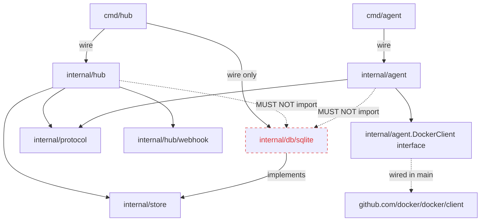

# Phase 2: GitHub Webhook → Job Dispatch → Reverse Proxy (End-to-End Preview Lifecycle)

작성일: 2026-04-24
작성자: planner
상태: APPROVED

## 1. Phase 개요

Phase 1이 "Agent를 토큰으로 인증해 online으로 만드는 제어 평면"을 완성했다면, Phase 2는 **GitHub PR 이벤트가 Agent 머신에서 컨테이너로 부화하고, 사용자 브라우저가 `pr-N.preview.localhost:<HUB_PORT>` 호스트 헤더로 그 컨테이너에 도달하기까지의 전 데이터 평면**을 처음으로 닫는다. 종료 시점에 Hub는 (a) `previews`/`preview_events` 테이블과 `PreviewStore` 인터페이스를 가지며, (b) `POST /webhooks/github`에서 `pull_request` 이벤트의 HMAC을 timing-safe 검증하고 `previews` 행을 upsert/teardown하고, (c) Agent의 `READY {capacity}` 메시지에 응답해 라벨 매칭된 preview를 race-free로 `ClaimPreview`한 뒤 `JOB_ASSIGN`으로 전송하며, (d) 호스트 헤더 `pr-{n}.preview.<base-domain>(:port)?`가 들어오면 매칭되는 running preview의 Agent 주소로 `httputil.NewSingleHostReverseProxy`를 통해 트래픽을 흘리고, (e) 1분 reconciliation 루프가 5분 이상 `assigned`로 멈춘 preview를 `queued`로 되돌린다. Agent는 `--work-dir`/`--prefetch-interval` 플래그로 RepoCache(bare clone + worktree per preview)를 운영하며, `JOB_ASSIGN` 수신 시 `building → running` 전이를 STATUS_UPDATE로 보고하고 `JOB_TEARDOWN` 시 컨테이너 stop+rm + worktree remove까지 수행한다. 검증은 **세 단계 Step (S1: webhook→DB, S2: dispatcher+job exec, S3: proxy+teardown)**으로 분할되어 evaluator가 단계별 부분 평가를 할 수 있다.

### 1-1. Evaluator 실행 환경 가정

- Shell: **bash on Linux/macOS/WSL/Git Bash** (POSIX sh 호환). PowerShell/cmd.exe 네이티브는 대상 아님.
- Go 툴체인: **Go 1.22 이상**.
- 필수 CLI: `curl`, `jq`, `grep`(GNU 호환), `find`, `awk`, `wc`, `kill`, `sleep`, `openssl`(HMAC sha256 생성용), `git`(Agent RepoCache 단위 검증).
- **권장 CLI**: `sqlite3` (DB 직접 조회/seed 시 가장 단순). 미설치 환경 대비 대안은 §6 Step별 사전 절차 + Hub 서브커맨드(`go run ./cmd/hub previews list`, `go run ./cmd/hub previews seed-stale --pr=N`) 제공.
- **Docker** (Step 2/3): Docker Desktop 또는 Docker Engine 24+ 가 evaluator 머신에서 동작 중이어야 함. `docker info` exit 0 확인. **Docker 미설치 환경에서는 S2-Live·S3-Live 항목을 UNVERIFIED로 처리**하되 `internal/agent/runner.go`가 fake docker client를 주입받아 동작하는 단위 테스트는 통과해야 한다(NF-Test-Docker-1).
- 포트: Phase 2 는 Phase 1과 같은 기본 `:3000` 사용. 충돌 시 `HUB_ADDR=:3001` 등으로 오버라이드. 검증 명령은 `PORT=${HUB_PORT:-3000}`을 export한 전제. Reverse proxy 호스트 헤더 검증은 `pr-1.preview.localhost:$PORT` 형식.
- 호스트 이름 해석: `*.localhost`는 macOS/Linux/WSL에서 자동 `127.0.0.1` resolve. Windows는 hosts 파일 또는 Git Bash MSYS2 환경 의존. **검증 명령은 `curl --resolve pr-1.preview.localhost:$PORT:127.0.0.1 ...`로 OS 의존을 제거**(F-S3-* 참조).
- 네트워크: 외부 인터넷 접근 가능(GitHub clone). 폐쇄망에서는 §6 Step 2 사전 절차의 옵션 B(로컬 git fixture, `file://`)를 사용한다.
  - **폐쇄망 한 줄 예시**: `git init --bare /tmp/preview-fixture` 로 bare 저장소 생성 후 Agent에 `--repo-url=file:///tmp/preview-fixture` 지정. 상세 절차는 §6 Step 2 사전.
- 타이밍: sleep 기반 검증은 2배 마진. dispatcher 재시도 루프는 최대 100ms; reconciliation은 1분 주기이지만 검증은 `--reconcile-interval=2s` 플래그로 단축(NF-Reconcile-1).

## 2. 범위와 비범위

### 범위 (In Scope)

- **DB 마이그레이션 추가**: `db/migrations/0002_previews.up.sql` + `0002_previews.down.sql`. `previews` 테이블(§5-4) + `preview_events` 테이블. 양쪽 DB 호환 SQL.
- **sqlc 쿼리**: `db/queries/previews.sql`에 `UpsertPreview`, `ListQueuedPreviewsForLabels`, `ClaimPreview`, `UpdatePreviewStatus`, `ListRunningPreviewsByAgent`, `GetPreviewByID`, `FindPreviewByHost`, `ListStaleAssignedPreviews`, `InsertPreviewEvent`, `ListPreviews`(관리용), `ResetAllAssignedPreviews`, `SeedStaleAssignedPreview`(test-only) 추가.
- **PreviewStore 인터페이스 신설**: `internal/store/store.go`에 `PreviewStore` 메서드 9개 첫 도입 (§5-1, 결정 1). 운영 특수 메서드(`ResetAllAssigned`)는 인터페이스 밖 구체 타입(결정 11 패턴 재사용).
- **SQLite 구현체**: `internal/db/sqlite/preview_store.go` — sqlc 생성 코드를 감싸 `PreviewStore` 만족.
- **Webhook 엔드포인트**: `POST /webhooks/github`. `X-Hub-Signature-256` HMAC-SHA256 timing-safe 검증(`hmac.Equal`). `pull_request` 이벤트 외 모든 이벤트는 200 + `{"ignored":true}`. action 분기:
  - `opened` / `synchronize` / `reopened` → `UpsertPreview`(필드 갱신만, status 결정 없음, §5-5) + 핸들러가 별도로 `UpdateStatus(done|failed → queued)` 호출(재오픈 시) 또는 신규 row면 INSERT 시점에 status='queued'로 들어감
  - `closed` → `UpdateStatus(*→teardown)` + Agent에 `JOB_TEARDOWN` enqueue
- **Dispatcher 루프**: Agent의 `READY {capacity}` 메시지 수신 처리. capacity 만큼 Claim 시도. 라벨 매칭은 Go(§5-7), Claim은 `ClaimPreview` 쿼리(§5-5).
- **Reconciliation 루프**: Hub 기동 후 별도 goroutine. 1분 주기(`--reconcile-interval` 플래그로 단축). 5분 이상 `assigned`인 preview를 `queued`로 되돌림 + offline agent의 running preview는 보존 + 로그(Phase 3 정책 표시).
- **Hub Reverse Proxy**: 호스트 헤더 매칭. `pr-{n}.preview.<base-domain>` (또는 `:port` 포함) → `previews` 조회 → `httputil.NewSingleHostReverseProxy` 로 `http://<agent_host>:<agent_port>` 전달. 매칭 실패는 기존 라우팅 fallthrough(§5-12 미들웨어 패턴).
- **Hub Admin API 확장**: `GET /admin/previews`, `GET /admin/previews/{id}`, `DELETE /admin/previews/{id}` (수동 teardown). 응답 shape는 §5-3.
- **Hub CLI 확장**: `previews list`, `previews show <id>`, `previews seed-stale --pr=N`(test-only, sqlite3 미설치 대안). (HTTP의 동등 기능, 데몬 미기동 시도 동작 — Phase 1 `agents list` 패턴 재사용.)
- **Agent CLI 확장**: `--work-dir`(기본 `~/.hub-agent`), `--prefetch-interval`(기본 `5m`, `0`은 비활성화), `--repo-url`(필수, Agent 1개=레포 1개 가정), `--build-timeout`(기본 `10m`), `--clone-timeout`(기본 `10m`), `--docker-host`(기본 OS 기본값).
- **Agent RepoCache**: `internal/agent/repocache.go`. bare clone + `git worktree`. mutex로 fetch 직렬화. Background prefetch ticker. 디렉토리 레이아웃·repo-slug 규칙은 §5-13.
- **Agent Runner**: `internal/agent/runner.go`. Job 수신 → STATUS_UPDATE(building) → repoCache.Ensure → Checkout → Dockerfile 존재 확인 → docker build → 동적 포트 할당 → docker run → STATUS_UPDATE(running, host, port). `map[previewID]runningJob` + mutex.
- **Agent Teardown 처리**: `JOB_TEARDOWN` 수신 → 컨테이너 stop+rm → worktree remove → STATUS_UPDATE(done).
- **Agent 재시작 시 컨테이너/worktree 복원·고아 정리**: `docker ps --filter label=hub-preview-id=*`로 살아있는 컨테이너 발견 + 라벨에서 previewID 추출 + 메모리 jobs 맵 복원. 복원된 컨테이너 ID와 DB 상태(`ListByAgent`)를 비교해 DB에 없거나 `teardown/done/failed` 상태인 컨테이너는 stop+rm. `git worktree list` ↔ DB running 비교로 고아 worktree는 `git worktree remove --force` + `os.RemoveAll`. (§4-7-1 흡수.)
- **메시지 프로토콜 확장**: Phase 1에서 상수만 동결한 `READY`, `JOB_ASSIGN`, `STATUS_UPDATE`, `LOG`, `JOB_TEARDOWN` 의 **구조체 정의** (§5-2). `LOG`는 구조체만 정의, 송수신 와이어링은 본 Phase에서 **선언만** 하고 Phase 3 이월(결정 14).
- **Docker SDK 의존 추가**: `github.com/docker/docker/client`. 인터페이스 `agent.DockerClient`로 감싸 단위 테스트에서 fake 주입.
- **단위·통합 테스트**: HMAC 검증, 라벨 매칭, ClaimPreview race(고루틴 50개) + multi-candidate race(F-S2-2-b), RepoCache fetch mutex, Reverse proxy host 파싱·캐시 invalidation, Reconciliation, Runner with fake docker.
- **문서 업데이트**: README "로컬 실행"에 Phase 2 검증 플로우 추가. `.env.example`에 `GITHUB_WEBHOOK_SECRET`, `PREVIEW_BASE_DOMAIN`(이미 존재), `AGENT_REPO_URL`, `AGENT_WORK_DIR`, `AGENT_PREFETCH_INTERVAL` 추가.

### 비범위 (Out of Scope — 이번 Phase에 하지 않음)

- 관리자 웹 UI / Playwright e2e → Phase 3.
- `LOG` 메시지 wiring (docker logs → Hub 스트리밍) → 구조체만 선언, 송수신 미구현(결정 14).
- multi-repo 라우팅 (한 Hub가 여러 GitHub 레포의 preview를 동시에 호스팅) → Phase 3+(결정 2).
- 빌드 실패 자동 재시도 → 본 Phase는 **재시도 없음**, push로 trigger.
- 컨테이너 헬스체크 / 빌드 캐시 공유 / 멀티 아키텍처 빌드 → 후속.
- `gh-ost`-style zero-downtime 마이그레이션, multi-Hub HA, Postgres 실연결 → 후속.
- Token rotation, audit log → 후속.
- **Reverse proxy WebSocket upgrade 라우팅·HTTP/2·gRPC 트레일러·대용량 요청 본문(>10MB) 스트리밍 보증**: 본 Phase는 HTTP/1.1 단방향 요청-응답만 검증 범위. `httputil.ReverseProxy`가 자동 지원하는 Upgrade 헤더는 **미검증**으로 둠(Phase 3).

## 3. 설계 결정 및 근거

### 결정 1: `PreviewStore`를 본 Phase에서 첫 도입, 메서드 9개 + 운영 특수 1개는 인터페이스 밖

- **결정**: `internal/store/store.go`에 `PreviewStore` 인터페이스 첫 선언. 메서드는 `Upsert`, `GetByID`, `FindByHost`, `ListQueuedForCandidates`, `Claim`, `UpdateStatus`, `ListRunningByAgent`, `ListStaleAssigned`, `ListByAgent` 9개. `InsertPreviewEvent`는 `Upsert`/`UpdateStatus` 내부에서 같은 트랜잭션으로 호출되며 외부에 노출되지 않는다(상태 변경 단일 진입점). 운영 특수 메서드 `ResetAllAssigned`(Hub 재기동 시 dispatch flap 방지)는 결정 11(Phase 1) 패턴 재사용해 `*sqlitePreviewStore` 구체 타입 메서드.
- **근거**:
  1. Phase 0 §9·Phase 1 §9-0에서 명시적으로 `PreviewStore` Phase 2 이월. 메서드는 사용자 요구사항 7개 + reconciliation 2개로 자연스럽게 9개.
  2. `InsertPreviewEvent` 외부 노출 시 호출자가 status 변경 없이 이벤트만 기록하는 우회 경로를 만들 수 있음 — `internal/hub` 도메인 전체에서 status 변경의 단일 진입점을 깨뜨림(CLAUDE.md "상태 전이는 단일 진입점").
  3. 사용자 요구 "preview_events는 상태 변경 시마다 Go 헬퍼로 기록 (트리거 X)" 의 정확한 구현 = "store가 status update 트랜잭션 안에서 event를 함께 INSERT".
  4. `ResetAllAssigned`는 Hub crash 시 잔존 `assigned` 레코드를 `queued`로 일괄 복구 — 운영 특수 경로이므로 인터페이스 표면에 두지 않음. Reconciliation 루프가 동등 기능을 분당 수행하지만 기동 직후 0~60s gap을 메우기 위해 startup hook으로 1회 호출.
- **버려진 대안 A**: `InsertPreviewEvent`를 인터페이스에 노출. 호출자 자유도 증가하지만 상태/이벤트 일관성 깨짐. 기각.
- **버려진 대안 B**: `Claim`을 `Dispatch` 같은 도메인 동사로 묶고 라벨 매칭까지 포함. 라벨 매칭이 SQL이 아닌 Go에 머물러야 이식성 확보(결정 4)이므로 Store 메서드는 dumb 한 단계로 유지.
- **되돌림 비용**: 낮음. 인터페이스에 메서드 추가/제거는 컴파일러가 모든 호출자를 잡아냄.

### 결정 2: 호스트 헤더 라우팅 규약은 `pr-{n}.preview.<base-domain>` (multi-repo 미지원)

- **결정**: 정규식 `^pr-(\d+)\.preview\.([^:]+)(?::\d+)?$` 로 호스트 헤더 파싱(콜론 제외 명시). PR 번호 + base-domain 두 개 캡처. base-domain은 `PREVIEW_BASE_DOMAIN`과 정확 일치 검증. 매칭된 preview row가 1개라는 가정(=한 Hub 인스턴스가 단일 GitHub 레포만 담당). 0개면 fallthrough(매칭 실패 → 기존 admin/webhook 라우팅), 2개 이상이면 `500 multi_repo_not_supported`. **시그니처**: `MatchHost(host string) (prNumber int, base string, ok bool)`.
- **근거**:
  1. 사용자 요구 원문: "한 Hub 인스턴스가 단일 GitHub 레포만 담당하는 가정. multi-repo 라우팅은 Phase 3 이후."
  2. lazy `(.+?)` 는 콜론을 잡거나 못 잡거나 백트래킹 의존 — 모호. `[^:]+`로 콜론 제외 명시하면 hostname 캡처와 port 분리가 결정적.
  3. `prv-<uuid>.preview.localhost` 같이 preview_id 기반 호스트 키도 검토했으나 (a) 사용자 검증 플로우의 `pr-1.preview.localhost:3000`이 PR 번호 기반이고, (b) UUID는 사람이 외우거나 link로 전달하기 어려워 DX 손해.
  4. 동일 PR 번호가 여러 레포에 있을 가능성은 multi-repo Phase에서 `<repo-slug>--pr-<n>.preview.<base-domain>` 같은 확장 슬러그로 해결 — 본 Phase에선 발생 시 명시적 500.
- **버려진 대안 A**: `prv-<uuid>` 호스트. UUID 가독성 손해. 기각.
- **버려진 대안 B**: `pr-{n}-{repo-slug}.preview.<base-domain>` 부터 멀티-repo 지원. Phase 2 범위 확장 + 검증 부담 → 기각.
- **되돌림 비용**: 중간. 정규식 + DB lookup 1곳 교체. Phase 3에서 호스트 슬러그 표준화하면서 마이그레이션.

#### 정규식 입력→출력 매핑 (단위 테스트 케이스 표)

| 입력 host | prNumber | base | ok |
|---|---|---|---|
| `pr-1.preview.localhost:3000` | 1 | `localhost` | true |
| `pr-42.preview.localhost` | 42 | `localhost` | true |
| `pr-7.preview.example.com:8443` | 7 | `example.com` | true |
| `pr-7.preview.dev.example.com` | 7 | `dev.example.com` | true |
| `preview.localhost:3000` | 0 | `` | false (pr-N 부재) |
| `pr-abc.preview.localhost` | 0 | `` | false (숫자 아님) |
| `pr-1.preview.localhost:abc` | 0 | `` | false (port 비숫자) |
| `pr-1.PREVIEW.localhost` | 0 | `` | false (대소문자 — 호스트 헤더는 보통 lower로 정규화되지만 본 Phase는 case-sensitive 매칭, 운영자가 lower 강제 가정) |
| `prefix-pr-1.preview.localhost` | 0 | `` | false (^ 앵커) |

이후 base가 정규식으로 통과해도 `PREVIEW_BASE_DOMAIN` 정확 일치 검증을 거치며, 불일치면 fallthrough.

### 결정 3: HMAC 검증은 `crypto/hmac.Equal` 사용 (timing-safe)

- **결정**: `X-Hub-Signature-256` 헤더 파싱 → `sha256=<hex>` 형식 검증 → `hmac.New(sha256.New, []byte(secret))`로 본문 해싱 → `hmac.Equal([]byte(expected), []byte(received))` 비교. `bytes.Equal` 또는 `==` 비교는 **금지**(린트 grep으로 강제, NF-Security-1).
- **근거**:
  1. `bytes.Equal` 또는 string `==` 는 짧은 차이에서 빠르게 false를 반환 → 타이밍 공격으로 byte-by-byte 추론 가능.
  2. `crypto/hmac.Equal`은 내부적으로 `crypto/subtle.ConstantTimeCompare`를 호출 — 길이가 다르면 0(불일치)을 반환하면서도 동일 시간 소비.
  3. GitHub 공식 문서가 권장하는 검증 방식과 일치.
- **버려진 대안**: `bytes.Equal` 또는 `string ==`. 즉각 기각.
- **되돌림 비용**: 매우 낮음. 한 줄.

### 결정 4: 라벨 매칭은 Go 메모리에서만 (DB JSON 함수 회피)

- **결정**: Hub는 Agent의 라벨을 `agents.labels` JSON 컬럼에서 디코드해 메모리(`map[agentID]map[string]string`)에 보관. `previews.labels`도 `Upsert` 시 디코드해 `Preview` 도메인 객체 필드로 보유. 매칭 함수 `func labelsMatch(previewLabels, agentLabels map[string]string) bool`은 §5-7에 시그니처/테이블로 명시. SQL의 `json_extract`(SQLite)·`->>`(Postgres) 등 DB JSON 함수는 사용 금지(NF-Portability-3 grep).
- **근거**:
  1. CLAUDE.md "이식성 원칙" — SQLite·Postgres 양쪽 호환 SQL만. `json_extract`는 SQLite, `->>`는 Postgres 전용. Cross-DB 표준 부재.
  2. Agent labels는 보통 ≤10 entry, 매치 횟수도 dispatch 시점만 → 메모리 매칭 비용 미미.
  3. SQL은 dumb fetch만 담당하면 race-free Claim 쿼리(결정 5)도 단순화.
- **버려진 대안**: SQL `json_extract` 사용 + DB별 분기 코드. 분기 표면 증가, 이식성 원칙 훼손. 기각.
- **되돌림 비용**: 낮음. 함수 1개 + 호출 위치 1곳.

#### 매칭 의미론(테이블)

| `preview.labels` | `agent.labels` | 결과 |
|---|---|---|
| `{}` | `{}` | match (둘 다 비어있음) |
| `{}` | `{env:home}` | match (preview가 요구 없음 → 모든 agent가능) |
| `{env:home}` | `{}` | **no match** (agent에 `env`가 없음) |
| `{env:home}` | `{env:home, owner:alice}` | match (subset) |
| `{env:home,owner:alice}` | `{env:home}` | no match (owner 부족) |
| `{env:home}` | `{env:office}` | no match (값 불일치) |

정의: `forall (k,v) in preview.labels: agent.labels[k] == v`. 빈 preview labels는 vacuously true → 모든 agent 매치.

### 결정 5: ClaimPreview는 SQLite·Postgres 공통 race-free 패턴 (sqlc.slice 후보)

- **결정**: `ClaimPreview` SQL은 candidate IDs 슬라이스를 받아 한 row만 `assigned`로 업데이트:

```sql
-- name: ClaimPreview :one
UPDATE previews
SET status = 'assigned',
    assigned_agent_id = ?,
    updated_at = ?
WHERE id = (
  SELECT id FROM previews
  WHERE status = 'queued'
    AND id IN (sqlc.slice('candidate_ids'))
  ORDER BY created_at ASC
  LIMIT 1
)
RETURNING *;
```

`RETURNING *`이 0행이면 `sql.ErrNoRows` → dispatcher가 다음 후보로 재시도. 호출 측은 최대 3회 재시도 후 capacity 1 슬롯을 다음 READY 사이클로 이월.

- **근거**:
  1. SQLite는 `SELECT ... FOR UPDATE SKIP LOCKED` 미지원. 그러나 SQLite의 writer는 직렬화되어 있으므로(`SetMaxOpenConns(1)` Phase 1 결정 8) 동시 업데이트가 직렬 처리됨 — race-free의 직접 원천은 SQLite의 직렬 writer + **`UPDATE` 의 `WHERE status='queued'` 필터가 CAS 가드 역할**(이미 `assigned`로 바뀐 row는 매칭 0행 → 0행 영향). row lock 자체가 race-free 원천이 아님을 정정.
  2. Postgres는 같은 SQL이 동작하나 동시성에서 `SELECT ... LIMIT 1`이 두 트랜잭션에 같은 id를 줄 수 있음. 그러나 두 번째 트랜잭션의 `UPDATE ... WHERE status='queued'`는 첫 트랜잭션이 commit 후 row를 다시 평가(read-committed) — 이미 `assigned`로 바뀌었으므로 0행 영향. 즉 `WHERE status='queued'`가 SQLite·Postgres 공통의 CAS 가드.
  3. `sqlc.slice('candidate_ids')`는 sqlc가 SQLite·Postgres 양쪽에서 동등 코드 생성. 검증: `sqlc generate` 후 `agents.sql.go` 패턴과 동일.
- **버려진 대안 A**: `BEGIN IMMEDIATE` + `SELECT` + `UPDATE` 두 단계. 코드 복잡도 증가, 트랜잭션 boundary가 호출자 책임. 기각.
- **버려진 대안 B**: Postgres `FOR UPDATE SKIP LOCKED` 분기. 이식성 위반. 기각.
- **되돌림 비용**: 중간. 쿼리 + dispatcher 재시도 루프를 함께 변경.

### 결정 6: Docker 제어는 SDK (`github.com/docker/docker/client`), `os/exec` 미사용

- **결정**: Agent는 `github.com/docker/docker/client.NewClientWithOpts(client.FromEnv)`로 시작. `internal/agent/docker.go`에 인터페이스 `DockerClient`를 정의해 단위 테스트는 fake 주입. 메서드: `ImageBuild(ctx, BuildContext, opts) (BuildResponse, error)`, `ContainerCreate(...)`, `ContainerStart(...)`, `ContainerStop(...)`, `ContainerRemove(...)`, `ContainerInspect(...)`, `ContainerList(ctx, filters)`. SDK가 노출하는 모든 호출은 `context.Context` 우선 인자.
- **근거**:
  1. AGENTS.md 기술 스택이 `github.com/docker/docker/client` 못박음.
  2. `os/exec("docker")`는 환경 의존(설치/PATH/버전), stdout 파싱 부담, JSON 라인 스트림 핸들링 어려움. SDK는 stream/error 정형 객체.
  3. SDK transitive deps (수 MB) 부담은 인정 — Agent 바이너리만 영향, Hub는 영향 없음. Hub/Agent 분리 바이너리 결정(Phase 0 결정 1)이 이 비용을 격리.
  4. 단위 테스트가 인터페이스 mocking으로 통과하므로 Docker 미설치 환경 evaluator도 단위 레벨 검증 가능(NF-Test-Docker-1).
- **버려진 대안 A**: `os/exec("docker")`. 환경 의존·파싱 부담. 기각.
- **버려진 대안 B**: `containerd` 직접 호출. 추상도 더 낮고 cross-platform 부담 큼. 기각.
- **되돌림 비용**: 중간. SDK 인터페이스가 캡슐화되어 있으므로 교체 시 어댑터 1개. 그러나 현실적으로 다시 옮길 가능성 낮음.

### 결정 7: GitHub 페이로드는 자체 minimal DTO, `go-github` 미채택

- **결정**: `internal/hub/webhook/payload.go`에 5개 필드만 가진 DTO 정의:

```go
type PullRequestEvent struct {
    Action      string `json:"action"`
    Number      int    `json:"number"` // 또는 PullRequest.Number
    PullRequest struct {
        Number int `json:"number"`
        Head   struct {
            SHA string `json:"sha"`
            Ref string `json:"ref"`
        } `json:"head"`
    } `json:"pull_request"`
    Repository struct {
        FullName string `json:"full_name"`
    } `json:"repository"`
}
```

- **근거**:
  1. `go-github` 라이브러리는 GitHub REST API 클라이언트 + 모든 webhook 이벤트 타입 + OAuth 등 transitive 30+ 패키지. 본 Phase는 `pull_request` 이벤트의 5개 필드만 사용 — over-engineering.
  2. 자체 DTO는 GitHub의 webhook payload 스키마 변경(Field 추가) 시 자동으로 안전(JSON unmarshal은 unknown field 무시).
  3. 의존 추가 폭을 최소화 → NF-Deps-1을 6개로 유지.
- **버려진 대안**: `github.com/google/go-github/v62`. 의존 폭 큼. 기각.
- **되돌림 비용**: 매우 낮음. DTO 추가만.

### 결정 8: 동적 포트 할당은 `net.Listen(":0")` + 충돌 시 1회 재시도

- **결정**: Agent runner가 `l, _ := net.Listen("tcp", "127.0.0.1:0"); port := l.Addr().(*net.TCPAddr).Port; l.Close()`로 free port 추출. 직후 `docker run -p <port>:<exposed>`. 컨테이너 시작이 "port already in use"로 실패하면 1회 재시도(다른 포트). 두 번째도 실패하면 status=failed + error_message. 분리된 함수 `allocatePort(retries int)`로 단위 테스트 가능.
- **근거**:
  1. `:0` listen은 OS ephemeral range에서 즉시 free port를 보장. close 후 docker run까지 race window는 보통 수 ms — 충돌 빈도 낮음.
  2. 1회 재시도는 단순 + 라이브 환경에서 충분. Phase 후속에서 retry/backoff 다듬기.
  3. 시스템 ephemeral range 무작위 선택은 충돌 빈도가 높고 OS별 range 다름 — 복잡도 큼.
- **버려진 대안 A**: 무재시도. 첫 충돌에 failed → 라이브 PR 워크플로 마찰.
- **버려진 대안 B**: 사전 reserved port pool. capacity 늘릴 때마다 운영자 작업 필요. 기각.
- **되돌림 비용**: 낮음.

### 결정 9: Agent = 1 레포 1 Agent (한 Agent가 여러 레포 미지원)

- **결정**: Agent CLI에 `--repo-url <url>` 필수 플래그(env `AGENT_REPO_URL`). RepoCache는 단일 bare clone. `JOB_ASSIGN`의 repo_url이 일치하지 않으면 STATUS_UPDATE(failed, message="repo mismatch") + 컨테이너 시작 거부.
- **근거**:
  1. 사용자 요구 원문: "한 Agent = 한 레포 담당. PR마다 clone 안 하고 git worktree로 절약."
  2. multi-repo 지원은 (a) RepoCache 인덱싱 키 확장, (b) Agent label routing이 repo도 포함, (c) Hub 라우팅 호스트도 repo 슬러그 포함 — Phase 2 범위 폭증.
  3. Phase 3+에서 `--repo-url`을 반복 플래그로 확장하면 됨 — DX 영향만.
- **버려진 대안**: 처음부터 multi-repo. 범위 폭증. 기각.
- **되돌림 비용**: 중간. CLI 플래그 + RepoCache 인덱싱.

### 결정 10: capacity = 1 출발, READY 메시지가 capacity 만큼 반복 발송 (검증은 N=1 위주)

- **결정**: Agent는 `--max-jobs N`(기본 1)으로 동시 실행 한도 보유. 시작 시 N개의 READY를 동시 발송하지 않고 **현재 비어있는 슬롯 수만큼 READY 발송**(완료/실패 시 슬롯 1개 회수 후 새 READY). 즉 "READY 1통 = 슬롯 1개 요청". Hub는 각 READY를 독립적 Claim 시도로 처리. capacity field는 **READY 메시지 페이로드에 포함하지 않음** — 단순화. 같은 preview가 두 번 잡히지 않는 안전성은 ClaimPreview의 row-level update가 보장.
- **근거**:
  1. 사용자 요구 원문: "capacity가 여러 개면 Agent가 여러 READY 보내는 식 (단순함)" — capacity 페이로드 없이 발송 빈도로 표현.
  2. N=1로 검증 시 race가 발생하지 않으므로 단위/E2E가 빨라짐. N>1은 단위 테스트(고루틴 50개 ClaimPreview 동시 호출, NF-Test-Race-1)로 race-free 보장 검증.
  3. `READY {capacity}`도 사용자 요구 원문에 등장하지만 메시지 페이로드 없이 빈도로 충분 — 페이로드 추가 시 Hub의 카운팅 책임 발생, 거부.
- **버려진 대안 A**: `READY {capacity:N}` 페이로드 + Hub가 카운팅. Hub 측 상태 증가, Agent 슬롯 회수 책임 분산. 기각.
- **버려진 대안 B**: capacity 무한 (Agent가 무한 READY). 백프레셔 역할 상실. 기각.
- **되돌림 비용**: 낮음. READY 빈도 정책만 변경.

### 결정 11: preview.status는 단일 진입점 (`PreviewStore.UpdateStatus`)에서 트랜잭션으로 변경 + event 기록

- **결정**: 모든 status 전이는 `PreviewStore.UpdateStatus(ctx, id, fromStatus, toStatus, message string, now time.Time, fields PreviewFields)`만 호출. 구현체는 단일 트랜잭션에서 (a) 현재 status가 `fromStatus`인지 확인 후 update(0행이면 `ErrStaleState`), (b) `preview_events` 행 INSERT. 이중 update / dangling event 방지. SQL 트리거 미사용(이식성).
- **`Upsert`와의 관계**: Upsert SQL은 **status를 절대 변경하지 않는다**(commit_sha/branch/labels/updated_at만 갱신). 신규 INSERT 시점에는 SQL `DEFAULT 'queued'`로 status=queued + `preview_events`에 `from_status=NULL → to_status=queued` 1행 INSERT. 기존 row이고 status가 `done|failed`였다가 새 push로 재오픈 시, **webhook handler가 `Upsert` 후 별도로 `UpdateStatus(done|failed → queued, ...)`를 호출**한다(handler가 Upsert의 returning row에서 이전 status를 읽어 분기). 이로써 결정 11의 "status 변경은 UpdateStatus 단일 진입점" 원칙을 깨뜨리지 않는다.
- **근거**:
  1. 사용자 요구 원문 "preview_events는 상태 변경 시마다 Go 헬퍼로 기록 (트리거 X)" + "모든 DB 쓰기 transaction".
  2. CLAUDE.md "상태 전이는 단일 진입점에서만". Upsert SQL이 status를 분기하면 이 원칙이 깨짐.
  3. `fromStatus` CAS 패턴은 dispatcher가 `assigned → building` 전이 시 racing teardown(`assigned → teardown`)을 안전하게 거절.
- **버려진 대안 A**: status update와 event insert를 별도 트랜잭션. dangling event 위험. 기각.
- **버려진 대안 B**: Upsert SQL이 자체 트랜잭션에서 SELECT+INSERT/UPDATE+event를 모두 처리. atomic하지만 status 변경 진입점이 두 곳(Upsert/UpdateStatus)으로 분산 — 결정 11과 정합성 깨짐. 기각.
- **되돌림 비용**: 낮음.

#### preview_events INSERT 정책 (룰 표)

| 호출 | 신규 row? | status 변경? | event INSERT 건수 | from_status | to_status |
|---|---|---|---|---|---|
| `Upsert`(action=opened, 신규) | yes | n/a (DEFAULT queued) | 1 | NULL | queued |
| `Upsert`(action=synchronize, 기존 status 변경 없음) | no | no | **0** | — | — |
| `Upsert`(action=opened/synchronize, 기존, 핸들러가 별도 UpdateStatus 호출) | no | yes (UpdateStatus가) | 1 (UpdateStatus가 INSERT) | done\|failed | queued |
| `UpdateStatus(from→to)` 일반 경로 | n/a | yes | 1 | from | to |
| `UpdateStatus`에서 fromStatus CAS 실패 (0행) | n/a | no | 0 (트랜잭션 rollback) | — | — |

규칙 정리: **(R1)** UpdateStatus는 성공 시 항상 event 1건. **(R2)** Upsert는 INSERT(신규)면 event 1건(NULL→queued), UPDATE이면서 status 동일이면 event 0건. **(R3)** Upsert는 status를 변경하지 않으므로 status 전이 event를 만들지 않는다(R2의 "신규"만 예외).

### 결정 12: Reconciliation 루프 주기 = 60s, 검증은 `--reconcile-interval` 플래그로 단축

- **결정**: Hub는 `internal/hub/reconciler.go` 별도 goroutine. 기본 주기 60s. CLI 플래그 `--reconcile-interval=2s`로 검증 환경에서 단축. 작업: (1) `ListStaleAssignedPreviews(staleAfter=5min)` → `UpdateStatus(assigned→queued, message="reconciliation: stale assigned")` (5분은 사용자 요구). (2) offline agent의 running preview는 보존 + 카운트 로그(`reconciler_orphan_running{count=N}`). teardown은 Phase 3 정책.
- **근거**:
  1. dispatcher가 assigned 직후 crash하면 preview가 영원히 갇힘 → 1분 주기로 안전망.
  2. 5분 임계는 Agent가 실제 building에 들어갈 시간 + STATUS_UPDATE(building) 도착 여유. building 상태로 전이되면 reconciliation 대상 아님.
  3. 검증을 위해 60s 대기 강요는 NG → 플래그로 단축. 단축 시에도 5분 임계는 유지(절대 시간이라 sleep 5분 강요? — 아니고 `--stale-after` 플래그로 함께 단축).
- **버려진 대안 A**: 30s. 더 빠른 복구지만 dispatcher race 여유 줄어듦.
- **버려진 대안 B**: 5min. 너무 느림. 기각.
- **되돌림 비용**: 매우 낮음.

### 결정 13: RepoCache fetch는 mutex 직렬화, worktree 작업은 mutex 외부

- **결정**: `RepoCache.fetch(ctx)`만 `sync.Mutex` 보호. `git worktree add/remove`는 mutex 외부에서 호출 가능. 이유: `git fetch`는 `.git/objects/`에 동시 쓰기 시 corruption 위험; `git worktree add`는 본 worktree 디렉토리 생성 + ref 갱신만 — 다른 worktree 작업과 독립.
- **근거**:
  1. 사용자 요구 원문: "git fetch는 mutex 직렬화 (background와 job fetch 충돌 방지)", "worktree add/remove는 fetch와 독립 → 병렬 가능".
  2. fetch와 worktree-add를 동시 실행할 때 worktree-add가 참조하는 sha가 fetch 중일 가능성 — 하지만 실제로는 (a) prefetch 덕분에 sha가 거의 항상 로컬 존재, (b) 동시 시 worktree-add는 ref가 없으면 명확히 실패하고 runner가 fetch 호출 후 재시도. 단순한 mutex 정책으로 충분.
  3. 모든 worktree 작업을 단일 mutex로 묶으면 N개 동시 job이 직렬화되어 N>1 capacity의 의미가 사라짐.
- **버려진 대안**: 단일 RWMutex (fetch=W, worktree=R). 의미가 모호하고 RW 패턴은 fetch가 worktree 진행 중에 차단 — 의도와 반대 방향이라 잘못된 추상.
- **되돌림 비용**: 중간. 동시성 모델 재설계.

#### Checkout 사전 확인 정책 (권고 수용)

`Checkout(previewID, sha)` 진입 시 먼저 `git rev-parse --verify <sha>^{commit}`을 본 worktree 부모 bare repo에서 시도해 sha가 이미 로컬에 있으면 fetch를 skip하고 바로 `git worktree add <path> <sha>`. 미존재 시에만 fetch(mutex) 호출. prefetch 덕분에 정상 흐름은 fetch skip이 다수.

### 결정 14: `LOG` 메시지는 구조체만 정의, 송수신 미구현

- **결정**: `internal/protocol/messages.go`에 `LogData{PreviewID, Stream, Line, TS}` 구조체만 추가. Hub/Agent 어느 쪽도 본 Phase에서 송수신 코드 작성 안 함. Agent runner의 `docker logs` 스트리밍은 Phase 3.
- **근거**:
  1. 사용자 요구 원문: "(옵션) docker logs 스트리밍 → Hub LOG (Phase 3로 미룰 수 있음)".
  2. preview 동작 검증은 reverse proxy로 충분 — LOG는 운영자 디버깅 편의용.
  3. 구조체를 미리 동결하면 Phase 3에서 와이어 호환성 깨질 일 없음(Phase 1의 Phase 2 메시지 상수 동결 패턴 재사용).
- **버려진 대안 A**: LOG 본 Phase 풀 와이어링. 범위 폭증 + 백프레셔 정책 필요.
- **버려진 대안 B**: 구조체조차 미선언. Phase 3 진입 시 와이어 변경 가능성.
- **되돌림 비용**: 매우 낮음.

### 결정 15: Webhook 서명 누락/잘못 시 401, 본문 파싱 실패는 400, 알 수 없는 event는 200 ignored

- **결정**: 응답 코드 매핑:
  - 헤더 `X-Hub-Signature-256` 부재 또는 형식 오류(`sha256=` 누락) → 401, body `{"error":"missing_signature"}`
  - HMAC mismatch → 401, body `{"error":"invalid_signature"}`
  - 본문이 JSON 파싱 실패 → 400, body `{"error":"invalid_payload"}`
  - `X-GitHub-Event` 가 `pull_request` 외 → 200, body `{"ignored":true,"event":"<received>"}` (서명 검증은 통과해야 200 — 아니면 401 우선)
  - action이 `opened|synchronize|reopened|closed` 외 → 200, body `{"ignored":true,"action":"<received>"}`
  - 정상 처리 → 202, body `{"preview_id":"<uuid>","status":"queued|teardown"}`
- **근거**:
  1. 401 vs 403 — 401은 "credential 없음/잘못", 403은 "credential은 맞으나 권한 부족". HMAC은 credential이므로 401.
  2. 200 vs 202 — RFC 7231: 202 Accepted = "처리 의사는 있으나 비동기 진행". preview는 큐에 들어가는 비동기 처리 → 202 적합.
  3. 서명 검증 실패가 event 무시보다 우선 — 잘못된 서명을 가진 요청은 GitHub 외부의 공격자일 수 있음.
- **버려진 대안 A**: 모두 200. 디버깅 어려움.
- **버려진 대안 B**: invalid_signature → 403. 의미론적 부정확.
- **되돌림 비용**: 매우 낮음.

### 결정 16: ReverseProxy Director Host 처리 + 캐시 invalidation

- **결정**: Hub 의 reverse proxy는 `httputil.NewSingleHostReverseProxy(target)` 의 기본 Director를 그대로 쓰지 않는다. 커스텀 Director 함수가 (a) `req.URL.Scheme = target.Scheme`, (b) `req.URL.Host = target.Host`, (c) **`req.Host = target.Host`** 를 명시 설정한다(기본 Director는 `req.Host`를 변경하지 않아 백엔드가 Host 헤더에 의존하면 깨짐). 커넥션 캐시는 `(previewID, agentHost, agentPort)` 합성 키로 관리하고, preview의 `agent_host`/`agent_port` 필드 변경 또는 status 전이(`running → 그 외`) 시 해당 entry를 evict. WebSocket/HTTP/2 trailer/대용량 본문 한계는 §2 비범위.
- **근거**:
  1. `httputil.ReverseProxy`의 기본 Director는 `req.Host` 보존이 디폴트. localhost fixture에서는 무관하지만 실제 배포에서 백엔드 vhost 라우팅에 의존할 가능성 높음. 명시 설정이 안전.
  2. 캐시 invalidation 부재 시 preview 재배포(컨테이너 교체로 port 변경) 후 stale 주소로 흘러 502가 지속됨. status 전이 시점이 가장 명확한 evict 트리거.
  3. WebSocket Upgrade는 `httputil`이 자동 지원하나 본 Phase 검증 시나리오(브라우저 GET 1회)에 포함되지 않음 → 비범위 명시.
- **버려진 대안 A**: 기본 Director 사용 + 문제는 운영 단계에서. 운영 디버깅 비용 증가. 기각.
- **버려진 대안 B**: 캐시 미사용(매 요청 새 ReverseProxy). 메모리는 절약되지만 keep-alive 풀이 깨짐. 기각.
- **되돌림 비용**: 낮음.

## 4. 아키텍처 / 구조

### 4-1. 디렉토리 트리 (Phase 2 종료 후, 변경 부분만)

```
/
├── cmd/
│   ├── hub/main.go                    # 서브커맨드 dispatch: "" | "migrate" | "agents" | "previews"
│   └── agent/main.go                  # "start" 서브커맨드 (--repo-url, --work-dir, --prefetch-interval, --max-jobs, --build-timeout 추가)
├── internal/
│   ├── hub/
│   │   ├── webhook/
│   │   │   ├── handler.go             # POST /webhooks/github
│   │   │   ├── signature.go           # HMAC 검증 (hmac.Equal)
│   │   │   └── payload.go             # PullRequestEvent DTO
│   │   ├── dispatcher.go              # READY 처리 + Claim 재시도 + JOB_ASSIGN
│   │   ├── proxy.go                   # 호스트 헤더 파서 + ReverseProxyMiddleware (mux wrapper, §5-12)
│   │   ├── reconciler.go              # 1분 루프 (5분 stale assigned)
│   │   ├── handlers_previews.go       # GET/DELETE /admin/previews
│   │   ├── ws_hub.go                  # (Phase 1 유지) + READY/STATUS_UPDATE 라우팅
│   │   └── services/preview_service.go# upsert/teardown/lifecycle
│   ├── agent/
│   │   ├── repocache.go               # bare clone + worktree (§5-13 레이아웃)
│   │   ├── runner.go                  # JOB_ASSIGN 처리 + docker build/run
│   │   ├── docker.go                  # DockerClient 인터페이스 + SDK 어댑터 + fakeDockerClient
│   │   ├── jobs.go                    # map[previewID]runningJob + mutex
│   │   ├── teardown.go                # JOB_TEARDOWN 처리
│   │   └── orphan_cleanup.go          # 재시작 시 컨테이너+worktree 복원/정리 (§4-7-1)
│   ├── store/
│   │   ├── store.go                   # AgentStore + PreviewStore (신규)
│   │   └── errors.go                  # ErrStaleState 추가
│   ├── db/sqlite/
│   │   ├── preview_store.go           # sqlitePreviewStore (PreviewStore 구현)
│   │   ├── preview_queries.sql.go     # sqlc 생성물 (queries/previews.sql 기반)
│   │   ├── migrations_embed.go        # 0002 추가
│   │   └── (기존 파일 유지)
│   └── protocol/
│       ├── messages.go                # ReadyData/JobAssignData/StatusUpdateData/JobTeardownData/LogData 구조체 추가
│       └── version.go                 # ProtoVersion 유지
├── db/
│   ├── migrations/
│   │   ├── 0002_previews.up.sql       # 신규
│   │   └── 0002_previews.down.sql     # 신규
│   ├── queries/
│   │   ├── agents.sql                 # 유지
│   │   └── previews.sql               # 신규 (12개 쿼리)
│   └── schema/schema.sql              # 0001+0002 합본
├── docs/specs/phase-2-webhook-dispatch-proxy.md  # 이 문서
├── .env.example                       # GITHUB_WEBHOOK_SECRET, AGENT_REPO_URL 등 추가
└── go.mod                             # docker/docker 추가
```

### 4-2. 모듈 의존 관계



`depguard` 규칙(Phase 1 결정 13)을 그대로 유지. `docker/docker/client`는 `cmd/agent`에서만 직접 import; `internal/agent`는 인터페이스 `DockerClient`만 알면 된다(NF-Depguard-2).

### 4-3. PR Open → Preview Running 시퀀스 (S1 + S2)

```
GitHub                Hub (webhook)         Hub (dispatcher)        Agent              Docker
  |                       |                        |                  |                   |
  | POST /webhooks/github |                        |                  |                   |
  |   X-Hub-Sig-256: ...  |                        |                  |                   |
  |---------------------->|                        |                  |                   |
  |                       | hmac.Equal(...)        |                  |                   |
  |                       | UpsertPreview(fields)  |                  |                   |
  |                       |   ↳ 신규면 INSERT(status=queued, event NULL→queued)            |
  |                       |   ↳ 기존이고 prev=done|failed면                                |
  |                       |     UpdateStatus(prev→queued, event)  ← 단일 진입점            |
  | 202 {preview_id,..}   |                        |                  |                   |
  |<----------------------|                        |                  |                   |
  |                       |                        |                  | READY (1 slot)    |
  |                       |                        |<-----------------|                   |
  |                       |                        | ListQueuedFor    |                   |
  |                       |                        | Candidates()     |                   |
  |                       |                        | labelsMatch (Go) |                   |
  |                       |                        | Claim → UpdateStatus(queued→assigned, event)  |
  |                       |                        | JOB_ASSIGN       |                   |
  |                       |                        |----------------->|                   |
  |                       |                        |                  | STATUS_UPDATE(building)
  |                       |                        |<-----------------|                   |
  |                       | UpdateStatus(assigned→building, event)  ← 단일 진입점          |
  |                       |                        |                  | repoCache.Ensure  |
  |                       |                        |                  | repoCache.Checkout|
  |                       |                        |                  | docker build      |
  |                       |                        |                  |------------------>|
  |                       |                        |                  |<------------------|
  |                       |                        |                  | net.Listen(":0")  |
  |                       |                        |                  | docker run -p P:E |
  |                       |                        |                  |------------------>|
  |                       |                        |                  | STATUS_UPDATE(running, host, port)
  |                       |                        |<-----------------|                   |
  |                       | UpdateStatus(building→running, fields, event)  ← 단일 진입점   |
```

`event` 표시는 결정 11/§5-1의 `UpdateStatus`가 단일 트랜잭션 안에서 `preview_events` 1건을 INSERT하는 위치. `Claim`은 내부적으로 같은 진입점(트랜잭션)에서 status 전이 + event 기록.

### 4-4. PR Open → Browser Hit (S3 추가)

```
User Browser            Hub (proxy)             Agent Container
  |                         |                          |
  | GET / Host: pr-1.preview.localhost:3000           |
  |------------------------>|                          |
  |                         | regex match → pr_number=1, base=localhost
  |                         | base == PREVIEW_BASE_DOMAIN ?
  |                         | FindPreviewByHost(1)
  |                         | preview.status==running
  |                         | Director: req.URL.{Scheme,Host}=target; req.Host=target.Host
  |                         | proxy → agent_host:agent_port
  |                         |------------------------->|
  |                         |<-------------------------|
  | 200 (app body)          |                          |
  |<------------------------|                          |
```

### 4-5. PR Close → Teardown 시퀀스 (S3)

```
GitHub                Hub                       Agent              Docker
  | action=closed     |                           |                   |
  |------------------>| UpdateStatus(*→teardown, event)               |
  |                   | enqueue JOB_TEARDOWN      |                   |
  |                   |-------------------------->|                   |
  |                   |                           | container stop+rm |
  |                   |                           |------------------>|
  |                   |                           | repoCache.Remove  |
  |                   |                           | (worktree remove) |
  |                   |                           | STATUS_UPDATE(done)|
  |                   |<--------------------------|                   |
  |                   | UpdateStatus(teardown→done, event)            |
  |                   | proxy cache evict(previewID)                  |
```

### 4-6. preview.status 상태 전이

```
[queued] --(ClaimPreview)----------> [assigned]
[queued] --(action=closed)---------> [teardown]    # 큐에서 바로 정리
[assigned] --(STATUS_UPDATE building)-> [building]
[assigned] --(reconciliation 5min)-> [queued]      # 결정 12
[assigned] --(action=closed)-------> [teardown]
[building] --(STATUS_UPDATE running)-> [running]
[building] --(STATUS_UPDATE failed)-> [failed]
[building] --(action=closed)-------> [teardown]
[running]  --(action=closed)-------> [teardown]
[teardown] --(STATUS_UPDATE done)--> [done]
[done|failed] --(action=opened|synchronize)-> [queued]   # 결정 11, handler가 UpdateStatus 호출
[*]        --(STATUS_UPDATE failed)-> [failed]     # 빌드/실행 실패 어느 단계나
```

`UpdateStatus(fromStatus, toStatus, ...)` CAS로 동시 변경 시 한쪽만 성공(결정 11). `failed`는 단말 상태(재시도 없음, push 새 sha만 새 row 생성 — 정확히는 동일 row의 done|failed → queued 재진입).

### 4-7. Agent 내부 동시성

```
agent.run(ctx):
  client = WSClient(ctx, hubURL, token)
  cache  = RepoCache(workDir, repoURL)
  cache.Ensure(ctx)
  if prefetchInterval > 0 { go cache.StartPrefetch(ctx, prefetchInterval) }
  jobs = newJobMap(maxJobs)
  // 재시작 복원: docker labels로 살아있는 컨테이너 발견 + DB 비교 + worktree 정리 (§4-7-1)
  orphanCleanup.Run(ctx, cache, docker, hubRPC)
  loop {
    msg := client.Read(ctx)
    switch msg.Type {
      case JOB_ASSIGN: go runner.Run(ctx, msg, cache, docker, jobs)
      case JOB_TEARDOWN: go teardown.Run(ctx, msg, cache, docker, jobs)
    }
    if jobs.SlotsFree() > 0 { client.Send(READY) }
  }
```

#### 4-7-1. Agent 재시작 시 컨테이너/worktree 복원·고아 정리

**문제**: Agent 프로세스 재시작 시 메모리 `jobs` 맵이 휘발 → 살아있는 컨테이너의 previewID/포트 정보 소실 → 후속 `JOB_TEARDOWN` 도착 시 컨테이너 식별 불가능. 또한 Agent가 panic/SIGKILL로 죽었다가 재기동하지 않은 채 Hub가 다른 Agent에 재배정하면 컨테이너+worktree leak.

**복원 정책 (재시작 시)**:

1. `docker.ContainerList(filters: label "hub-preview-id")`로 살아있는 컨테이너 목록 조회.
2. 각 컨테이너의 `Labels["hub-preview-id"]`에서 previewID 추출 + `Inspect`로 노출 포트 추출.
3. `agent.JobsMap` 에 `runningJob{previewID, containerID, host, port, worktreePath}` 복원.
4. Hub에 `STATUS_UPDATE(running)`을 다시 보내 agent_host/port 재확인(Hub 측 stale 캐시 evict 효과).

**고아 정리 정책 (재시작 시 + 정상 동작 중 1회)**:

1. 복원된 컨테이너의 previewID 집합 vs Hub로부터의 `ListByAgent`(또는 startup 직후 STATUS_QUERY — 본 Phase 미도입) 비교는 **본 Phase 단순 버전: DB 쿼리는 Hub만 가능하므로 Agent는 자기 라벨 컨테이너 목록만 사용**.
2. 컨테이너 라벨에 `hub-preview-id`가 있지만 본 Agent의 `--repo-url` 해시와 다르면 (다른 Agent의 컨테이너) 건너뜀.
3. Agent가 "내 라벨 컨테이너 = 살아있는 jobs"로 가정하고 정상화. Hub 측에 stale `assigned/building` row가 있어도 Hub의 reconciliation(5분 stale → queued)이 별도로 회수.
4. `git worktree list` 실행. 결과 중 `preview-<id>` 패턴 worktree 와 jobs 맵의 previewID 비교. jobs에 없는 worktree는 `git worktree remove --force` + `os.RemoveAll`.

**Agent crash 후 미재기동 시나리오**: 컨테이너+worktree leak 발생. 본 Phase에서는 다음으로 수용:
- Hub reconciliation이 `assigned`만 회수(running은 보존, 결정 12). running 상태는 운영자 수동 정리 또는 Phase 3의 offline-agent 자동 teardown 정책으로 처리.
- 더 정교한 동기화는 Phase 3의 `LIST_RUNNING_PREVIEWS` Hub→Agent RPC.

## 5. 인터페이스 계약

### 5-1. 함수·메서드 시그니처

| 패키지/타입 | 시그니처 | 설명 |
|---|---|---|
| `internal/store.PreviewStore` | `Upsert(ctx, p Preview) (created bool, prev *Preview, err error)` | repo+pr_number 유니크. 존재 시 commit_sha/branch/labels/updated_at 업데이트, 없으면 INSERT + status=queued + event(NULL→queued). **status 변경 없음**. `prev`는 UPDATE 직전 status 보고 (재오픈 분기용) |
| `internal/store.PreviewStore` | `GetByID(ctx, id string) (*Preview, error)` | 미존재 `ErrNotFound` |
| `internal/store.PreviewStore` | `FindByHost(ctx, repoFullName string, prNumber int) (*Preview, error)` | reverse proxy 라우팅용. running/building 상태만. 미존재 `ErrNotFound` |
| `internal/store.PreviewStore` | `ListQueuedForCandidates(ctx) ([]Preview, error)` | 라벨 매칭 후보. status='queued', `ORDER BY created_at ASC`, 모든 라벨 함께 디코드 |
| `internal/store.PreviewStore` | `Claim(ctx, candidateIDs []string, agentID string, now time.Time) (*Preview, error)` | race-free. 0행이면 `ErrNotFound`. 내부적으로 status 전이(queued→assigned) + event 기록 (단일 진입점 위배 아님 — Claim은 UpdateStatus의 특수형이며 event를 함께 기록) |
| `internal/store.PreviewStore` | `UpdateStatus(ctx, id string, fromStatus, toStatus, message string, now time.Time, fields PreviewFields) error` | 단일 트랜잭션 CAS + preview_events INSERT. fields는 nullable 옵션. 0행이면 `ErrStaleState` |
| `internal/store.PreviewStore` | `ListRunningByAgent(ctx, agentID string) ([]Preview, error)` | reconciler용 |
| `internal/store.PreviewStore` | `ListStaleAssigned(ctx, staleAfter time.Time) ([]Preview, error)` | `assigned AND updated_at < staleAfter` |
| `internal/store.PreviewStore` | `ListByAgent(ctx, agentID string, statuses []string) ([]Preview, error)` | offline agent의 running 보존 카운트 |
| `internal/store` | `var ErrStaleState = errors.New("store: stale state")` | CAS 실패 |
| `internal/store` (PreviewFields) | (아래 5-1-2 참조) | UpdateStatus의 nullable 부수 필드 묶음 |
| `internal/hub/webhook` | `Verify(secret []byte, signatureHeader string, body []byte) error` | hmac.Equal 사용. 시그니처 누락 → `ErrMissingSignature`, mismatch → `ErrInvalidSignature` |
| `internal/hub/webhook` | `ParsePullRequest(body []byte) (*PullRequestEvent, error)` | minimal DTO |
| `internal/hub.LabelsMatch` | `func LabelsMatch(preview, agent map[string]string) bool` | §3 결정 4 의미론 |
| `internal/hub.Dispatcher` | `OnReady(ctx, agentID string) error` | 라벨 fetch → ListQueuedForCandidates → labelsMatch → Claim → JOB_ASSIGN 송신. 후보 0이면 즉시 nil(no-op). 의사코드는 §5-1-3 |
| `internal/hub.Reconciler` | `Run(ctx, interval, staleAfter time.Duration)` | goroutine 진입점 |
| `internal/hub.Proxy` | `MatchHost(host string) (prNumber int, base string, ok bool)` | regex 파싱 + base-domain 캡처. caller가 `PREVIEW_BASE_DOMAIN`과 비교 |
| `internal/hub.Proxy` | `ServeHTTP(w, r)` | reverse proxy. fallthrough 시 `next.ServeHTTP(w, r)` 호출(§5-12) |
| `internal/hub.NewProxyMiddleware` | `func NewProxyMiddleware(next http.Handler, store PreviewStore, base string) http.Handler` | mux를 감싸는 미들웨어 패턴 (§5-12) |
| `internal/agent.RepoCache` | `Ensure(ctx) error` | bare clone(없으면). 두 번째 호출 idempotent (logger.Info `repocache_already_initialized`, clone 호출 0회) |
| `internal/agent.RepoCache` | `Checkout(ctx, previewID, sha string) (worktreePath string, err error)` | (1) `git rev-parse --verify <sha>^{commit}` → 있으면 fetch skip. (2) 없으면 fetch (mutex). (3) `git worktree add <path> <sha>` |
| `internal/agent.RepoCache` | `Remove(ctx, previewID string) error` | worktree remove --force + os.RemoveAll |
| `internal/agent.RepoCache` | `StartPrefetch(ctx, interval time.Duration)` | ticker. 실패 로그만, 종료는 ctx |
| `internal/agent.DockerClient` | `ImageBuild(ctx, ctxDir, tag string) error` | 인터페이스 |
| `internal/agent.DockerClient` | `ContainerRun(ctx, opts RunOpts) (containerID string, err error)` | -p, --label hub-preview-id=<id>, image |
| `internal/agent.DockerClient` | `ContainerStop(ctx, id string) error` | 30s graceful |
| `internal/agent.DockerClient` | `ContainerRemove(ctx, id string) error` | force=true |
| `internal/agent.DockerClient` | `ContainerList(ctx, filterLabelKey string) ([]ContainerSummary, error)` | 재시작 복원용 (§4-7-1) |
| `internal/agent.Runner` | `Run(ctx, msg JobAssignData) error` | building → docker build → docker run → STATUS_UPDATE(running) |

#### 5-1-1. 인터페이스 밖 구체 타입 메서드

| 대상 | 시그니처 | 용도 | 호출 지점 |
|---|---|---|---|
| `*sqlitePreviewStore` | `ResetAllAssigned(ctx) (int64, error)` | Hub 기동 시 잔존 `assigned`를 `queued`로 일괄 복귀 | `cmd/hub/main.go` 데몬 기동 경로(마이그레이션 직후, `ListenAndServe` 직전). 로그 이벤트 `startup_bulk_assigned_reset{reset_count=N}` |
| `*sqlitePreviewStore` | `SeedStaleAssigned(ctx, prNumber int) error` | test-only, sqlite3 미설치 환경에서 stale fixture 삽입 | `cmd/hub/previews seed-stale --pr=N` 서브커맨드 |

#### 5-1-2. PreviewFields (UpdateStatus 부수 필드)

```go
// internal/store/types.go
type PreviewFields struct {
    ContainerID  *string
    AgentHost    *string
    AgentPort    *int
    PublicURL    *string
    ErrorMessage *string
}
```

각 필드가 nil이면 SQL `COALESCE(?, container_id)`로 기존 값 보존. `&""` (빈 문자열 포인터)도 명시 갱신으로 취급(빈 값 set). `UpdatePreviewStatusFields :execrows`(§5-5)가 이 필드 묶음을 받는다.

#### 5-1-3. Dispatcher.OnReady 의사코드 (라벨 fetch 경로)

```go
// internal/hub/dispatcher.go
func (d *Dispatcher) OnReady(ctx context.Context, agentID string) error {
    agent, err := d.agentStore.GetByID(ctx, agentID)
    if err != nil {
        return err // ErrNotFound 면 dispatcher 무시
    }
    candidates, err := d.previewStore.ListQueuedForCandidates(ctx)
    if err != nil {
        return err
    }
    matched := make([]string, 0, len(candidates))
    for _, p := range candidates {
        if hub.LabelsMatch(p.Labels, agent.Labels) {
            matched = append(matched, p.ID)
        }
    }
    if len(matched) == 0 {
        return nil // no-op
    }
    p, err := d.previewStore.Claim(ctx, matched, agentID, d.now())
    if errors.Is(err, store.ErrNotFound) {
        return nil // 다른 Agent가 선점, 다음 READY로 이월
    }
    if err != nil {
        return err
    }
    return d.ws.SendJobAssign(ctx, agentID, p)
}
```

라벨은 `agentStore.GetByID`로 매 READY마다 fetch (Agent 등록 시점 변경 가능성, 캐싱은 Phase 3).

### 5-2. 메시지·DTO 타입

#### 신규 WebSocket 메시지 (Phase 1에서 상수만 동결, 본 Phase에서 구조체 도입)

| 이름 | 필드 | 타입 | 필수 | 설명 |
|---|---|---|---|---|
| `ReadyData` | `slot_id` | `string` | yes | Agent가 슬롯 회수 시 새로 발급한 nonce. Hub는 단순 echo 안 함(매칭은 ClaimPreview row가 함). 단순 디버깅용 |
| `JobAssignData` | `preview_id` | `string` | yes | UUID |
| `JobAssignData` | `repo_url` | `string` | yes | git clone url |
| `JobAssignData` | `commit_sha` | `string` | yes | 빌드 대상 sha |
| `JobAssignData` | `branch` | `string` | no | 진단용 |
| `JobAssignData` | `labels` | `map[string]string` | no | preview 라벨(에코) |
| `StatusUpdateData` | `preview_id` | `string` | yes | UUID |
| `StatusUpdateData` | `status` | `string` | yes | `building`/`running`/`failed`/`done` |
| `StatusUpdateData` | `message` | `string` | no | 에러 메시지 등 |
| `StatusUpdateData` | `agent_host` | `string` | no | running 시 필수 |
| `StatusUpdateData` | `agent_port` | `int` | no | running 시 필수 |
| `StatusUpdateData` | `container_id` | `string` | no | running 시 권장 |
| `JobTeardownData` | `preview_id` | `string` | yes | UUID |
| `LogData` (구조체만 정의, 본 Phase 미와이어) | `preview_id` | `string` | yes | UUID |
| `LogData` | `stream` | `string` | yes | `stdout`/`stderr` |
| `LogData` | `line` | `string` | yes | 줄 단위 |
| `LogData` | `ts` | `int64` | yes | Unix ms |

#### HTTP Body (신규)

| 이름 | 필드 | 타입 | 필수 | 설명 |
|---|---|---|---|---|
| `PreviewView` | `id`,`repo_full_name`,`pr_number`,`commit_sha`,`branch`,`status`,`assigned_agent_id`,`agent_host`,`agent_port`,`public_url`,`labels`,`error_message`,`created_at`,`updated_at` | mixed | yes | 리스트·단일 응답 |
| `WebhookResponse` | `preview_id`/`ignored`/`error` | `string`/`bool`/`string` | one of | §3 결정 15 |

### 5-3. HTTP 엔드포인트

| 메서드 | 경로 | 요청 | 응답 | 상태코드 |
|---|---|---|---|---|
| POST | `/webhooks/github` | (body=GitHub payload) + `X-Hub-Signature-256`, `X-GitHub-Event` 헤더 | `WebhookResponse` | 202(처리) / 200(ignored) / 400(payload) / 401(서명) |
| GET | `/admin/previews` | — | `[]PreviewView` | 200 |
| GET | `/admin/previews/{id}` | — | `PreviewView` | 200 / 404 |
| DELETE | `/admin/previews/{id}` | — | (빈 body) | 204(teardown 큐잉) / 404 |
| GET | `<reverse proxy>` | Host: `pr-{n}.preview.<base>` | (Agent 응답 그대로) | (passthrough) / 502(Agent 연결 실패) / 503(매칭되나 status≠running) / 그 외 fallthrough |

에러 응답 공통 shape는 Phase 1 §5-3 그대로(`{"error":"<machine_code>","message":"<human>"}`). machine_code 추가: `missing_signature`, `invalid_signature`, `invalid_payload`, `multi_repo_not_supported`, `proxy_target_unreachable`, `preview_not_running`.

### 5-4. DB 스키마

#### 테이블 `previews`

| 컬럼 | 타입 | 제약 | 비고 |
|---|---|---|---|
| `id` | TEXT | PRIMARY KEY NOT NULL | UUIDv4 |
| `repo_full_name` | TEXT | NOT NULL | `owner/repo` |
| `pr_number` | INTEGER | NOT NULL | GitHub PR 번호 |
| `commit_sha` | TEXT | NOT NULL | head sha |
| `branch` | TEXT | NOT NULL DEFAULT '' | head ref |
| `status` | TEXT | NOT NULL DEFAULT 'queued' | queued/assigned/building/running/teardown/done/failed |
| `assigned_agent_id` | TEXT | NULL | FK agents.id (논리적, FK 제약 부여) |
| `container_id` | TEXT | NULL | docker container id |
| `agent_host` | TEXT | NULL | running 시 채워짐 |
| `agent_port` | INTEGER | NULL | running 시 채워짐 |
| `public_url` | TEXT | NULL | `http://pr-{n}.preview.<base-domain>` |
| `labels` | TEXT | NOT NULL DEFAULT '{}' | JSON |
| `error_message` | TEXT | NULL | failed/teardown 시 |
| `created_at` | TEXT | NOT NULL | ISO8601 |
| `updated_at` | TEXT | NOT NULL | ISO8601 |

제약:
- `UNIQUE(repo_full_name, pr_number)` — 한 PR당 한 row.
- `FOREIGN KEY (assigned_agent_id) REFERENCES agents(id) ON DELETE SET NULL` — agent 삭제 시 NULL.
- 인덱스: `CREATE INDEX IF NOT EXISTS idx_previews_status ON previews(status);`, `CREATE INDEX IF NOT EXISTS idx_previews_repo_pr ON previews(repo_full_name, pr_number);`, `CREATE INDEX IF NOT EXISTS idx_previews_assigned ON previews(assigned_agent_id, status);`

이식성 준수:
- `pr_number`/`agent_port`만 INTEGER. 나머지 TEXT. (Phase 1 결정과 일관, INTEGER도 SQLite·Postgres 호환.)
- `INSERT ... ON CONFLICT(repo_full_name, pr_number) DO UPDATE SET ...` (SQLite 3.24+ / Postgres 9.5+ 호환). EXCLUDED 사용.
- `AUTOINCREMENT`/`INSERT OR REPLACE`/`::jsonb` 미사용.

#### 테이블 `preview_events`

| 컬럼 | 타입 | 제약 | 비고 |
|---|---|---|---|
| `id` | TEXT | PRIMARY KEY NOT NULL | UUIDv4 |
| `preview_id` | TEXT | NOT NULL | FK previews.id ON DELETE CASCADE |
| `from_status` | TEXT | NULL | 최초 INSERT 시 NULL |
| `to_status` | TEXT | NOT NULL | |
| `message` | TEXT | NOT NULL DEFAULT '' | |
| `created_at` | TEXT | NOT NULL | ISO8601 |

인덱스: `CREATE INDEX IF NOT EXISTS idx_preview_events_preview ON preview_events(preview_id, created_at);`

#### `0002_previews.up.sql` 요지

```sql
CREATE TABLE IF NOT EXISTS previews (
  id TEXT PRIMARY KEY NOT NULL,
  repo_full_name TEXT NOT NULL,
  pr_number INTEGER NOT NULL,
  commit_sha TEXT NOT NULL,
  branch TEXT NOT NULL DEFAULT '',
  status TEXT NOT NULL DEFAULT 'queued',
  assigned_agent_id TEXT,
  container_id TEXT,
  agent_host TEXT,
  agent_port INTEGER,
  public_url TEXT,
  labels TEXT NOT NULL DEFAULT '{}',
  error_message TEXT,
  created_at TEXT NOT NULL,
  updated_at TEXT NOT NULL,
  UNIQUE (repo_full_name, pr_number),
  FOREIGN KEY (assigned_agent_id) REFERENCES agents(id) ON DELETE SET NULL
);
CREATE INDEX IF NOT EXISTS idx_previews_status ON previews(status);
CREATE INDEX IF NOT EXISTS idx_previews_repo_pr ON previews(repo_full_name, pr_number);
CREATE INDEX IF NOT EXISTS idx_previews_assigned ON previews(assigned_agent_id, status);

CREATE TABLE IF NOT EXISTS preview_events (
  id TEXT PRIMARY KEY NOT NULL,
  preview_id TEXT NOT NULL,
  from_status TEXT,
  to_status TEXT NOT NULL,
  message TEXT NOT NULL DEFAULT '',
  created_at TEXT NOT NULL,
  FOREIGN KEY (preview_id) REFERENCES previews(id) ON DELETE CASCADE
);
CREATE INDEX IF NOT EXISTS idx_preview_events_preview ON preview_events(preview_id, created_at);
```

#### `0002_previews.down.sql`

```sql
DROP INDEX IF EXISTS idx_preview_events_preview;
DROP TABLE IF EXISTS preview_events;
DROP INDEX IF EXISTS idx_previews_assigned;
DROP INDEX IF EXISTS idx_previews_repo_pr;
DROP INDEX IF EXISTS idx_previews_status;
DROP TABLE IF EXISTS previews;
```

### 5-5. sqlc 쿼리 (`db/queries/previews.sql`)

| 이름 | SQL 개요 | 반환 |
|---|---|---|
| `UpsertPreview :one` | `INSERT INTO previews (...) VALUES (...) ON CONFLICT(repo_full_name, pr_number) DO UPDATE SET commit_sha=EXCLUDED.commit_sha, branch=EXCLUDED.branch, labels=EXCLUDED.labels, updated_at=EXCLUDED.updated_at RETURNING *` (status 분기 없음) | `Preview` (created bool 추론은 호출자 책임 — 별도 SELECT 또는 RETURNING의 created_at 비교) |
| `GetPreviewByID :one` | `SELECT * FROM previews WHERE id = ?` | `Preview` |
| `FindPreviewByHost :one` | `SELECT * FROM previews WHERE repo_full_name = ? AND pr_number = ? AND status IN ('running','building') ORDER BY updated_at DESC LIMIT 1` | `Preview` |
| `ListQueuedPreviewsForLabels :many` | `SELECT * FROM previews WHERE status = 'queued' ORDER BY created_at ASC LIMIT 50` | `[]Preview` |
| `ClaimPreview :one` | (§3 결정 5의 본문) | `Preview` |
| `UpdatePreviewStatusFields :execrows` | `UPDATE previews SET status=?, updated_at=?, container_id=COALESCE(?, container_id), agent_host=COALESCE(?, agent_host), agent_port=COALESCE(?, agent_port), public_url=COALESCE(?, public_url), error_message=COALESCE(?, error_message), assigned_agent_id=COALESCE(?, assigned_agent_id) WHERE id = ? AND status = ?` | rows affected (CAS) |
| `InsertPreviewEvent :exec` | `INSERT INTO preview_events (id, preview_id, from_status, to_status, message, created_at) VALUES (?,?,?,?,?,?)` | — |
| `ListRunningPreviewsByAgent :many` | `SELECT * FROM previews WHERE assigned_agent_id = ? AND status IN ('assigned','building','running','teardown')` | `[]Preview` |
| `ListStaleAssignedPreviews :many` | `SELECT * FROM previews WHERE status = 'assigned' AND updated_at < ?` | `[]Preview` |
| `ListPreviews :many` | `SELECT * FROM previews ORDER BY created_at DESC LIMIT ? OFFSET ?` | `[]Preview` (admin) |
| `ResetAllAssignedPreviews :execrows` | `UPDATE previews SET status='queued', assigned_agent_id=NULL, updated_at=? WHERE status='assigned'` | rows affected |
| `SeedStaleAssignedPreview :exec` (test-only) | `INSERT INTO previews (id, repo_full_name, pr_number, commit_sha, branch, status, labels, created_at, updated_at) VALUES (?,?,?,?,?, 'assigned', '{}', ?, ?)` | — |

#### UpsertPreview SQL 풀어쓰기 (결정 11 정합)

```sql
-- name: UpsertPreview :one
INSERT INTO previews (
  id, repo_full_name, pr_number, commit_sha, branch,
  status, labels, created_at, updated_at
)
VALUES (?, ?, ?, ?, ?, 'queued', ?, ?, ?)
ON CONFLICT(repo_full_name, pr_number) DO UPDATE SET
  commit_sha = EXCLUDED.commit_sha,
  branch = EXCLUDED.branch,
  labels = EXCLUDED.labels,
  updated_at = EXCLUDED.updated_at
RETURNING *;
```

이 SQL은 **status를 절대 변경하지 않는다**. status 변경은 webhook handler가 `Upsert` 결과(이전 row의 status)를 보고 필요 시 `UpdateStatus(done|failed → queued)`를 별도 호출(결정 11). 신규 INSERT 시점은 `DEFAULT 'queued'`. preview_events INSERT는 `Upsert` 트랜잭션 내부에서 신규 row면 `(NULL → queued)` 1건 추가, 기존 row면 0건(상태 변경이 없으므로). `*sqlitePreviewStore.Upsert` Go 구현이 트랜잭션 + INSERT/UPDATE 결과 row 수 비교 + event 분기를 책임진다.

### 5-6. 프로토콜 타입 상수 (Phase 1 동결분 그대로 유지) + 신규 구조체

`internal/protocol/messages.go`에 `ReadyData`, `JobAssignData`, `StatusUpdateData`, `JobTeardownData`, `LogData` 5개 구조체 추가. Phase 1의 상수 9개는 변경 없음.

### 5-7. 라벨 매칭 (Go 함수 시그니처)

```go
// internal/hub/labels.go
package hub

// LabelsMatch 는 preview 가 요구하는 모든 키-값 쌍이 agent 에 동일하게 존재할 때만 true.
// 빈 preview labels 는 vacuously true (모든 agent 매치).
// 빈 agent labels 는 preview 가 빈 경우에만 true.
func LabelsMatch(preview, agent map[string]string) bool {
    for k, v := range preview {
        if av, ok := agent[k]; !ok || av != v {
            return false
        }
    }
    return true
}
```

테이블 검증은 §3 결정 4의 6 case + 단위 테스트 `TestLabelsMatch`에서 동일 6 case + 추가 edge(nil map).

### 5-8. 환경변수 (신규)

| 변수 | 기본값 | 용도 | 사용처 |
|---|---|---|---|
| `GITHUB_WEBHOOK_SECRET` | (빈 값) | HMAC 검증 secret. 빈 값이면 Hub 기동 시 fail-fast(`config: GITHUB_WEBHOOK_SECRET required for webhook`) | Hub |
| `PREVIEW_BASE_DOMAIN` | `preview.localhost` | Reverse proxy 호스트 매칭 base. Phase 1까지 비활성, 본 Phase 활성 | Hub |
| `RECONCILE_INTERVAL` | `60s` | Reconciliation 루프 주기 | Hub |
| `STALE_ASSIGNED_AFTER` | `5m` | assigned → queued 임계 | Hub |
| `AGENT_REPO_URL` | (필수) | Agent 1개=레포 1개. 빈 값 시 fail-fast | Agent |
| `AGENT_WORK_DIR` | `~/.hub-agent` | RepoCache 루트 | Agent |
| `AGENT_PREFETCH_INTERVAL` | `5m` | background fetch 주기. `0` = 비활성화 | Agent |
| `AGENT_MAX_JOBS` | `1` | 동시 슬롯 한도 | Agent |
| `AGENT_BUILD_TIMEOUT` | `10m` | docker build context timeout | Agent |
| `AGENT_CLONE_TIMEOUT` | `10m` | git clone/fetch context timeout | Agent |

### 5-9. CLI 플래그 (신규)

#### Hub

| 플래그 | env | 기본값 | 용도 |
|---|---|---|---|
| `--reconcile-interval` | `RECONCILE_INTERVAL` | `60s` | reconciler 주기 |
| `--stale-assigned-after` | `STALE_ASSIGNED_AFTER` | `5m` | assigned 임계 |
| `--preview-base-domain` | `PREVIEW_BASE_DOMAIN` | `preview.localhost` | proxy 매칭 base |

#### Hub 서브커맨드 추가

| 서브커맨드 | 인자 | stdout | exit |
|---|---|---|---|
| `previews list` | `--limit N` (기본 50) | `[]PreviewView` JSON | 0 / 1 |
| `previews show` | `<id>` | `PreviewView` JSON | 0 / 1(open) / 2(args) |
| `previews seed-stale` (test-only) | `--pr=N` `[--repo=owner/repo]` | `{"id":"<uuid>"}` | 0 / 1(open) / 2(args) |

#### Agent

| 플래그 | env | 기본값 | 용도 |
|---|---|---|---|
| `--repo-url` | `AGENT_REPO_URL` | (필수) | 결정 9 |
| `--work-dir` | `AGENT_WORK_DIR` | `~/.hub-agent` | RepoCache 루트 |
| `--prefetch-interval` | `AGENT_PREFETCH_INTERVAL` | `5m` | 0=비활성 |
| `--max-jobs` | `AGENT_MAX_JOBS` | `1` | capacity |
| `--build-timeout` | `AGENT_BUILD_TIMEOUT` | `10m` | docker build |
| `--clone-timeout` | `AGENT_CLONE_TIMEOUT` | `10m` | git fetch |

### 5-10. WebSocket Close Code 추가

(Phase 1 §5-3 표에 추가)

| Close Code | 의미 | 발생 조건 |
|---|---|---|
| 4002 | Agent capacity invalid | (예약, 본 Phase 미사용) |
| 4004 | Job dispatch error | Hub가 JOB_ASSIGN 송신 실패 시 진단용(미사용 예약) |

본 Phase는 추가 close code 미사용. Phase 1 4001/4003 그대로.

### 5-11. Makefile 타겟 (변경분)

| 타겟 | 명령 | Phase 2 동작 |
|---|---|---|
| `migrate-up` | `go run ./cmd/hub migrate up` | 0001 + 0002 모두 적용 |
| `sqlc` | `sqlc generate` | previews.sql 포함 |
| `e2e-webhook` (신규) | `bash scripts/e2e_webhook.sh` | S1 검증용 — 가짜 webhook 5회 호출 |

### 5-12. Reverse Proxy 라우팅 흐름 (미들웨어 패턴)

`net/http.ServeMux`는 host-wrap을 지원하지 않으므로, Hub의 라우팅 진입점은 `mux`를 감싸는 미들웨어 핸들러로 구성한다.

#### 와이어링 (의사코드)

```go
// cmd/hub/main.go
mux := http.NewServeMux()
mux.HandleFunc("/health", health)
mux.HandleFunc("/webhooks/github", webhookHandler)
mux.HandleFunc("/admin/agents", ...)
mux.HandleFunc("/admin/previews", ...)
// ... ws upgrade 등

proxyHandler := hub.NewProxyMiddleware(mux, previewStore, baseDomain)
srv := &http.Server{Addr: addr, Handler: proxyHandler}
srv.ListenAndServe()
```

`NewProxyMiddleware(next, store, base) http.Handler` 의 `ServeHTTP` 흐름:

1. `prNumber, hostBase, ok := MatchHost(r.Host)`. `ok==false`이면 `next.ServeHTTP(w, r)` 즉시 호출(fallthrough).
2. `hostBase != base` 이면 fallthrough.
3. `FindPreviewByHost(repoFullName=<config repo>, prNumber)` 호출. `ErrNotFound`면 fallthrough(매핑 안 된 호스트).
4. 다중 매칭이 발생하면 `500 multi_repo_not_supported`(이론상 UNIQUE(repo, pr) 제약으로 불가, 방어).
5. `preview.status != "running"` 이면 `503 preview_not_running` + `{"error":"preview_not_running","message":"status=<x>"}`. fallthrough하지 않는다(매칭은 됐으므로 호스트 의도가 명확함).
6. 캐시 lookup: 키 `(previewID, agent_host, agent_port)`. miss이면 `target := url.Parse("http://"+host+":"+port)` + `httputil.NewSingleHostReverseProxy(target)` 생성 + 커스텀 Director를 덮어써 `req.URL.Scheme/Host` 와 **`req.Host = target.Host`** 설정. 1k 엔트리 LRU(`golang.org/x/sync/singleflight` 또는 단순 mutex+container/list).
7. 캐시 invalidation: `UpdateStatus`가 `running → 그 외` 전이 시 `proxyCache.Evict(previewID)` 호출. agent_host/port 변경(드물지만) 시에도 `(previewID, host, port)` 키이므로 자동 miss → 새 proxy 생성.
8. `proxy.ErrorHandler`는 `http.Error(w, ..., 502)` + 로그 `proxy_target_unreachable`.

> Hub 서버 단일 레포 가정에서 `<config repo>`는 `PREVIEW_REPO_FULL_NAME` env(또는 webhook 첫 호출에서 추론). 결정 2의 multi-repo 미지원 명시.

#### 비범위 (proxy)

WebSocket Upgrade, HTTP/2, gRPC trailer, 대용량 요청 본문(>10MB) 스트리밍 보증은 본 Phase 검증 범위에서 제외한다(§2 비범위).

### 5-13. RepoCache 디렉토리 레이아웃 + repo-slug 규칙

#### 디렉토리 트리

```
<work-dir>/
  repos/<repo-slug>/.git/                  # bare clone (실제로는 디렉토리 자체가 bare)
  repos/<repo-slug>/worktrees/preview-<id>/ # `git worktree add` 결과
```

본 Phase는 단일 레포(결정 9)이므로 `<repo-slug>` 디렉토리는 1개만 존재하지만 Phase 3 multi-repo 확장을 위해 트리 구조를 미리 분리.

#### repo-slug 변환 규칙

`<repo-url>` → `<repo-slug>`:

1. `https://` 또는 `http://` 또는 `ssh://` 접두사 제거.
2. `git@` 접두사 제거 후 `:`을 `/`로 치환 (ssh 형식 정규화).
3. 끝의 `.git` 접미사 제거.
4. 모든 `/`를 `_`로 치환.

예시:
| 입력 (`--repo-url`) | repo-slug |
|---|---|
| `https://github.com/owner/repo.git` | `github.com_owner_repo` |
| `https://github.com/owner/repo` | `github.com_owner_repo` |
| `git@github.com:owner/repo.git` | `github.com_owner_repo` |
| `file:///tmp/preview-fixture` | `tmp_preview-fixture` |
| `ssh://git@example.com/team/svc.git` | `example.com_team_svc` |

단위 테스트 `TestRepoSlug`는 위 5케이스 + nil/empty edge 검증. RepoCache 생성자가 이 함수를 사용해 `<work-dir>/repos/<slug>` 경로를 결정한다.

## 6. 기능 요구사항 체크리스트

사전 조건(공통): 저장소 루트에서 실행. `export PORT=${HUB_PORT:-3000}`. `export GITHUB_WEBHOOK_SECRET=test-secret`. Hub 기동/종료는 Phase 1 절차 재사용. Step별 마지막에 `kill $HUB_PID` + `kill $AGENT_PID` 후처리.

### Step별 사전 절차 (모든 Step 공통)

각 Step 검증 시작 시:

```bash
# 1. DB 초기화
rm -f hub.db
go run ./cmd/hub migrate up

# 2. 환경변수
export PORT=${HUB_PORT:-3000}
export GITHUB_WEBHOOK_SECRET=test-secret
export PREVIEW_BASE_DOMAIN=preview.localhost
export PREVIEW_REPO_FULL_NAME=acme/web   # F-S1-* fixture와 일치

# 3. Hub 기동(필요 시)
HUB_ADDR=:$PORT go run ./cmd/hub > /tmp/hub.log 2>&1 &
HUB_PID=$!
sleep 1
```

후처리: `kill $HUB_PID 2>/dev/null; kill $AGENT_PID 2>/dev/null`.

### Step 2 사전 준비 (fixture)

S2/S3-Live 항목은 git 레포와 Dockerfile fixture가 필요하다. 다음 두 옵션 중 evaluator 환경에 맞는 하나를 선택한다.

#### 옵션 A — 외부 인터넷 가용

GitHub의 공개 fixture 레포(예: `https://github.com/<your-org>/preview-fixture-nginx`)에 다음 파일을 둔다:

```Dockerfile
# Dockerfile
FROM nginx:alpine
COPY index.html /usr/share/nginx/html/index.html
EXPOSE 80
```

```html
<!-- index.html -->
<h1>preview-fixture</h1>
```

Hub 기동: `PREVIEW_REPO_FULL_NAME=<your-org>/preview-fixture-nginx`. Agent 기동: `--repo-url=https://github.com/<your-org>/preview-fixture-nginx`.

#### 옵션 B — 폐쇄망 (로컬 git fixture)

```bash
# bare 저장소 생성
git init --bare /tmp/preview-fixture

# 작업 디렉토리에서 fixture commit 생성 후 push
mkdir -p /tmp/wt && cd /tmp/wt
git init
git config user.email evaluator@local
git config user.name evaluator
cat > Dockerfile <<'EOF'
FROM nginx:alpine
COPY index.html /usr/share/nginx/html/index.html
EXPOSE 80
EOF
echo '<h1>preview-fixture</h1>' > index.html
git add Dockerfile index.html
git commit -m init
git push /tmp/preview-fixture HEAD:main
cd -
```

Hub 기동: `PREVIEW_REPO_FULL_NAME=local/preview-fixture` (S1 webhook BODY의 `repository.full_name`도 동일). Agent 기동: `--repo-url=file:///tmp/preview-fixture`.

이 fixture의 `index.html` 정확 문자열 `<h1>preview-fixture</h1>`은 F-S3-2 검증 명령에서 직접 grep된다.

### Step 1 — Webhook 수신 → DB upsert (S1)

- [ ] **F-S1-0**: 사전 절차 — `rm -f hub.db && go run ./cmd/hub migrate up && export GITHUB_WEBHOOK_SECRET=test-secret && (Hub 기동)`. **검증 방법**: `go run ./cmd/hub previews list`가 exit 0 + `[]` 출력.
- [ ] **F-S1-1**: `db/migrations/0002_previews.up.sql`이 `previews` 테이블의 16개 컬럼 + UNIQUE 제약 + 3개 인덱스 + FK를 모두 정의한다 — **검증 방법**:
  ```bash
  for col in id repo_full_name pr_number commit_sha branch status assigned_agent_id container_id agent_host agent_port public_url labels error_message created_at updated_at; do
    grep -q "$col" db/migrations/0002_previews.up.sql || { echo "missing $col"; exit 1; }
  done
  grep -qiE 'UNIQUE\s*\(\s*repo_full_name\s*,\s*pr_number' db/migrations/0002_previews.up.sql
  grep -qiE 'FOREIGN KEY.*assigned_agent_id.*REFERENCES agents' db/migrations/0002_previews.up.sql
  for idx in idx_previews_status idx_previews_repo_pr idx_previews_assigned; do grep -q "$idx" db/migrations/0002_previews.up.sql; done
  ```
- [ ] **F-S1-2**: `preview_events` 테이블이 `0002_previews.up.sql`에 정의되어 있고 FK CASCADE가 설정 — **검증 방법**: `grep -qE 'CREATE TABLE.*preview_events' db/migrations/0002_previews.up.sql && grep -qE 'ON DELETE CASCADE' db/migrations/0002_previews.up.sql`.
- [ ] **F-S1-3**: `0002_previews.down.sql`이 두 테이블 + 4개 인덱스를 모두 DROP — **검증 방법**: 각 `DROP TABLE`/`DROP INDEX` 6개 grep.
- [ ] **F-S1-4**: `go run ./cmd/hub migrate up`이 0001+0002를 순차 적용 — **검증 방법**: `rm -f hub.db && go run ./cmd/hub migrate up`의 stdout이 `migrate: applied 2`. **대안 경로**(sqlite3 미설치): `go run ./cmd/hub previews list`가 exit 0 + `[]` 출력.
- [ ] **F-S1-5**: `internal/store/store.go`에 `PreviewStore` 인터페이스가 9개 메서드와 함께 선언 — **검증 방법**:
  ```bash
  grep -q 'type PreviewStore interface' internal/store/store.go
  for m in Upsert GetByID FindByHost ListQueuedForCandidates Claim UpdateStatus ListRunningByAgent ListStaleAssigned ListByAgent; do
    grep -q "$m(" internal/store/store.go || { echo "missing $m"; exit 1; }
  done
  ```
- [ ] **F-S1-6**: `var _ store.PreviewStore = (*sqlitePreviewStore)(nil)` 컴파일 타임 어설션이 `internal/db/sqlite/preview_store.go`에 존재 — **검증 방법**: `grep -qE 'var\s+_\s+store\.PreviewStore\s*=\s*\(\*\w+\)\(nil\)' internal/db/sqlite/preview_store.go`.
- [ ] **F-S1-7**: HMAC 서명 누락 webhook은 401 + `missing_signature` — **검증 방법**:
  ```bash
  curl -s -o /tmp/r.json -w "%{http_code}" -X POST "http://localhost:$PORT/webhooks/github" \
    -H "X-GitHub-Event: pull_request" -d '{}' | grep -qx 401
  grep -q 'missing_signature' /tmp/r.json
  ```
- [ ] **F-S1-8**: HMAC 서명 mismatch는 401 + `invalid_signature` — **검증 방법**:
  ```bash
  curl -s -o /tmp/r.json -w "%{http_code}" -X POST "http://localhost:$PORT/webhooks/github" \
    -H "X-GitHub-Event: pull_request" -H "X-Hub-Signature-256: sha256=deadbeef" -d '{}' | grep -qx 401
  grep -q 'invalid_signature' /tmp/r.json
  ```
- [ ] **F-S1-9**: 정상 PR opened webhook은 202 + previews row 1개 생성 (status=queued) — **검증 방법**:
  ```bash
  BODY='{"action":"opened","pull_request":{"number":42,"head":{"sha":"abc123","ref":"feature/x"}},"repository":{"full_name":"acme/web"}}'
  SIG=$(printf '%s' "$BODY" | openssl dgst -sha256 -hmac "$GITHUB_WEBHOOK_SECRET" -hex | awk '{print "sha256="$2}')
  curl -s -o /tmp/r.json -w "%{http_code}" -X POST "http://localhost:$PORT/webhooks/github" \
    -H "X-GitHub-Event: pull_request" -H "X-Hub-Signature-256: $SIG" -d "$BODY" | grep -qx 202
  go run ./cmd/hub previews list | grep -q '"pr_number":42'
  go run ./cmd/hub previews list | grep -q '"status":"queued"'
  ```
- [ ] **F-S1-10**: 동일 PR `synchronize` 이벤트로 commit_sha 갱신 + row 1개 유지 (UPSERT) — **검증 방법**: 위 BODY를 `action=synchronize`, `head.sha=def456`로 바꿔 호출. `previews list`의 row 수가 1, sha가 `def456`. status는 그대로 `queued`(Upsert는 status 변경 없음).
- [ ] **F-S1-11**: `closed` 이벤트는 status=teardown으로 전환 — **검증 방법**: `action=closed` BODY 호출. `previews list` 의 status가 `teardown`. (S2 dispatcher 미구현 시점이라 실제 Agent teardown 시도는 발생하지 않으나 status 전이는 완료.) Webhook handler 가 `UpdateStatus(*→teardown)` 호출 (단일 진입점).
- [ ] **F-S1-12**: `pull_request` 외 이벤트는 200 + `ignored` — **검증 방법**: `X-GitHub-Event: push`로 호출 → 200, body `"ignored":true`.
- [ ] **F-S1-13**: `preview_events` 테이블에 결정 11/§5-1의 INSERT 정책표 그대로 기록 — **검증 방법**: 위 시나리오(opened → synchronize → closed) 후 `sqlite3 hub.db 'SELECT from_status, to_status FROM preview_events ORDER BY created_at'` 출력이 정확히 2 행: `(NULL,queued)` (opened 신규) 와 `(queued,teardown)` (closed). synchronize는 status 변경 없으므로 event 0건. **sqlite3 미설치 환경**: `go run ./cmd/hub previews show <id>`의 응답에 `events` 배열 길이 == 2.
- [ ] **F-S1-14**: 재오픈 시나리오(done → opened) — **검증 방법**: F-S1-11 직후 추가로 `sqlite3 hub.db "UPDATE previews SET status='done' WHERE pr_number=42"` (또는 admin 경로) 로 강제 done 상태 만든 뒤, action=opened webhook 재호출. `previews list`의 status가 `queued`. preview_events 마지막 행이 `(done, queued)`.

### Step 2 — Dispatcher + Agent Runner + Job 실행 (S2)

전제: Phase 1의 Agent 등록 + WS 연결이 동작. S1 완료 상태(previews 1건 queued). Step 2 사전 준비(§6 시작부)에 따라 fixture 레포 준비 완료.

- [ ] **F-S2-0**: 사전 절차 — F-S1-0 + Step 2 사전 준비(옵션 A 또는 B) 완료. **검증 방법**: 옵션 B의 경우 `git --git-dir=/tmp/preview-fixture log --oneline` 출력에 commit 1건 이상.
- [ ] **F-S2-1**: Hub의 dispatcher가 Agent의 READY 메시지에 대해 `agentStore.GetByID → ListQueuedForCandidates → labelsMatch → ClaimPreview → SendJobAssign` 순서로 동작 (§5-1-3 의사코드) — **검증 방법** (단위): `go test ./internal/hub -run TestDispatcherOnReady` 통과. Mock store가 candidate 3건 반환, agent labels 매칭으로 첫 번째 선택, ClaimPreview 호출 검증, SendJobAssign 호출 인자 검증.
- [ ] **F-S2-2**: 50개 고루틴이 동시에 동일 단일 candidate에 ClaimPreview를 호출해도 1개만 성공 — **검증 방법**: `go test ./internal/db/sqlite -run TestClaimPreviewRace` (실제 SQLite 임시 파일, 50 goroutine, 단일 candidate id, success count == 1).
- [ ] **F-S2-2-b**: 10개 candidate × 10개 고루틴이 ClaimPreview를 동시 호출 시 각각 다른 row 점유 — **검증 방법**: `go test ./internal/db/sqlite -run TestClaimPreviewMultiCandidateRace` (10 candidate id 사전 INSERT, 10 goroutine 동시 Claim, 성공 카운트=10, 점유된 id 집합이 정확히 10개 unique, 중복 0).
- [ ] **F-S2-3**: labelsMatch 함수가 §5-7 6 case + nil map 모두 통과 — **검증 방법**: `go test ./internal/hub -run TestLabelsMatch` 7 subtest 통과.
- [ ] **F-S2-4**: Agent CLI에 `--repo-url`/`--work-dir`/`--prefetch-interval`/`--max-jobs` 플래그 존재 — **검증 방법**: `go run ./cmd/agent start --help 2>&1 | grep -E 'repo-url|work-dir|prefetch-interval|max-jobs'` 4건 매치.
- [ ] **F-S2-5**: `--repo-url` 미지정 시 fail-fast (exit 2) — **검증 방법**: `go run ./cmd/agent start --hub-url ws://x --token y; echo $?` 출력 `2`.
- [ ] **F-S2-6**: RepoCache.Ensure가 bare clone을 만들고 두 번째 호출은 no-op — **검증 방법**: 단위 테스트 `TestRepoCacheEnsureIdempotent` (file:// fixture, 임시 work-dir). 두 번째 Ensure 호출 시 (a) logger.Info `repocache_already_initialized` 1회 emit, (b) fakeRunner의 git clone 호출 횟수가 1회로 유지(증가 없음), (c) `<work-dir>/repos/<slug>/objects/info/packs` 와 같은 안정적 경로의 존재가 두 호출 사이 일관 (mtime/stat hash flaky 측정 회피).
- [ ] **F-S2-7**: RepoCache.Checkout이 `git rev-parse --verify <sha>^{commit}` 사전 확인 후 fetch skip 또는 fetch + worktree add — **검증 방법**: `TestRepoCacheCheckout` (file:// fixture, sha 파라미터로 호출 후 worktreePath 안의 특정 파일 내용 검증). `TestRepoCacheCheckoutSkipFetch` 별도 테스트로 sha가 이미 로컬에 있을 때 fakeRunner의 fetch 호출 0회 검증.
- [ ] **F-S2-8**: RepoCache.Remove가 worktree + 디렉토리 모두 정리 — **검증 방법**: `TestRepoCacheRemove` (Checkout 후 Remove → `git worktree list` 출력에서 사라짐 + 디렉토리 부재).
- [ ] **F-S2-9**: Background prefetch ticker는 ctx.Done에서 즉시 종료 — **검증 방법**: `TestRepoCachePrefetchCancel` (interval 100ms, ctx cancel 후 200ms 안에 ticker 종료).
- [ ] **F-S2-10**: fetch는 mutex로 직렬화, 동시 호출 50개에서 실제 git 호출은 순차 — **검증 방법**: `TestRepoCacheFetchSerialized` (fakeRunner로 git 호출 횟수 + 동시성 카운터 측정, max concurrent == 1).
- [ ] **F-S2-10-b**: repo-slug 변환 규칙 §5-13 5 케이스 + edge 검증 — **검증 방법**: `go test ./internal/agent -run TestRepoSlug` 5+2 subtest 통과.
- [ ] **F-S2-11 (S2-Live)**: Docker 가용 환경에서 PR opened 후 30초 이내 컨테이너가 `running` — **검증 방법**:
  ```bash
  docker info >/dev/null || { echo "SKIP: docker not available"; exit 77; }
  # 사전: S1 시나리오로 PR=1 queued 상태 + Agent --repo-url=<fixture> --label env=local
  for i in $(seq 1 30); do
    STATUS=$(go run ./cmd/hub previews show $PREVIEW_ID | jq -r .status)
    [ "$STATUS" = "running" ] && break
    sleep 1
  done
  [ "$STATUS" = "running" ]
  docker ps --filter "label=hub-preview-id=$PREVIEW_ID" | grep -qE '\bUp\s'
  ```
  Docker 미가용 환경: **UNVERIFIED** + 단위 테스트(F-S2-12)로 대체.
- [ ] **F-S2-12**: Runner가 fake DockerClient 주입으로 단위 테스트 통과 — **검증 방법**: `go test ./internal/agent -run TestRunnerHappyPath` (fakeDockerClient 주입, ImageBuild/ContainerCreate/ContainerStart 호출 순서 검증, STATUS_UPDATE 메시지 building → running 송신 검증).
- [ ] **F-S2-13**: Dockerfile 부재 시 status=failed + error_message — **검증 방법**: `TestRunnerNoDockerfile` (worktree에 Dockerfile 없는 fixture, fakeDockerClient 호출 0회, STATUS_UPDATE failed 송신 검증).
- [ ] **F-S2-14**: 동적 포트 할당 + 1회 재시도 로직 — **검증 방법**: `TestAllocatePortConflictRetry` (첫 호출에서 fakeListener가 EADDRINUSE 반환, 두 번째에서 성공. 단위 테스트.)
- [ ] **F-S2-15**: Agent의 동시 슬롯 관리 — **검증 방법**: `TestJobMapSlots` (max-jobs=2, 2건 점유 시 SlotsFree==0, 1건 완료 시 SlotsFree==1).
- [ ] **F-S2-16**: Agent 재시작 시 컨테이너 복원 — **검증 방법**: `TestAgentOrphanRestoreContainers` (단위, fakeDockerClient의 ContainerList가 라벨 `hub-preview-id=p1` 컨테이너 1건 반환, 재시작 시 jobs 맵에 `p1` 복원, STATUS_UPDATE(running) 송신).
- [ ] **F-S2-17**: Agent 재시작 시 고아 worktree 정리 — **검증 방법**: `TestAgentOrphanWorktreeCleanup` (단위, work-dir에 `preview-orphan` worktree 디렉토리 사전 생성 + jobs 맵 비어있음 → 정리 후 디렉토리 부재).

### Step 3 — Reverse Proxy + Teardown + Reconciliation (S3)

- [ ] **F-S3-0**: 사전 절차 — F-S1-0 + Step 2 사전 준비. **검증 방법**: F-S2-11 성공 후 PREVIEW_ID 환경변수 보유.
- [ ] **F-S3-1**: 호스트 헤더 정규식 §3 결정 2 매핑 표 9 케이스 모두 통과 — **검증 방법**: `go test ./internal/hub -run TestProxyMatchHost` (9 subtest: with port / without port / multi-segment base / no pr-N / non-numeric pr / non-numeric port / case mismatch / prefix attack / 정상). 시그니처 `MatchHost(host) (prNumber int, base string, ok bool)` 검증.
- [ ] **F-S3-2 (S3-Live)**: running preview에 대한 브라우저 접속이 Agent 컨테이너로 프록시 — **검증 방법**:
  ```bash
  docker info >/dev/null || { echo "SKIP"; exit 77; }
  # 사전: F-S2-11 성공 후 preview.status=running, agent_host=127.0.0.1, agent_port=...
  curl -s --resolve "pr-1.preview.localhost:$PORT:127.0.0.1" "http://pr-1.preview.localhost:$PORT/" | grep -q '<h1>preview-fixture</h1>'
  ```
  `<h1>preview-fixture</h1>` 문자열은 §6 Step 2 사전 준비 fixture의 `index.html` 내용과 일치.
- [ ] **F-S3-3**: preview.status != running 인 호스트 헤더는 503 — **검증 방법**: status=building 상태에서 같은 curl → 503 + `preview_not_running`.
- [ ] **F-S3-4**: 매칭 실패 호스트는 fallthrough — **검증 방법**: `Host: localhost:$PORT`로 `/health` 호출 시 정상 200 (proxy 미개입). 와이어링 §5-12 미들웨어 패턴 동작 검증.
- [ ] **F-S3-4-b**: ReverseProxy Director가 `req.Host = target.Host` 설정 — **검증 방법** (단위): `go test ./internal/hub -run TestProxyDirectorHostRewrite` (custom test handler 가 `r.Host`를 echo, proxy 통과 후 응답 body가 target host 문자열 포함).
- [ ] **F-S3-4-c**: preview status 전이 시 proxy 캐시 evict — **검증 방법** (단위): `TestProxyCacheEvictOnStatusChange` (running 상태에서 1차 요청 → 캐시 hit 카운트 1 → UpdateStatus(running→teardown) 호출 → 캐시 entry 부재 검증). 재요청 시 503 (status≠running) + 캐시는 다시 채우지 않음.
- [ ] **F-S3-5**: `closed` webhook 후 Agent가 JOB_TEARDOWN 수신 + container stop+rm — **검증 방법** (Live):
  ```bash
  # close BODY 호출 후
  for i in $(seq 1 20); do
    STATUS=$(go run ./cmd/hub previews show $PREVIEW_ID | jq -r .status)
    [ "$STATUS" = "done" ] && break
    sleep 1
  done
  [ "$STATUS" = "done" ]
  ! docker ps --filter "label=hub-preview-id=$PREVIEW_ID" | grep -qE '\bUp\s'
  ```
- [ ] **F-S3-6**: Teardown 후 worktree 디렉토리 부재 (§5-13 레이아웃) — **검증 방법** (Live): repo-slug 계산 후 `test ! -d "$AGENT_WORK_DIR/repos/<repo-slug>/worktrees/preview-$PREVIEW_ID"`. 옵션 B fixture라면 `<repo-slug>=tmp_preview-fixture`.
- [ ] **F-S3-7**: bare clone은 teardown 후에도 보존 — **검증 방법**: `test -d "$AGENT_WORK_DIR/repos/<repo-slug>"`. 추가로 `test -d "$AGENT_WORK_DIR/repos/<repo-slug>/objects"` 로 bare 구조 보존 확인.
- [ ] **F-S3-8**: Reconciliation 5분 stale → queued — **검증 방법**: `TestReconcilerStale` (단위, 임시 SQLite + reconciler 1회 호출, fixture로 `assigned`이고 `updated_at < now-5min` 인 preview 1건 + `assigned` 이고 `updated_at > now-5min`인 preview 1건. 호출 후 첫 번째만 queued로 전환).
- [ ] **F-S3-9**: `--reconcile-interval=2s --stale-assigned-after=3s`로 단축 검증 — **검증 방법**:
  ```bash
  rm -f hub.db; go run ./cmd/hub migrate up
  # stale assigned 1건 fixture 삽입 (sqlite3 권장, 미설치 환경은 seed-stale 서브커맨드)
  # 옵션 A (sqlite3 가용):
  NOW_PAST=$(date -u -d '10 seconds ago' +%Y-%m-%dT%H:%M:%SZ 2>/dev/null || date -u -v-10S +%Y-%m-%dT%H:%M:%SZ)
  sqlite3 hub.db "INSERT INTO previews (id,repo_full_name,pr_number,commit_sha,branch,status,labels,created_at,updated_at) VALUES ('p-stale','acme/web',99,'sha','b','assigned','{}','$NOW_PAST','$NOW_PAST');"
  # 옵션 B (sqlite3 미설치):
  # go run ./cmd/hub previews seed-stale --pr=99
  HUB_ADDR=:3001 go run ./cmd/hub --reconcile-interval=2s --stale-assigned-after=3s > /tmp/hub-rec.log 2>&1 &
  HUB_PID=$!
  sleep 6
  go run ./cmd/hub previews list | grep -q '"status":"queued"'
  kill $HUB_PID
  ```
- [ ] **F-S3-10**: Hub 기동 시 잔존 `assigned`를 `queued`로 일괄 복귀 (`startup_bulk_assigned_reset` 로그) — **검증 방법**: 사전: hub.db에 status='assigned' 1건 직접 INSERT(`sqlite3` 또는 `seed-stale`). Hub 기동 후 stderr/stdout에 `startup_bulk_assigned_reset` 이벤트 + `reset_count=1`. 그 후 status=queued.

## 7. 비기능 요구사항 체크리스트

- [ ] **NF-Build-1**: `go build ./...` exit 0 — **검증**: `go build ./...; echo $?` == 0.
- [ ] **NF-Vet-1**: `go vet ./...` 경고 0 — **검증**: stdout empty, exit 0.
- [ ] **NF-Fmt-1**: `gofmt -l .` 출력 0바이트.
- [ ] **NF-Lint-1**: `golangci-lint run ./...` exit 0. sqlc 신규 생성물 4파일(`preview_queries.sql.go`, `models.go` 갱신, `querier.go` 갱신, `db.go` 유지)도 `.golangci.yml` `issues.exclude-files` 패턴에 매치되어 무시 — **검증**: 명령 exit 0 + grep으로 exclude 항목 확인.
- [ ] **NF-Test-1**: 핵심 패키지 커버리지 ≥60% (`internal/hub`, `internal/hub/webhook`, `internal/agent`, `internal/db/sqlite`) — **검증**: `go test -cover ./...`의 각 패키지 line이 60.0% 이상.
- [ ] **NF-Test-Race-1**: `go test ./internal/db/sqlite -run TestClaimPreviewRace -race` exit 0 — **검증**: 50 goroutine 동시 ClaimPreview, success count == 1, 그 외 ErrNotFound, race detector 클린.
- [ ] **NF-Test-Race-2**: `go test ./internal/db/sqlite -run TestClaimPreviewMultiCandidateRace -race` exit 0 — **검증**: 10 candidate × 10 goroutine, success count == 10, unique id == 10.
- [ ] **NF-Test-Docker-1**: `internal/agent.Runner`가 fake DockerClient로 단위 테스트 통과 (Docker 미설치 환경에서도) — **검증**: `go test ./internal/agent -run TestRunner`가 docker 데몬 없는 환경에서도 exit 0.
- [ ] **NF-Security-1**: HMAC 비교가 `crypto/hmac.Equal` 또는 `crypto/subtle.ConstantTimeCompare`만 사용. `bytes.Equal`/`==` 미사용 — **검증**:
  ```bash
  grep -rn "Signature-256" internal/hub/webhook/ | head -1
  ! grep -rE '\b(bytes\.Equal|==)\s*\(' internal/hub/webhook/signature.go | grep -v 'hmac.Equal\|subtle'
  grep -q 'hmac.Equal' internal/hub/webhook/signature.go
  ```
- [ ] **NF-Security-2**: webhook secret이 로그/에러 응답에 노출되지 않음 — **검증**: 의도적 mismatch 호출 후 `/tmp/hub.log`에 `$GITHUB_WEBHOOK_SECRET` 값 grep 0 매치 + `/tmp/r.json` 응답 body에도 0 매치.
- [ ] **NF-Security-3**: webhook secret 환경변수 미지정 시 Hub가 기동 거부 — **검증**: `unset GITHUB_WEBHOOK_SECRET; go run ./cmd/hub` 실행 → exit ≠ 0 + stderr에 `GITHUB_WEBHOOK_SECRET required`.
- [ ] **NF-Portability-1**: 신규 SQL 금지어 0 매치 — **검증**: `grep -rnIE '\bAUTOINCREMENT\b|INSERT OR REPLACE|\bSERIAL\b|::jsonb|jsonb_|json_extract|->>' db/migrations/0002_previews.up.sql db/queries/previews.sql` == 0 매치. `ON CONFLICT(...) DO UPDATE SET ... EXCLUDED` 는 허용(SQLite 3.24+/Postgres 9.5+ 공통).
- [ ] **NF-Portability-2**: `internal/hub`, `internal/agent`에서 `internal/db/sqlite` 직접 import 0 — **검증**: Phase 1 NF-Portability-2 그대로 적용. Reverse proxy의 `Preview` 객체 lookup은 `PreviewStore` 인터페이스 경유.
- [ ] **NF-Portability-3**: 라벨 매칭 SQL 미사용 (Go 메모리 매칭만) — **검증**: `grep -rnE 'json_extract|->>' internal/ db/queries/` == 0 매치.
- [ ] **NF-Depguard-1**: depguard 규칙 (Phase 1)에 `internal/agent` → `internal/db/sqlite` deny 유지.
- [ ] **NF-Depguard-2**: `internal/agent`이 `github.com/docker/docker/client` 직접 import 0 (인터페이스 `DockerClient`만) — **검증**: `grep -rE 'github.com/docker/docker/client' internal/agent/` == 0 매치. `cmd/agent`만 import 허용 (wiring 예외).
- [ ] **NF-Deps-1**: root 의존이 6개 (Phase 1의 5개 + `github.com/docker/docker/client`) — **검증** (root-only 카운트, transitive 제외):
  ```bash
  go list -m -f '{{.Path}}' \
    github.com/coder/websocket modernc.org/sqlite github.com/google/uuid \
    golang.org/x/crypto github.com/golang-migrate/migrate/v4 \
    github.com/docker/docker | wc -l
  # == 6
  ```
  추가 `! go list -m all | grep -q 'github.com/google/go-github'` (go-github 미포함).
- [ ] **NF-Observability-1**: 신규 slog 이벤트 ≥6 (`webhook_received`, `dispatch_claimed`, `proxy_routed`, `reconciler_stale_requeued`, `agent_job_assign`, `agent_status_update_running`) 모두 1회 이상 emit — **검증**: 통합 시나리오 실행 후 `/tmp/hub.log`+`/tmp/agent.log` grep 6건 모두 ≥1 매치.
- [ ] **NF-Reconcile-1**: reconciler 주기/임계가 플래그·env로 단축 가능 — **검증**: F-S3-9.
- [ ] **NF-Timing-1**: webhook 처리 평균 응답시간 ≤200ms (HMAC + DB Upsert + event 1건) — **검증**: 100회 정상 webhook 호출 평균 latency 측정 (`time` 외부 측정 또는 hub 로그 duration). 공식 환경 기준 ≤200ms; CI 변동성 보정 1.5배 허용.
- [ ] **NF-Container-Label-1**: 모든 docker run 시 `--label hub-preview-id=<id>` 부여 — **검증**: F-S3-5의 `docker ps --filter "label=hub-preview-id=$PREVIEW_ID"` 동작 확인 (Live). 단위: `TestRunnerLabel` 에서 RunOpts.Labels에 키 존재.
- [ ] **NF-Doc-1**: README "Phase 2 검증" 섹션 추가, S1/S2/S3 각 시나리오 명령 포함 — **검증**: `grep -qF '## Phase 2 검증' README.md` + 3개 sub-시나리오 헤더.
- [ ] **NF-Doc-2**: `.env.example`에 신규 6개 env (`GITHUB_WEBHOOK_SECRET`은 기존, `RECONCILE_INTERVAL`, `STALE_ASSIGNED_AFTER`, `AGENT_REPO_URL`, `AGENT_WORK_DIR`, `AGENT_PREFETCH_INTERVAL`, `AGENT_MAX_JOBS`) 추가 — **검증**: 각 변수에 대해 `grep -qE '^<VAR>=' .env.example`.
- [ ] **NF-Commit-1**: `phase-1-end..HEAD` 커밋 수가 12 ~ 25 — **검증**: `git rev-list --count phase-1-end..HEAD`. (Phase 1 최종 단계에서 `phase-1-end` 태그 부착 전제. Phase 1 eval에서 미부착 상태 → 사전 작업으로 부착.)
- [ ] **NF-Commit-2**: Step별 커밋이 명확히 분리 — **검증**: `git log --oneline phase-1-end..HEAD | grep -E '(webhook|previews|migration)'` ≥2, `... | grep -E '(dispatcher|runner|repocache|docker)'` ≥2, `... | grep -E '(proxy|teardown|reconciler)'` ≥2.

## 8. 리스크와 완화책

### 리스크 1: Docker SDK transitive 의존이 Agent 바이너리/빌드 시간을 폭증시킴

- **원인**: `github.com/docker/docker/client`는 buildkit, swarmkit 등 transitive 30+ 패키지를 가져온다.
- **영향**: Agent 바이너리 +수십 MB, 빌드 시간 +수십 초, CVE 추적 표면 증가.
- **완화책**:
  1. Agent에서 사용하는 SDK 메서드를 6종 이내로 제한 (§5-1) → unused tree 차단.
  2. `go build -trimpath -ldflags='-s -w'`로 바이너리 축소.
  3. Hub 바이너리는 영향 없음(분리, Phase 0 결정 1).
  4. Phase 후속에서 `containerd`/`buildah` 등 가벼운 대안 검토.
- **트리거 지표**: `go build -o bin/agent ./cmd/agent && ls -l bin/agent` 출력이 Phase 1 대비 +60MB 초과 시 경고.

### 리스크 2: ClaimPreview의 race 안전성이 Postgres 환경에서 무너짐

- **원인**: `UPDATE ... WHERE id = (SELECT ... LIMIT 1)`는 Postgres에서 두 트랜잭션이 같은 id를 SELECT한 뒤 UPDATE 경합 — 한쪽은 0행 영향, 다른 쪽은 성공. 본 Phase는 SQLite만 검증.
- **영향**: 향후 Postgres 이전 시 동일 preview가 두 번 dispatch될 위험.
- **완화책**:
  1. `RETURNING *` + 0행이면 호출자 재시도. 단위 테스트(NF-Test-Race-1/2)는 SQLite만 검증하나, 의미론은 Postgres에서도 안전(`WHERE status='queued'` CAS 가드).
  2. Phase 후속에서 Postgres 통합 테스트 추가 시 `SELECT ... FOR UPDATE SKIP LOCKED`로 분기 가능 (DB별 sqlc 디렉토리 분리).
  3. 본 Phase 종료 시점에 `decisions/0002-claim-preview-race.md`(또는 docs/adr/)에 race 패턴 명시.
- **트리거 지표**: `TestClaimPreviewRace`가 50 goroutine에서 success count == 1을 만족하지 못하면 즉시 완화 실패.

### 리스크 3: 동적 포트 할당 race로 docker run이 EADDRINUSE 반복

- **원인**: `net.Listen(":0")` close 후 docker run 사이의 윈도우에서 다른 프로세스가 포트 점유.
- **영향**: 빌드는 성공했는데 실행이 실패 → status=failed, PR마다 재시도 필요(push만 trigger).
- **완화책**:
  1. 1회 재시도(결정 8). 두 번째도 실패하면 status=failed.
  2. Phase 후속에서 reserved port pool 또는 retry/backoff 도입.
  3. `--port-range` 플래그로 운영자가 충돌 적은 범위를 강제 가능.
- **트리거 지표**: `agent_port_alloc_retry` 로그 이벤트 빈도가 시간당 5회 초과 시 알람 (Phase 3 모니터링 도입 후).

### 리스크 4: Webhook 서명 검증 우회/타이밍 공격

- **원인**: `bytes.Equal`/`string ==` 사용 시 공격자가 byte-by-byte로 secret 추론 가능.
- **영향**: secret 누출 시 임의 webhook 위조 → 임의 sha 빌드 트리거 → 컨테이너 escape 시도.
- **완화책**:
  1. `hmac.Equal` 강제 (NF-Security-1 grep 검증).
  2. PR builder 컨테이너는 `--read-only` + 비루트 사용자 (Phase 후속).
  3. secret rotation 정책 (Phase 후속).
- **트리거 지표**: NF-Security-1 grep이 `bytes.Equal`/`==`를 1건이라도 매치하면 즉시 완화 실패.

### 리스크 5: RepoCache fetch가 단일 mutex 직렬화로 N>1 capacity의 의미 약화

- **원인**: 모든 Job이 처음 Checkout 시 fetch를 호출 → 직렬화로 N>1이지만 첫 fetch까지 대기.
- **영향**: Job 평균 시작 시간 증가. 그러나 prefetch가 동작하면 fetch는 거의 no-op.
- **완화책**:
  1. Background prefetch (5분 주기) 기본 활성화.
  2. fetch 자체가 시간 ≤2s 가정하면 N=4 capacity에서도 직렬 4*2=8s 추가 — 허용.
  3. Checkout 진입 시 `git rev-parse --verify`로 fetch skip(결정 13 권고 수용).
  4. Phase 후속: `git fetch --shallow=N` 또는 packfile mirror로 단축.
- **트리거 지표**: `agent_fetch_duration_ms` 평균이 5초 초과 시 경고.

### 리스크 6: Reverse proxy에서 호스트 헤더 spoofing으로 임의 preview 노출

- **원인**: 공격자가 외부 도메인 `pr-1.preview.attacker.com`에서 Hub로 트래픽을 보낼 때 호스트 헤더만 보고 라우팅.
- **영향**: 이론적으로는 base-domain 검증이 있어 안전 (`PREVIEW_BASE_DOMAIN`과 정확 일치). 그러나 운영자가 와일드카드 인증서 등으로 안전감을 가정해 base-domain 검증을 약화시킬 위험.
- **완화책**:
  1. base-domain 검증을 `regexp.MustCompile`로 단단히 박음(`(.+)`가 아니라 `[^:]+`로 컴파일 + 매칭 후 정확 일치 비교).
  2. 본 Phase는 localhost 환경 (`preview.localhost`) 가정 — 외부 노출은 Phase 후속에서 TLS + 인증 게이트.
  3. 매칭 실패 fallthrough 후 admin API에 도달하더라도 admin API 자체는 `localhost guard` (Phase 1)로 외부 차단.
- **트리거 지표**: `proxy_host_unmatched` 로그 이벤트가 외부 IP에서 1회라도 발생 시 운영자 검토.

### 리스크 7: Step 분할로 인한 부분 평가 모호성

- **원인**: Step 1만 통과한 상태에서 Step 2의 사전 조건 일부가 보존되지 않으면 evaluator가 회귀로 오판.
- **영향**: PASS/FAIL 판정 잘못.
- **완화책**:
  1. F-S1-* 검증은 S2/S3 미구현 상태에서도 모두 동작하도록 fixture 독립.
  2. Live 항목(F-S2-11, F-S3-2/5)은 명시적 `docker info` skip 가드 + `exit 77`(skipped)로 표시.
  3. evaluator 보고서에 "Step별 PASS 수"를 별도 표로 분리.
- **트리거 지표**: evaluator 1회 보고에 "S1만 PASS" 같은 부분 평가가 명확히 표시되지 않으면 완화 실패 → §10 보고 형식 보강.

### 리스크 8: Docker 데몬 재시작/down

- **원인**: 운영 중 Docker daemon이 SIGTERM(예: macOS 슬립, 시스템 업데이트)으로 down → Agent의 모든 SDK 호출이 connect refused.
- **영향**: Agent가 STATUS_UPDATE(failed)를 줄줄이 보내거나, 더 나쁘게는 silent hang(SDK timeout 미설정 시).
- **완화책**:
  1. 모든 SDK 호출에 `context.WithTimeout` (build/clone 10m, stop 30s, list 5s) 강제.
  2. Agent가 ContainerList 호출에서 connect refused 5회 연속 발생 시 WS 닫고 backoff 재연결 — Hub는 agent_offline로 마킹.
  3. Hub의 reconciler가 offline agent의 running preview는 보존(결정 12) → 데몬 복구 시 Agent 재기동으로 복원(§4-7-1).
- **트리거 지표**: `agent_docker_unreachable` 로그가 1분에 5회 초과 시 알람.

### 리스크 9: Force push로 commit_sha가 origin에서 사라짐

- **원인**: PR 작성자가 force-push(rebase 등)로 직전 sha를 dangling으로 만들고 새 sha로 갱신. webhook의 synchronize는 새 sha 한 건만 전달.
- **영향**: Agent가 직전 sha로 building 중이면 fetch가 사라진 sha를 못 찾아 실패. 또는 worktree가 이미 만들어진 상태에서 docker build가 sha 의존 step에서 실패.
- **완화책**:
  1. `Checkout` 시 `git fetch origin` 후 `git rev-parse --verify`로 sha 존재 확인 → 없으면 STATUS_UPDATE(failed, message="commit not found in origin (force-push?)") + 이번 Job만 실패 처리. 새 sha의 synchronize webhook이 새 row를 만들 때 새 빌드 자연 진행.
  2. Hub는 build 중인 row가 stale sha라도 즉시 cancel하지 않음 — Agent가 STATUS_UPDATE(failed)로 자연 정리.
  3. Phase 후속: `git rev-list` reflog 보존 정책.
- **트리거 지표**: `agent_checkout_sha_missing` 로그 이벤트 1회 이상.

### 리스크 10: Webhook replay 공격

- **원인**: 공격자가 과거 정상 webhook 요청(서명 포함)을 가로채 재전송. HMAC 서명만으로는 timestamp 검증이 없음.
- **영향**: 동일 PR의 과거 sha로 재빌드 trigger → 리소스 낭비. 더 심각한 위협은 closed → opened 순서 뒤집기로 done 상태를 의도치 않게 queued로 되돌림.
- **완화책**:
  1. 본 Phase: webhook 처리 idempotent 보장(동일 sha 재전송은 commit_sha/updated_at만 갱신, 부수 효과 동일). 결정 11의 `(done|failed)→queued` 재오픈 분기는 의도된 동작이므로 **공격자가 closed 후 opened replay 시 새 빌드 trigger**됨 — 이는 GitHub의 정당한 reopen과 구분 불가능. 본 Phase에서는 수용.
  2. Phase 후속: `X-GitHub-Delivery` UUID를 `webhook_deliveries(id, received_at)` 테이블에 INSERT(UNIQUE), 중복 발견 시 무시.
  3. Phase 후속: timestamp 헤더(`X-GitHub-Hook-Delivery-Time`이나 webhook payload의 `pull_request.updated_at`) ±5분 검증.
- **트리거 지표**: 동일 `X-GitHub-Delivery` 가 5분 안에 2회 이상 도착(Phase 후속 모니터링).

## 9. 다음 Phase 연결점

### Phase 3 (예상 주제: 관리자 UI + LOG 스트리밍 + Multi-repo)

- **관리자 웹 UI**: Phase 1의 `GET /admin/agents` + 본 Phase의 `GET /admin/previews`를 React/Vue/Vanilla SSR 중 택일로 시각화. Playwright e2e 첫 도입 — CLAUDE.md "e2e Playwright" 규약 발효.
- **LOG 메시지 wiring**: 본 Phase에서 구조체만 동결한 `LogData`. Agent runner의 `docker logs --follow`를 stdout/stderr 라인 단위로 LOG envelope 송신. Hub는 LOG를 `preview_logs` 테이블 또는 Tail 버퍼로 보관 + UI에서 실시간 스트리밍.
- **Multi-repo 라우팅**: 호스트 헤더 슬러그 확장(`<repo>--pr-<n>.preview.<base>`). `Agent --repo-url`을 반복 플래그로 확장. Hub의 `FindPreviewByHost`가 `repo_full_name` 매칭 추가.
- **Build 캐시·이미지 레지스트리**: docker build의 `--cache-from`/`--cache-to` 활용. 사설 registry 푸시 옵션. Phase 2의 단순 `docker build` → Phase 3의 분산 빌드.
- **Reconciliation 정책 강화**: offline agent의 running preview를 일정 시간 후 자동 teardown.
- **Token rotation**: Agent 토큰 만료 + rotate API.
- **Webhook replay 방어**: `webhook_deliveries(X-GitHub-Delivery)` 테이블 + timestamp 검증.
- **Hub 수평 확장**: SQLite → Postgres 이전. `internal/db/postgres/` 신설. Phase 0~2의 이식성 원칙 활용.
- **WebSocket Upgrade reverse proxy**: 본 Phase 비범위였던 Upgrade 요청 라우팅 검증.

### Phase 2가 채울 TODO (Phase 3 입장에서)

1. `phase-2-end` 태그 부착.
2. `internal/protocol.LogData` 구조체에 단위 테스트(JSON round-trip) 추가 + Phase 3에서 와이어링.
3. `cmd/hub/main.go`의 reverse proxy 미들웨어가 fallthrough 패턴이므로 Phase 3 UI 라우트 추가 시 우선순위 충돌 없음 — Phase 3는 `/admin/ui/*` 정적 자산만 추가하면 됨.
4. `internal/agent.RepoCache`를 `--repo-url` 반복 지원으로 확장 시 `<repo-slug>` 인덱싱 키만 변경 — 본 구현이 `map[repoSlug]*RepoCache`로 확장 가능한 형태(§5-13 레이아웃 그대로).
5. ClaimPreview의 race 패턴 ADR(`docs/adr/0002-claim-preview-race.md`) 작성 (Phase 3 Postgres 분기 설계의 기준).
6. Agent의 `LIST_RUNNING_PREVIEWS` RPC 또는 STATUS_QUERY 메시지 도입 (orphan worktree 정리의 정확도 향상).
7. `previews seed-stale` 서브커맨드는 test-only 마커 주석 + 운영 환경에서는 비활성화 또는 admin 토큰 게이트 (Phase 3).

---

## 리뷰 이력

- 2026-04-24 — planner: DRAFT 최초 작성. plan-reviewer 리뷰 대기.
- 2026-04-25 plan-reviewer: 1차 REQUEST_CHANGES (22건) → 반영 완료
