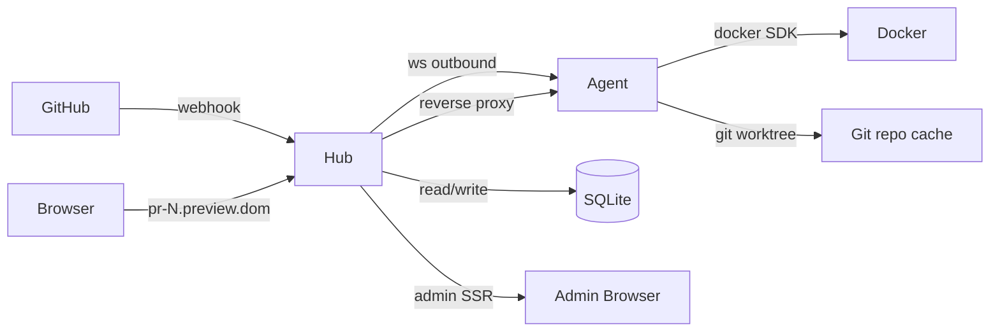

# Phase 3: Admin Dashboard SSR + MVP Closure (Auth, Reconcile, Graceful Shutdown, Portfolio Docs)

작성일: 2026-04-25
작성자: planner
상태: APPROVED

## 1. Phase 개요

Phase 0~2가 데이터 평면의 한 사이클(GitHub PR opened → Hub upsert → Agent 빌드/실행 → 사용자 브라우저가 reverse proxy로 도달 → PR closed → teardown → reconciliation)을 닫았다면, Phase 3은 **운영자(=프로젝트 사용자)가 GUI 한 곳에서 Agent와 Preview의 상태를 관찰·조작할 수 있는 평면을 추가**하고 이 시스템을 **MVP로서 portfolio-grade로 완결시키는 마지막 사이클**이다. 종료 시점에 Hub는 (a) `html/template` 표준 라이브러리만 사용하는 SSR 관리자 대시보드 3페이지(`/admin`, `/admin/agents`, `/admin/previews`)와 preview 상세/타임라인 + rebuild 버튼을 제공하고, (b) `/admin/*` 라우트에 한해 HTTP Basic Auth(`ADMIN_PASSWORD` env 기반)를 적용하면서 `/webhooks/*`·`/agent/ws`·reverse proxy 라우트는 인증 없이 통과시키며, (c) HELLO 메시지에 `running_previews: ["id1","id2"]` 필드가 포함되어 Hub가 Agent 재연결 시 DB와 비교해 실제로 동작 중인 컨테이너를 양방향 동기화하고(고아 컨테이너에는 `JOB_TEARDOWN`, DB 상 running이지만 Agent에 없으면 `failed`), (d) Hub/Agent 양쪽 모두 SIGTERM에 대한 graceful shutdown이 명세대로 동작하며(Hub: dispatcher.Pause → in-flight HTTP 30s drain → WS close frame → exit, Agent: 신규 잡 거부 → 빌드 완료 대기 → 컨테이너는 그대로 두고 종료), (e) README가 portfolio용 8개 design decisions FAQ + Mermaid 아키텍처 다이어그램 + Local/Production 운영 절차로 재작성되며, (f) `docs/demo.md`가 데모 스크린샷·asciinema 캡처 가이드를 포함하고, (g) `dispatcher`·`protocol`·`db/sqlite` 세 패키지에 50-goroutine claim race + message round-trip + in-memory repository integration 테스트가 추가되어 evaluator가 단위·통합·E2E를 모두 자동 검증할 수 있다. 검증은 **세 단계 Step (S1: Auth + Dashboard SSR, S2: HELLO 동기화 + Reconcile 강화, S3: Graceful Shutdown + Docs + Tests)** 으로 분할되어 evaluator가 단계별 부분 평가를 할 수 있다.

### 1-1. Evaluator 실행 환경 가정

- Shell: **bash on Linux/macOS/WSL/Git Bash** (POSIX sh 호환). Phase 2와 동일.
- Go 툴체인: **Go 1.22 이상**.
- 필수 CLI: `curl`, `jq`, `grep`(GNU 호환), `awk`, `kill`, `sleep`, `openssl`(HMAC), `git`, `wc`, `find`. 추가로 **Playwright 의존: Node.js 20+ + `npx playwright`** (S1 e2e 검증, AGENTS.md "UI 있는 Phase부터 Playwright"). Playwright 미설치 환경은 F-S1-9 e2e만 SKIP(`exit 77`); SSR HTML 직접 검증(F-S1-2..7)은 `curl` + `grep` 으로 수행 가능.
- **Docker** (S2 일부): Phase 2와 동일 가드. Docker 미설치 시 HELLO 동기화의 fake-agent 단위 테스트로 대체.
- 포트: 본 Phase는 Phase 2와 같은 기본 `:3000`. 충돌 시 `HUB_ADDR=:3001`. 검증 명령은 `PORT=${HUB_PORT:-3000}` export 전제.
- 호스트 이름 해석: `*.localhost` 는 macOS/Linux/WSL에서 자동 `127.0.0.1` resolve. Windows는 hosts 파일 또는 Git Bash 환경 의존. 검증 명령은 `curl --resolve` 사용.
- 인증: 본 Phase 부터 `/admin/*` 가 Basic Auth 가드. 검증 명령은 `-u admin:test-pass` 사용. `ADMIN_PASSWORD` 미설정 시 경고 로그 + 무인증 통과(로컬 dev 모드).
- 타이밍: graceful shutdown 검증은 SIGTERM → 종료 코드 0 + 30s 이내 종료. sleep 기반 검증은 2배 마진. dispatcher.Pause 토글 후 새 READY 1건은 1s 내에 무시되어야 함(NF-Shutdown-Pause-1).

## 2. 범위와 비범위

### 범위 (In Scope)

- **Admin Dashboard SSR**: `html/template` 만으로 3페이지 + 1 detail 페이지.
  - `GET /admin` — 홈 대시보드. Agent 카운트(online/offline/total) + Preview 카운트(queued/assigned/building/running/done/failed/teardown) 요약.
  - `GET /admin/agents` — Agent 리스트 테이블(name, status, labels JSON, current_running_count, last_seen_at). "Add Agent" 폼(name + labels) + POST → 생성된 토큰을 페이지로 1회 표시 + "Delete" 버튼(DELETE → 302 redirect to list).
  - `GET /admin/previews` — Preview 리스트 + 필터(`?repo=...&status=...`). 각 row 클릭 시 detail.
  - `GET /admin/previews/{id}` — Preview 상세: 메타(repo/pr/sha/branch/labels/agent_host:port/public_url), `preview_events` 타임라인(역시간순 또는 시간순), Rebuild 버튼(POST `/admin/previews/{id}/rebuild` → status=queued 전이 + 302 redirect).
  - 정적 자산: 단일 CSS (Pico.css CDN `<link>` 태그 또는 `internal/hub/views/static/style.css` 임베드 — §5-15에서 결정 17로 fix).
  - JS 프레임워크 **없음**. 대화형 동작은 폼 POST + redirect 만.
- **Auth Middleware**: `internal/hub/auth.go`. `BasicAuthMiddleware(next, password)` 가 `/admin/*` 라우트에만 적용. `ADMIN_PASSWORD` 비어있으면 wrap 안 하고 시작 시 1회 `WARN admin_unauthenticated` 로그(§5-9). webhook/ws/proxy 는 미적용.
- **HELLO 프로토콜 확장**: `protocol.HelloData` 에 `RunningPreviews []string` 필드 추가. Agent runner의 jobs 맵 keys 를 직렬화. 이전 Hub와의 호환을 위해 `omitempty` + nil 시 빈 배열 무시(§5-2).
- **Reconcile 강화 (HELLO 시점)**: WS handler가 HELLO 수신 직후 `previewStore.ListByAgent(agentID, []string{"assigned","building","running","teardown"})` 호출. 비교:
  - **Set DB** (DB가 이 Agent에게 할당된 status∈{assigned,building,running,teardown}) vs **Set Agent** (HELLO.RunningPreviews).
  - `Agent − DB` (Agent는 보유, DB엔 단말 상태 done/failed/teardown 또는 다른 agent로 재배정): Hub가 즉시 `JOB_TEARDOWN` 송신. 단, `DB.assigned_agent_id != this agent` 인 경우는 다른 agent 가 새 일을 받았으므로 정리 우선. 로그 `reconcile_hello_orphan_container`.
  - `DB − Agent` (DB는 running, Agent에 부재): `UpdateStatus(running→failed, message="agent restart lost container")`. 로그 `reconcile_hello_lost_container`.
  - `Agent ∩ DB` 의 단순 일치 항목은 변경 없음.
- **기존 Reconciler 강화**: Phase 2의 5분 stale assigned→queued 그대로 유지. 추가 변경 없음(본 Phase는 HELLO 시점 동기화로 보강).
- **Graceful Shutdown 완결 (Hub)**: `internal/hub/server.go` 의 `shutdown()` 단계 확장. 시퀀스(§5-13):
  1. SIGTERM/SIGINT 수신 → root context cancel.
  2. `dispatcher.Pause()` 호출 → 이후 `OnReady` 는 즉시 nil (no-op) 반환 + 로그 `dispatcher_paused`. 진행 중인 OnReady는 끝까지 진행.
  3. Reconciler ticker 종료(ctx 의존, 자연 종료).
  4. `http.Server.Shutdown(ctx, 30s)` → in-flight HTTP request drain.
  5. `registry.closeAll(websocket.StatusGoingAway, "going away")` (이미 Phase 1) — drain 직후 1001 close frame.
  6. exit 0.
  - 만일 30s 내 in-flight 미종료 시 `Shutdown` 이 timeout error → exit 1 + `WARN hub_shutdown_drain_timeout`.
- **Graceful Shutdown 완결 (Agent)**: `internal/agent/runner.go` + `cmd/agent/main.go` 시그널 핸들러. 시퀀스(§5-13):
  1. SIGTERM/SIGINT → `runner.Pause()` → 이후 `JOB_ASSIGN` 수신은 즉시 STATUS_UPDATE(failed, message="agent shutting down") 송신 후 무시.
  2. WS client는 새 READY 송신 중지(중요: shutdown 시작 후에 in-flight READY 가 보낸 직후 일 수도 있음 → 위 (1)이 받침대).
  3. 진행 중인 builds(jobs 맵의 building/running 미완료 entry)는 자체 ctx 가 살아있는 동안 완료.
  4. 30s 내 미완료 build는 그대로 두고 종료(컨테이너는 살아있는 채로 leave). teardown은 본 시점 수행하지 않음 — PR close 시점에만.
  5. WS close frame 송신(GoingAway) 후 exit 0.
- **README portfolio 재작성**: 구조(§5-14):
  - Title + 1줄 + 데모 GIF placeholder (`` — 파일 부재여도 spec 통과: `<!-- demo placeholder -->` 마커가 있으면 OK).
  - Why we built this (사용자 동기, 1~2 단락).
  - Architecture (Mermaid 다이어그램 1개 — Hub/Agent/GitHub/User Browser/Docker 5 노드, 8 화살표).
  - Design Decisions FAQ — 정확히 8개 항목 (§5-14-1).
  - Local Run (Phase 2 README 의 검증 절차 압축).
  - Production Deployment (TLS termination, reverse proxy 권장 구성, `ADMIN_PASSWORD` 강제, 백업 등 가이드).
  - Roadmap (LOG streaming, multi-repo, build cache, Postgres, Token rotation, audit log, container hardening, scheduled cleanup).
  - Tech Stack (Go 1.22, modernc.org/sqlite, coder/websocket, html/template, docker SDK).
- **Demo Artifacts**: `docs/demo.md` 신설.
  - 스크린샷 placeholder 4장(`docs/screenshots/dashboard.png`, `agents.png`, `previews.png`, `preview-detail.png` — 파일 부재 OK, 마크다운 image 태그만 검증).
  - asciinema 가이드: `asciinema rec docs/demo.cast` 사용 절차 + 시연 시나리오 step list (PR open → 빌드 진행 → 브라우저 hit → close → teardown). 명령 줄 스크립트 6개.
- **테스트 보강**:
  - `internal/hub/dispatcher_test.go` 에 `TestDispatcherClaimRace` 추가(50 goroutine, 단일 queued preview, 정확히 1 Claim 성공 + 49 ErrNotFound 또는 no-op). race detector 클린.
  - `internal/protocol/messages_test.go` 에 `TestMessageRoundTrip` 추가(모든 9개 메시지 타입 — HELLO/WELCOME/PING/PONG/READY/JOB_ASSIGN/STATUS_UPDATE/JOB_TEARDOWN/LOG — Marshal → Unmarshal → DeepEqual).
  - `internal/db/sqlite/preview_store_integration_test.go` 신설 — 실제 in-memory SQLite (`file:memdb1?mode=memory&cache=shared`) 위에서 Upsert → Claim → UpdateStatus → ListByAgent 시나리오 통합 테스트(트랜잭션·event 기록 일관성 검증).
- **Hub 코드 변경**: 라우팅 진입점에 SSR mux 등록(`/admin`, `/admin/agents`, `/admin/previews`, `/admin/previews/{id}`, `POST /admin/previews/{id}/rebuild`). 기존 JSON API 라우트(`POST /admin/agents`, `DELETE /admin/agents/{id}`)는 그대로 유지(SSR 폼이 동일 라우트로 POST 가능, 응답 Content-Negotiation: `Accept: application/json` → JSON, 그 외 → 302 redirect; §5-7 결정 6).
- **문서**: README, `docs/demo.md`, `.env.example`(추가 env: `ADMIN_PASSWORD`).

### 비범위 (Out of Scope — 이번 Phase에 하지 않음)

- **LOG 메시지 wiring** — 구조체는 Phase 2에 동결, 실제 docker logs streaming/`preview_logs` 테이블/UI tail은 Phase 4 이후. (사용자 요구사항 명시 비범위.)
- **Multi-repo 라우팅**.
- **JS 프레임워크 / SPA / 클라이언트 사이드 렌더링** — 명시적 거부. 폼 POST + redirect 만.
- **Old done/failed cleanup 정책** — README roadmap 에만 기재. 본 Phase 자동 정리 없음(사용자 요구사항 명시).
- **Token rotation / audit log / RBAC** — 후속.
- **Build 캐시·이미지 레지스트리·multi-arch 빌드**.
- **Postgres 실연결**, multi-Hub HA.
- **WebSocket reverse proxy upgrade** — Phase 2에서도 비범위, 본 Phase도 미검증.
- **Agent rolling restart / hot reload**.
- **Preview detail 의 라이브 logs / 실시간 progress streaming** — Phase 4 LOG wiring과 함께.
- **CSRF 방어 토큰** — 본 Phase는 localhost dev 환경 + Basic Auth 가드 가정, CSRF 토큰은 비범위. README "Production" 섹션에 reverse proxy 앞단에 별도 CSRF 게이트 권장으로 기재.
- **Reconciliation 의 offline-agent running auto-teardown 정책** — 본 Phase는 보존 + 카운트 로그(Phase 2 결정 12 그대로). Phase 4 대상.

### 이월 (Deferred)

- LOG streaming → Phase 4.
- Multi-repo + repo slug 호스트 → Phase 4.
- Build cache / registry push → Phase 4.
- Postgres 분기 + ADR `0002-claim-preview-race.md` → Phase 4 진입과 함께(Phase 2 §9 TODO 5번).
- Webhook replay 방어(`webhook_deliveries`) → Phase 4.
- F-S2-15/16/17 (Phase 2에서 이월된 capacity 회수, 컨테이너 복원, 고아 worktree 정리) — **본 Phase의 HELLO 동기화로 일부 대체**(F-S2-16 의 컨테이너 복원이 HELLO.RunningPreviews 로 단순화). 잔여(슬롯 회수 정교화, worktree 자동 정리)는 여전히 Phase 4.

## 3. 설계 결정 및 근거

### 결정 1: SSR 템플릿 엔진은 `html/template` 표준 라이브러리만 사용

- **결정**: 외부 템플릿 엔진(`pongo2`, `jet`, `html/template` 의 fork 등) 미채택. `html/template` 만으로 4 페이지를 구성하고 layout 은 `define`/`template`/`block` 로 공통화. 템플릿 파일은 `internal/hub/views/*.gohtml` 에 두고 `embed.FS` 로 바이너리에 포함.
- **근거**:
  1. AGENTS.md "기술 스택"이 "`net/http` 표준 라이브러리 (웹 프레임워크 없이)"를 명시. 템플릿도 동일 정신.
  2. `html/template` 은 자동 contextual escape(HTML/JS/URL/CSS) 제공 → XSS 1차 방어 무료. 외부 엔진 도입 시 escape 정책 별도 검토 필요.
  3. 단일 바이너리 배포 정책(Phase 0 결정 1)과 정합 — `embed.FS` 로 템플릿이 바이너리 안에 박힘.
  4. 본 Phase의 템플릿은 4개로 단순. 템플릿 상속·블록·partial 정도면 표준 라이브러리로 충분.
- **버려진 대안 A**: `pongo2`(Django 호환). 외부 의존 + escape 정책 재검토. 기각.
- **버려진 대안 B**: 정적 HTML + Vanilla JS 클라이언트 fetch. SSR 요구사항 위반(사용자 요구사항이 SSR 명시). 기각.
- **되돌림 비용**: 중간. 템플릿 4개 + 헬퍼 함수 1~2개. 다른 엔진으로 옮기면 escape 정책 재검토 필요.

### 결정 2: CSS는 Pico.css CDN 단일 `<link>` (1줄, JS 없음)

- **결정**: 모든 SSR 페이지의 `<head>` 에 동일한 `<link rel="stylesheet" href="https://cdn.jsdelivr.net/npm/@picocss/pico@2/css/pico.min.css">` 1 줄. inline `<style>` 은 5 줄 내 페이지별 패치(예: `.timeline { ... }`)에만 허용. Pico CDN unreachable 환경 대비 README "Production" 섹션에 `internal/hub/views/static/pico.min.css` 로 vendor 후 self-host 하라는 가이드 — 본 Phase 검증은 CDN 가정.
- **근거**:
  1. 사용자 요구사항: "CSS: embed one minimal stylesheet (Pico.css CDN link or inline minimal CSS). No JS frameworks."
  2. Pico.css 는 classless(시맨틱 HTML 만으로 OK) → 템플릿이 `<table>`, `<article>`, `<form>`, `<input>` 만 쓰면 됨. 클래스 네이밍 부담 0.
  3. CDN 의존은 **portfolio 데모 환경** 가정 — 사내망/airgapped 환경은 README 가이드대로 self-host. 본 Phase 검증은 portfolio 시나리오에 맞춤.
  4. JS 미사용은 사용자 요구사항 강제. 폼 POST + redirect 가 표준 HTML 동작이므로 Pico만으로 UX 충분.
- **버려진 대안 A**: Tailwind / Bootstrap. 클래스 폭증 + JS 필요한 컴포넌트 다수. 기각.
- **버려진 대안 B**: 자체 CSS 직접 작성(50~100줄). 가능하지만 portfolio quality 가 시간 대비 낮음. CDN 한 줄로 동등 효과.
- **되돌림 비용**: 매우 낮음.

### 결정 3: Auth는 HTTP Basic 만 (세션/쿠키/JWT 미도입)

- **결정**: `Authorization: Basic <base64(admin:<ADMIN_PASSWORD>)>` 헤더 검증. 사용자명은 `admin` 고정. `ADMIN_PASSWORD` env 가 비어있으면 미들웨어 wrap 자체를 skip + 기동 시 1회 `WARN admin_unauthenticated` 로그. 인증 실패 시 `401` + `WWW-Authenticate: Basic realm="hub-admin"` → 브라우저가 자동 prompt.
- **근거**:
  1. 사용자 요구사항이 Basic Auth를 명시적으로 지정.
  2. Basic Auth 는 무상태 — 쿠키/세션 저장소 부담 0.
  3. 본 Phase 의 protect 표면은 `/admin/*` 만 — webhook(외부 GitHub), agent ws(토큰), proxy(공개 PR 미리보기) 는 모두 미적용. 라우팅 분리가 명확.
  4. `subtle.ConstantTimeCompare` 로 password 비교 → 타이밍 공격 1차 방어(NF-Security-1).
- **버려진 대안 A**: 세션 쿠키 + 로그인 페이지. 상태 저장소 + CSRF + logout 등 표면 폭증. portfolio MVP 범위 초과. 기각.
- **버려진 대안 B**: GitHub OAuth. 외부 의존(GitHub OAuth app 발급) + 다른 환경 마찰. 본 Phase 비범위.
- **되돌림 비용**: 낮음. 미들웨어 1개. 향후 세션 도입 시 같은 `BasicAuthMiddleware` 자리에 `SessionMiddleware` 교체.

### 결정 4: 인증 미들웨어는 `/admin/*` 만 wrap, 라우터 진입점에서 분기

- **결정**: `cmd/hub/main.go` (또는 `internal/hub/server.go`)에서 mux 를 두 단계로 구성:
  - `adminMux := http.NewServeMux()` — `/admin/...` 라우트만 등록.
  - `mainMux := http.NewServeMux()` — webhook/ws/health 등록 + `mainMux.Handle("/admin/", BasicAuthMiddleware(adminMux, password))`.
  - 최외곽은 reverse proxy 미들웨어(Phase 2 §5-12) 가 `mainMux` 를 wrap.
- **근거**:
  1. 분기 표면을 한 곳(=`mainMux.Handle("/admin/", ...)`)으로 좁힘 → "어떤 라우트가 인증 대상인가" 가 grep 1회로 확인 가능(NF-Security-2).
  2. webhook/ws 가 동일 미들웨어를 거치지 않으므로 인증 누수 위험 0.
  3. mux 두 개 패턴은 Go 표준 라이브러리 정수 — 외부 라우터 도입 회피.
- **버려진 대안 A**: 모든 라우트에 미들웨어 + 핸들러 내부에서 path 검사로 skip. 분기 표면 분산, 휴먼 에러 위험. 기각.
- **버려진 대안 B**: `chi`/`gorilla/mux` 의 라우트 그룹. 외부 의존 도입. AGENTS.md 정신 위반. 기각.
- **되돌림 비용**: 낮음.

### 결정 5: SSR 템플릿은 `embed.FS` + `template.Must(template.ParseFS(...))` 시작 시 1회 파싱

- **결정**: `//go:embed views/*.gohtml` 로 임베드. 시작 시 `template.Must(template.ParseFS(fs, "views/*.gohtml"))` 호출 — 파싱 실패는 즉시 panic(=fail-fast on startup, 운영 중 처음 페이지 hit 에서 500 폭발 회피). 핸들러는 `t.ExecuteTemplate(w, "agents.gohtml", data)` 호출.
- **근거**:
  1. 단일 바이너리 배포 정책(Phase 0 결정 1) → 별도 templates/ 디렉토리 배포 회피.
  2. 시작 시 파싱은 (a) 템플릿 syntax error 를 즉시 감지(crash-loop), (b) 핸들러는 매 요청마다 파싱 비용 0.
  3. dev 모드에서 템플릿 변경 즉시 반영이 필요하면 빌드 태그 `dev` 로 `template.ParseFiles` 분기 — 본 Phase는 단순화로 미도입.
- **버려진 대안 A**: 매 요청마다 `template.ParseFiles`. 100% latency penalty + dev/prod 동작 차이 없음. 기각.
- **버려진 대안 B**: 템플릿 외부 디렉토리. 단일 바이너리 정책 위반. 기각.
- **되돌림 비용**: 낮음.

### 결정 6: SSR 폼 POST 의 응답은 Content-Negotiation (Accept 헤더 분기)

- **결정**: `POST /admin/agents` 와 `DELETE /admin/agents/{id}` 핸들러는 `Accept` 헤더를 본다.
  - `Accept` 가 `application/json` 포함 → 기존 JSON 응답(Phase 1) 그대로.
  - 그 외 (HTML 폼 submit) → `303 See Other` + `Location: /admin/agents` (또는 토큰 표시 페이지 `Location: /admin/agents/token?id=<id>&t=<token>` — 결정 7).
  - 신규 라우트 `POST /admin/previews/{id}/rebuild` 도 같은 패턴.
- **근거**:
  1. 동일 핸들러를 JSON API와 SSR 폼 양쪽이 공유 → 코드 중복 회피.
  2. POST 후 GET redirect (PRG 패턴) 은 새로고침 시 폼 재제출 다이얼로그를 회피하는 표준 기법.
  3. Accept 분기는 Go 표준 라이브러리만으로 단순(`strings.Contains(r.Header.Get("Accept"), "application/json")`).
- **버려진 대안 A**: SSR 전용 라우트(`POST /admin/agents/form`)를 별도 추가. 라우트 폭증 + 핸들러 중복. 기각.
- **버려진 대안 B**: 모든 응답 JSON, SSR 페이지에서 fetch + JS 처리. JS 미사용 정책 위반. 기각.
- **되돌림 비용**: 낮음.

### 결정 7: 신규 Agent 토큰은 redirect URL query 로 1회 표시 후 즉시 휘발

- **결정**: `POST /admin/agents` (SSR form) 처리 후 `303 → /admin/agents/token?name=<name>&t=<token>`. 이 페이지는 **토큰을 plaintext 로 표시**하면서 "이 페이지를 떠나면 토큰을 다시 볼 수 없습니다" 경고 박스를 함께 그림. 토큰은 query string 에만 살아있고 서버는 저장하지 않음(Phase 1 처럼 hash 만 보관).
- **근거**:
  1. 사용자 요구사항: "POST → token shown once".
  2. URL query 는 referer 로 누출 가능성이 있으나 본 Phase는 localhost dev 환경 가정 + Basic Auth 동시 적용으로 외부 referer 0.
  3. 세션 저장소 없이 1회성 표시를 구현하는 가장 단순한 방법.
  4. 사용자가 페이지를 닫고 토큰을 잃어버리면 Agent 삭제 → 재생성. 정책상 회복 가능.
- **버려진 대안 A**: 서버 메모리에 토큰 N분 보관 후 별도 페이지에서 조회. 상태 저장소 도입 + 보관 시간 정책 결정 필요. 기각.
- **버려진 대안 B**: POST 응답을 그대로 HTML 페이지로 렌더(redirect 없음). 새로고침 시 폼 재제출 → Agent 중복 생성 위험. 기각.
- **되돌림 비용**: 낮음. URL → 세션 전환은 미들웨어 1개.

### 결정 8: HELLO 의 `running_previews` 필드는 추가만, 기존 필드 호환

- **결정**: `protocol.HelloData` 에 `RunningPreviews []string` 추가. 기존 `Version`, `Labels`, `AdvertiseHost` 필드 위치/타입 변경 없음. JSON 태그는 `running_previews,omitempty` — 빈 배열은 wire 에서 생략. Hub 측 디코더는 nil 시 `[]string{}` 로 정규화 후 비교 로직 진입(§5-2).
- **근거**:
  1. 와이어 호환 — Phase 2 Agent (구버전) 가 본 Phase Hub 에 연결 시 `RunningPreviews=nil` → 비교 결과 "DB - Agent" 가 전부 lost 로 표시될 위험. 그래서 §5-3에 **legacy 보호 규칙**: HELLO 페이로드의 `version` 이 `"v1"` 인데 `running_previews` 필드 자체가 JSON 에 부재(=nil) 면 "Agent 가 정보를 안 보냄" 으로 판정 → 비교 SKIP + `WARN reconcile_hello_legacy_agent` 로그. 빈 배열 `[]` 은 명시적 "running 없음" 의미로 처리.
  2. 와이어 호환을 깨려면 ProtoVersion `v2` 로 올려야 하는데, 본 Phase는 단일 필드 추가뿐 → `v1` 유지. 단 (a) Agent 가 보내는 새 필드가 옵션이고 (b) 보내도 무해함을 보장하므로 forward/backward 모두 안전.
  3. `omitempty` 는 nil/빈 배열을 모두 생략 → Hub 가 "없음 vs 빈" 을 구분 못 함. **(1)의 'JSON 필드 자체 부재로 판정' 이 의미적으로 '레거시 vs running 없음' 을 구분하기에는 부족** — 따라서 `RunningPreviews` 는 `omitempty` **제외**(항상 직렬화). 빈 배열은 빈 배열로, 부재면 레거시. JSON 태그는 단순 `json:"running_previews"`.
- **버려진 대안 A**: ProtoVersion v2 로 올리고 v1 거절. 모든 운용 Agent 동시 배포 강제 — MVP 단계에선 부담.
- **버려진 대안 B**: 별도 메시지 `RUNNING_REPORT` 신설. 핸드셰이크 직후 1회 송신. HELLO 한 번에 묶는 편이 단순(왕복 1회 절약).
- **되돌림 비용**: 낮음.

### 결정 9: HELLO 동기화 비교는 Hub 측 transactional snapshot 1회 + 외부 트랜잭션 없음

- **결정**: HELLO 처리 흐름:
  1. WS handler 가 HELLO decode.
  2. `dbList := previewStore.ListByAgent(ctx, agentID, []string{"assigned","building","running","teardown"})` (Phase 2 도입된 메서드).
  3. Set 비교 (§5-3 의사코드).
  4. `Agent − DB` 항목 각각: `wsRegistry.SendTeardown(ctx, agentID, previewID)` 발사 후 즉시 다음 항목으로(응답 대기 없음). 송신 실패는 로그만.
  5. `DB − Agent` 항목 각각: `previewStore.UpdateStatus(ctx, id, fromStatus=<DB status>, "failed", "agent restart lost container", now, fields)` 호출. CAS 실패(`ErrStaleState`)면 무시(다른 path 가 동시에 변경).
  6. 단일 트랜잭션으로 묶지 않음 — 항목별 독립.
- **근거**:
  1. 단일 트랜잭션은 의미상 매력적이나 (a) `JOB_TEARDOWN` 송신은 트랜잭션 외 IO 이고, (b) 항목별 CAS 실패가 전체 abort 가 되면 다른 정상 항목까지 돌이킴 → 가용성 손해.
  2. CAS 실패는 "다른 path 가 같은 row 를 동시에 처리 중" 을 의미하며 본 Phase 정의된 다른 path 는 없으므로(reconciler 5분 stale 만, 그것도 assigned 만) 실제 발생 가능성 낮음 + 로그로 충분.
  3. ListByAgent 는 SELECT 1회 — snapshot 시점은 명확.
- **버려진 대안 A**: ListByAgent + 각 UpdateStatus 를 단일 트랜잭션. Postgres-friendly 하지만 SQLite 에서 Connection 1개 정책(Phase 1 결정 8)과 충돌 시 dispatcher 가 동시 차단. 기각.
- **버려진 대안 B**: HELLO 시점 비교를 비활성화하고 reconciler 만 의존. 사용자 요구사항(HELLO 시 `running_previews` 비교) 위반. 기각.
- **되돌림 비용**: 낮음.

### 결정 10: dispatcher.Pause 는 atomic.Bool 1개 — 진행 중 OnReady 는 끝까지 진행

- **결정**: `Dispatcher` 에 `paused atomic.Bool` 필드 추가. `Pause()` 는 `paused.Store(true)` 만. `OnReady` 진입 시 `if d.paused.Load() { return nil }` 즉시 반환. 이미 진입한 호출은 Claim/SendJobAssign 까지 계속 진행(인터럽트 없음).
- **근거**:
  1. 사용자 요구사항: "stop accepting new jobs" — 신규 진입 차단으로 충분. 진행 중인 dispatch 를 강제 abort 하면 (a) Claim 후 SendJobAssign 직전에 abort 시 preview 가 `assigned` 인데 Agent 는 모름 → reconciler 5분 후 회수, 또는 (b) SendJobAssign 후 abort 시 같은 결과 — 즉 abort 가 상태를 더 깨끗하게 만들지 못함.
  2. atomic.Bool 은 lock 무료, race 없음.
  3. SIGTERM 시점에 진행 중인 OnReady 가 길어야 수십 ms (DB 1~2 query + WS write) → drain 30s 안에 자연 종료.
- **버려진 대안 A**: dispatcher 에 mutex + paused field. 매 OnReady 가 lock 획득. 성능 손해(미세).
- **버려진 대안 B**: dispatcher 자체를 nil 로 교체(atomic.Pointer). 복잡.
- **되돌림 비용**: 매우 낮음.

### 결정 11: Agent shutdown 시 컨테이너는 그대로 둠 (teardown 없음)

- **결정**: SIGTERM 수신 시 Agent 는 `runner.Pause()` → 새 잡 거부 → 진행 중 build 대기 → exit. 컨테이너 stop/rm 호출 없음. 다음 Agent 기동 시 HELLO.RunningPreviews 에 살아있는 컨테이너 ID 들이 실린다(jobs 맵 복원은 별도 §4-7-1 / Phase 4 작업이지만 본 Phase 의 HELLO 동기화는 컨테이너만 살아있어도 docker label 로 복원 가능).
- **근거**:
  1. 사용자 요구사항 명시: "leave running containers as-is (teardown only on PR close)".
  2. Agent restart 시 사용자 미리보기가 끊기지 않음 — UX 우수.
  3. teardown은 PR close 라는 명확한 신호가 있을 때만 — 정책 단순화.
- **고민점**: Agent 재기동 직후 HELLO 시 docker label 로 RunningPreviews 를 추출해야 한다. **본 Phase 는 jobs 맵 복원을 단순 버전으로 도입**: `agent.go` 시작 시 `docker.ContainerList(filter label=hub-preview-id)` → 각 컨테이너의 label 에서 previewID 추출 → jobs 맵에 `{previewID, containerID, host=advertiseHost, port=Inspect.NetworkSettings.Port}` 채움 → HELLO.RunningPreviews 송신. **이는 Phase 2 §4-7-1 의 F-S2-16 작업의 일부를 본 Phase 에서 흡수**(사용자 요구사항이 HELLO 동기화를 명시했고, 이 작업 없이는 동기화가 무의미). 단, 고아 worktree 정리(F-S2-17)는 본 Phase 비범위 유지.
- **버려진 대안 A**: shutdown 시 모든 컨테이너 stop. 사용자 미리보기 끊김. 기각.
- **버려진 대안 B**: Agent 재기동 시 모든 컨테이너 stop+rm 후 새로 빌드. 빌드 시간 낭비 + 사용자 미리보기 N분 다운. 기각.
- **되돌림 비용**: 중간(F-S2-16 의 일부 흡수가 코드 변경).

### 결정 12: Rebuild 버튼은 status 의 단일 진입점 통해 `* → queued` (단, teardown/done/failed 만 허용)

- **결정**: `POST /admin/previews/{id}/rebuild` 핸들러:
  1. `GetByID(id)` 호출. 미존재 → 404.
  2. 현재 status ∈ {`queued`, `assigned`, `building`, `running`, `teardown`} → `409 already_in_flight`. teardown 은 agent 가 cleanup 중이므로 done 으로 전이 전까지 재빌드 불허(teardown 중 queued 전환 시 agent 의 STATUS_UPDATE(done) 이 ErrStaleState 를 만나고 동시에 HELLO sync 가 JOB_TEARDOWN 을 보낼 수 있는 경쟁 위험). queued/assigned/building/running 은 이미 진행 중.
  3. status ∈ {`done`, `failed`} 만 허용 → `UpdateStatus(<from>→queued, message="rebuild requested via admin UI", now, fields with assigned_agent_id=nil, container_id=nil, agent_host=nil, agent_port=nil)` (PreviewFields 빈 갱신 — running 시 채워졌던 필드는 덮어씀, 결정 12-b).
  4. 성공 → `303 → /admin/previews/{id}` (또는 JSON `{"status":"queued"}`).
- **결정 12-b (필드 정리 정책)**: `UpdatePreviewStatusFields` 의 `COALESCE(?, container_id)` 패턴은 nil 이면 보존이지만, rebuild 시점에 보존하면 dispatch 후 STATUS_UPDATE(running) 가 같은 필드를 덮어쓰지 않을 위험 있음(이미 값이 있어서 stale 상태로 보임). **본 Phase 는 PreviewFields 에 명시적 sentinel 추가**: `&""` (포인터로 빈 문자열) 은 "갱신해서 NULL/빈 으로" 의미로 해석되어 SQL 측에서 `?` 자리에 빈 값 또는 NULL 이 들어가도록. SQL 측은 `COALESCE` 에서 빈 문자열을 그대로 받아 컬럼에 빈 문자열이 들어가는 것을 허용. (NULL 강제가 필요하면 별도 plain `=` SQL 도입 — 본 Phase 는 빈 문자열 수용.)
- **근거**:
  1. 사용자 요구사항: "rebuild button (triggers queued status)".
  2. 이미 in-flight 인 작업을 강제 재시작하면 (a) 진행 중 build 의 Agent 가 STATUS_UPDATE 을 보내는 시점에 status 이미 queued → CAS 실패 → 로그 폭증, (b) 사용자 의도와 일치 안 함. 그래서 단말 상태(done/failed/teardown)에서만 허용.
  3. status 변경은 `UpdateStatus` 단일 진입점(Phase 2 결정 11) 정합.
- **버려진 대안 A**: rebuild 가 강제로 in-flight 도 큐로 되돌림 + 진행 중 STATUS_UPDATE 무시. 상태 모순. 기각.
- **버려진 대안 B**: rebuild 로 새 row 생성(이전 row archive). 데이터 모델 폭증. 기각.
- **되돌림 비용**: 낮음.

### 결정 13: 그레이스풀 셧다운 timeout 30s 는 hardcoded, env 미노출

- **결정**: Hub `http.Server.Shutdown` 의 ctx timeout 30s + Agent build wait 의 30s 모두 코드 상수. env/플래그 미노출. README "Production" 에 "튜닝이 필요하면 코드 상수 변경 후 재빌드" 가이드.
- **근거**:
  1. 사용자 요구사항: "wait for in-flight HTTP requests (30s timeout)" — 30s 명시.
  2. 운영자가 함부로 늘리면 deploy 가 답답해지고, 줄이면 in-flight drop 이 늘어남 → 정책으로 못박는 편이 안전.
  3. 환경별 튜닝이 필요해지면 그때 env 도입.
- **버려진 대안**: env `HUB_SHUTDOWN_TIMEOUT` 도입. 표면 폭증 + 기본값 의존. 기각.
- **되돌림 비용**: 매우 낮음.

### 결정 14: `preview_events` 타임라인은 시간순(오래된 → 최신) + 페이지당 50건 + ORDER BY created_at, id

- **결정**: 신규 sqlc 쿼리 `ListPreviewEvents :many`: `SELECT * FROM preview_events WHERE preview_id = ? ORDER BY created_at ASC, id ASC LIMIT 50 OFFSET ?`. SSR 렌더 시 시간순(과거 위 → 최신 아래). 첫 페이지만 본 Phase 검증 — pagination UI 는 next/prev 링크 정도(50건 미만이면 노출 안 함).
- **근거**:
  1. 타임라인은 보통 시간순으로 읽음(이력서 형태).
  2. 50건 = 1 PR 이 보통 갖는 status 전이 이벤트 수의 충분한 상한(queued→assigned→building→running→teardown→done = 6, push 마다 done→queued→... = +5, 10번 push 면 50 근사).
  3. tie-break `id ASC` 는 동일 created_at 인 이벤트(드물지만 같은 ms) 의 결정적 순서 보장.
- **버려진 대안**: DESC + 최신 위로. PR 활동 로그처럼 보이지만 status 전이는 오래된 → 최신이 인과 흐름이라 ASC 가 자연스러움.
- **되돌림 비용**: 매우 낮음.

### 결정 15: README portfolio FAQ 는 정확히 8개 — 사용자가 합의한 항목

- **결정**: 8개 결정 항목(§5-14-1):
  1. Why Go (단일 바이너리, 정적 컴파일, 표준 라이브러리만으로 도구 제작 가능).
  2. Why pull-based dispatch (Agent 가 NAT 뒤에 있어도 동작, 자연스러운 백프레셔).
  3. Why agent → hub direction (방화벽 친화적).
  4. Why SQLite (zero-config, 단일 파일 백업, Postgres 이전 가능한 추상).
  5. Why html/template + no JS framework (단일 바이너리, contextual escape, MVP 단순함).
  6. Why git worktree (clone 비용 N→1, PR 동시성).
  7. Why Docker SDK (vs `os/exec` — 정형 객체 응답, 단위 테스트 용이성).
  8. Why label-based routing (가정용 PC + 사무실 워크스테이션 같은 다양한 호스팅 환경 자연 매핑).
- **근거**: 사용자가 전달한 요구사항 원문 "Design Decisions FAQ (8 decisions listed in requirements)" 의 8개 항목을 명시. 가감 시 사용자 합의 필요.
- **버려진 대안**: 5개 또는 12개. 사용자 요구 위반. 기각.
- **되돌림 비용**: 매우 낮음.

### 결정 16: Demo Artifacts 는 placeholder 만 — 실제 GIF/스크린샷은 본 Phase 검증에서 제외

- **결정**: `docs/demo.md` + 스크린샷/GIF placeholder. 검증은 (a) `docs/demo.md` 존재, (b) 마크다운 안에 `` 같은 image 태그 4건, (c) asciinema 가이드 6 step 검증 — 실제 image 파일 존재 검증 안 함. 사용자가 데모 제작 시 단계별 가이드를 따라 채울 수 있는 stub.
- **근거**:
  1. 사용자 요구사항: "placeholder screenshots / asciinema instructions" — 실제 콘텐츠 미요구.
  2. 자동 evaluator 가 GIF/PNG 의 시각 품질을 판정할 수 없음 → placeholder 검증이 합리적.
  3. portfolio 단계의 책임은 (a) 가이드 제공(이 Phase) + (b) 사용자가 실제 제작(이 Phase 외).
- **버려진 대안**: planner/implementer 가 직접 스크린샷 만들기. 시연 가능한 데모 환경(GitHub PR 실연결) 부재 → 가짜 fixture 스크린샷은 portfolio quality 손해.
- **되돌림 비용**: 매우 낮음.

### 결정 17: 정적 자산 라우팅 — Pico CDN 한 줄로 끝내고 자체 정적 자산 0

- **결정**: 본 Phase는 자체 CSS/JS/이미지 0. 모든 스타일은 Pico CDN. SSR 페이지의 favicon 등은 inline `<link rel="icon" href="data:,">` 으로 404 회피. `/static/*` 라우트 미신설.
- **근거**:
  1. 결정 2 의 연장. CDN 한 줄로 portfolio quality 충족.
  2. 자체 정적 자산 도입 시 (a) 캐시 헤더 정책, (b) 압축, (c) ETag 등 표면 폭증.
  3. 향후 self-host 필요 시 `internal/hub/views/static/` + `embed.FS` + `mux.Handle("GET /static/", ...)` 추가 — Phase 4 작업.
- **버려진 대안**: 자체 CSS 파일 + `/static/` 라우트. 본 Phase 비범위.
- **되돌림 비용**: 매우 낮음.

## 4. 아키텍처 / 구조

### 4-1. 디렉토리 트리 (Phase 3 종료 후, 변경 부분만)

```
/
├── cmd/
│   ├── hub/main.go                   # SIGTERM 핸들러 + dispatcher.Pause + admin mux 분기
│   └── agent/main.go                 # SIGTERM 핸들러 + runner.Pause + container restore (HELLO에 RunningPreviews)
├── internal/
│   ├── hub/
│   │   ├── auth.go                   # BasicAuthMiddleware (신규)
│   │   ├── auth_test.go              # (신규)
│   │   ├── admin_ui.go               # SSR 핸들러 (홈/agents/previews/preview detail/rebuild) (신규)
│   │   ├── admin_ui_test.go          # (신규)
│   │   ├── admin_handler.go          # 기존 + Accept 분기 (결정 6)
│   │   ├── dispatcher.go             # Pause atomic.Bool 추가
│   │   ├── dispatcher_test.go        # 기존 + TestDispatcherClaimRace (50 goroutine)
│   │   ├── reconciler.go             # 변경 없음 (HELLO 동기화는 ws_handler 가 처리)
│   │   ├── ws_handler.go             # HELLO 수신 후 RunningPreviews 비교 분기 추가
│   │   ├── ws_handler_test.go        # 신규 케이스 (legacy agent / orphan / lost)
│   │   ├── server.go                 # graceful shutdown 시퀀스 정렬 (dispatcher.Pause → drain → close)
│   │   ├── server_test.go            # 신규: TestGracefulShutdown
│   │   └── views/
│   │       ├── layout.gohtml         # 공통 layout (head + nav + main slot)
│   │       ├── dashboard.gohtml      # / admin 홈
│   │       ├── agents.gohtml         # /admin/agents 리스트 + add form
│   │       ├── token.gohtml          # /admin/agents/token (1회 표시)
│   │       ├── previews.gohtml       # /admin/previews 리스트 + 필터
│   │       └── preview_detail.gohtml # /admin/previews/{id} 타임라인 + rebuild
│   ├── agent/
│   │   ├── runner.go                 # Pause atomic.Bool 추가
│   │   ├── orphan_restore.go         # 신규: docker.ContainerList → jobs 맵 복원 (결정 11)
│   │   └── (그 외 Phase 2 유지)
│   ├── protocol/
│   │   ├── messages.go               # HelloData.RunningPreviews 추가
│   │   └── messages_test.go          # TestMessageRoundTrip 추가
│   └── db/sqlite/
│       ├── preview_store.go          # ListPreviewEvents 메서드 추가
│       ├── previews.sql.go           # sqlc 재생성
│       └── preview_store_integration_test.go  # 신규: in-memory SQLite end-to-end
├── db/queries/previews.sql           # ListPreviewEvents 쿼리 추가
├── docs/
│   ├── demo.md                       # 신규
│   ├── screenshots/                  # placeholder 디렉토리 (gitkeep)
│   └── specs/phase-3-admin-ui-and-mvp.md  # 이 문서
├── README.md                         # portfolio 재작성 (8 FAQ + Mermaid)
├── .env.example                      # ADMIN_PASSWORD 추가
└── go.mod                            # 변경 없음 (외부 의존 추가 없음)
```

### 4-2. 모듈 의존 관계 (Phase 2와 동일)

신규 모듈은 모두 기존 의존 그래프 안. 외부 의존 추가 없음(NF-Deps-1: Phase 2의 6개 유지).

### 4-3. Admin UI 라우팅 (S1)

```
+------------------------------+
| Reverse Proxy Middleware     |  (Phase 2 §5-12)
| (host header 매칭 우선)      |
+--------------+---------------+
               | fallthrough
               v
+------------------------------+
| mainMux (mux 1)              |
| - /health                    |  (auth 없음)
| - /webhooks/github           |  (auth 없음, HMAC만)
| - /agent/ws                  |  (auth 없음, Bearer 토큰만)
| - /admin/  ─→ BasicAuthMW    |
+--------------+---------------+
               |
               v (auth 통과 시)
+------------------------------+
| adminMux (mux 2)             |
| - GET   /admin               |
| - GET   /admin/agents        |
| - POST  /admin/agents        |  (Accept 분기, 결정 6)
| - GET   /admin/agents/token  |
| - DELETE /admin/agents/{id}  |
| - GET   /admin/previews      |
| - GET   /admin/previews/{id} |
| - POST  /admin/previews/{id}/rebuild |
+------------------------------+
```

`adminMux` 는 `BasicAuthMiddleware` 의 `next`로 전달. wrap 진입 시 password 비교, 실패 → 401, 성공 → adminMux 위임. middleware 1 개로 6 라우트 모두 보호.

### 4-4. Agent 재연결 → HELLO 동기화 시퀀스 (S2)

```
Agent restart                Hub                          DB                      Docker
   |                          |                            |                       |
   | (start)                  |                            |                       |
   | docker.ContainerList     |                            |                       |
   | filter label=hub-preview-id ----------------------------------------------> |
   |<---------------------------------------------------------------------------- |
   | jobs 맵 복원              |                            |                       |
   | WS connect + HELLO       |                            |                       |
   |   {running_previews: [p1,p3]}                          |                       |
   |------------------------->|                            |                       |
   |                          | ListByAgent(agentID,       |                       |
   |                          |  [assigned,building,       |                       |
   |                          |   running,teardown])       |                       |
   |                          |--------------------------->|                       |
   |                          | DBSet = {p1,p2}            |                       |
   |                          |<---------------------------|                       |
   |                          | AgentSet = {p1,p3}         |                       |
   |                          | Agent − DB = {p3} → JOB_TEARDOWN to Agent          |
   |<-------------------------|                            |                       |
   |                          | DB − Agent = {p2} →        |                       |
   |                          | UpdateStatus(running       |                       |
   |                          |   → failed,                |                       |
   |                          |   "agent restart           |                       |
   |                          |    lost container")        |                       |
   |                          |--------------------------->|                       |
   | (Hub 가 WELCOME)         |                            |                       |
   |<-------------------------|                            |                       |
   | (정상 운영 진입)         |                            |                       |
```

### 4-5. Hub Graceful Shutdown 시퀀스 (S3)

```
[OS]               [main.go]              [hub.Server]            [dispatcher]      [http.Server]    [WS conns]
  | SIGTERM         |                       |                        |                |               |
  |---------------->| ctx.Cancel()          |                        |                |               |
  |                 |---------------------->| shutdown()             |                |               |
  |                 |                       | dispatcher.Pause()     |                |               |
  |                 |                       |----------------------->| paused=true    |               |
  |                 |                       | (reconciler ticker     |                |               |
  |                 |                       |  ctx.Done로 자연 종료) |                |               |
  |                 |                       | http.Shutdown(30s ctx) |                |               |
  |                 |                       |---------------------------------------->| in-flight 대기 |
  |                 |                       |                                          |               |
  |                 |                       | (in-flight 종료 후)                       | done          |
  |                 |                       | registry.closeAll(GoingAway, "going away")|              |
  |                 |                       |---------------------------------------------------------->| 1001 close    |
  |                 |                       | return nil                                |               |
  |                 |<----------------------|                                           |               |
  |                 | os.Exit(0)            |                                           |               |
```

만일 30s 내 drain 미종료 → `http.Shutdown` 이 ctx.DeadlineExceeded 반환 → `WARN hub_shutdown_drain_timeout` + `os.Exit(1)`. WS close frame 송신은 timeout 분기에서도 시도(in-flight HTTP 와 무관).

### 4-6. Agent Graceful Shutdown 시퀀스 (S3)

```
[OS]            [agent main.go]          [WSClient]              [Runner]          [Docker]
  | SIGTERM      |                         |                        |                  |
  |------------->| ctx.Cancel()            |                        |                  |
  |              |------------------------>| stop READY 송신        |                  |
  |              | runner.Pause()          |                        |                  |
  |              |--------------------------------------------->    | paused=true      |
  |              | wait for jobs.InFlight()|                        |                  |
  |              |   <- timeout 30s        |                        |                  |
  |              |                         |                        | build 진행 중    |
  |              |                         |                        |   (계속)         |
  |              |                         |                        | build done       |
  |              |                         |                        | docker run       |
  |              |                         |                        |   (성공)         |
  |              |                         |                        | STATUS_UPDATE    |
  |              |                         |                        |   (running)      |
  |              | InFlight==0 또는 30s    |                        |                  |
  |              | wsClient.Close(GoingAway)|                       |                  |
  |              |------------------------>|                        |                  |
  |              | os.Exit(0)              |                        |                  |
  | (컨테이너는 살아있음 — teardown 없음, 결정 11)                                       |
```

JOB_ASSIGN 도착 시 (paused=true → STATUS_UPDATE(failed, "agent shutting down") 발사 후 무시). Hub 측 reconciler 가 5분 후 다른 agent 에 재할당 시도(failed 는 단말 상태이므로 webhook 의 push 가 새 sha 를 만들 때까지 대기).

### 4-7. preview.status 상태 전이 (Phase 2와 동일 + Rebuild 추가)

```
[done|failed|teardown] --(rebuild button)----> [queued]   # 결정 12, 단말 상태에서만
[그 외 Phase 2 §4-6 유지]
```

Phase 2 의 `[done|failed]→queued (action=opened|synchronize)` 흐름과 동등하지만 트리거가 webhook 이 아니라 admin UI POST. 단일 진입점 `UpdateStatus` 동일.

## 5. 인터페이스 계약

### 5-1. 함수·메서드 시그니처

| 패키지/타입 | 시그니처 | 설명 |
|---|---|---|
| `internal/hub.BasicAuthMiddleware` | `func BasicAuthMiddleware(next http.Handler, password string, logger *slog.Logger) http.Handler` | password=="" 면 next 그대로 반환(미들웨어 미적용) + 시작 시 1회 WARN. 실패 시 401 + WWW-Authenticate. |
| `internal/hub.AdminUIHandler` | `Register(adminMux *http.ServeMux)` | 6개 SSR 라우트 등록 |
| `internal/hub.AdminUIHandler` | `dashboard(w, r)`, `agentsList(w, r)`, `agentToken(w, r)`, `previewsList(w, r)`, `previewDetail(w, r)`, `previewRebuild(w, r)` | 핸들러 메서드 |
| `internal/hub.Dispatcher` | `Pause()` | `paused.Store(true)` |
| `internal/hub.Dispatcher` | `Paused() bool` | atomic.Load. 테스트용 + shutdown 진단 로그 |
| `internal/agent.Runner` | `Pause()` | `paused.Store(true)`. 신규 JOB_ASSIGN 거절. 진행 중 build는 계속 |
| `internal/agent.Runner` | `Paused() bool` | atomic.Load |
| `internal/agent.Runner` | `InFlight() int` | jobs 맵에서 status="building"/"running" 카운트. shutdown drain 폴링용 |
| `internal/agent.OrphanRestore` | `Restore(ctx, docker DockerClient, jobs *JobMap, advertiseHost string) ([]string, error)` | docker.ContainerList → jobs 맵에 복원, 복원된 previewID 슬라이스 반환 |
| `internal/hub.WSHandler` | `(syncOnHello)(ctx, agentID, helloRunning []string) error` | HELLO 직후 호출. ListByAgent + 비교 + JOB_TEARDOWN/UpdateStatus. 실패는 로그만 |
| `internal/hub.WSHandler` | 필드 추가: `PreviewStore store.PreviewStore` | HELLO 동기화 시 `ListByAgent` + `UpdateStatus` 호출에 사용. `cmd/hub/daemon.go` 에서 `ws.SetPreviewStore(previewStore)` 로 주입. |
| `internal/hub.WSHandler` | `SetPreviewStore(s store.PreviewStore)` | PreviewStore 주입 setter |
| `internal/hub.WSHandler` | 필드 추가: `TeardownSender TeardownSender` | HELLO 동기화 시 orphan container 에 `SendTeardown` 호출. `cmd/hub/daemon.go` 에서 `ws.SetTeardownSender(jobSender)` 로 주입. (이미 `WSJobSender` 가 `SendTeardown(ctx, agentID, previewID)` 구현) |
| `internal/hub.WSHandler` | `SetTeardownSender(s TeardownSender)` | TeardownSender 주입 setter |
| `internal/store.PreviewStore` | `ListPreviewEvents(ctx, previewID string, limit, offset int) ([]PreviewEvent, error)` | (신규) preview detail 타임라인 |
| `internal/store.PreviewEvent` | (struct) | id, preview_id, from_status (*string), to_status, message, created_at |

### 5-2. 메시지·DTO 타입 (변경 분)

#### `protocol.HelloData` 확장

```go
type HelloData struct {
    Version          string            `json:"version"`
    Labels           map[string]string `json:"labels,omitempty"`
    AdvertiseHost    string            `json:"advertise_host,omitempty"`
    RunningPreviews  []string          `json:"running_previews"` // 신규, omitempty 미적용 (결정 8)
}
```

JSON wire 예시:

```json
{"type":"HELLO","data":{"version":"v1","labels":{"env":"home"},"advertise_host":"127.0.0.1","running_previews":["p1","p3"]}}
```

레거시 Agent (Phase 2) 의 HELLO 는 `running_previews` 키 자체가 없음 → Hub 디코더는 `nil` 로 받음 → 동기화 SKIP + 1회 WARN(§5-3).

#### 신규 SSR Form Body (browser → hub)

`POST /admin/agents` (Accept != application/json):
- Content-Type: `application/x-www-form-urlencoded`
- Fields: `name=<string>`, `labels=<string, "k1=v1,k2=v2" 형식>` (옵션)

`POST /admin/previews/{id}/rebuild`:
- Body 없음 (id 는 path param).

`DELETE /admin/agents/{id}` 의 SSR 변형: form 제출이 method=DELETE 를 직접 못 보내므로 `<form method="POST" action="/admin/agents/{id}/delete">` 로 wrapping. **신규 라우트 `POST /admin/agents/{id}/delete`** 가 SSR 전용으로 추가되며, 내부적으로 기존 `Store.Delete` 호출 후 303 redirect. JSON API (`DELETE /admin/agents/{id}`) 는 그대로 유지.

### 5-3. HELLO 동기화 의사코드

```go
// internal/hub/ws_handler.go (확장)
func (h *WSHandler) syncOnHello(ctx context.Context, agentID string, hello protocol.HelloData) {
    // 레거시 Agent 보호: running_previews 가 JSON 에 부재이거나 nil 이면 SKIP.
    // 본 Phase 의 Agent 는 빈 배열 [] 라도 명시적으로 보냄.
    // Go decoder 한계: nil vs [] 구분 불가. 따라서 envelope.Data 의 raw JSON 을
    // 한 번 더 검사해서 "running_previews" 키 존재 여부를 본다.
    if !hasRunningPreviewsKey(envelopeRaw) {
        h.Logger.Warn("reconcile_hello_legacy_agent", "agent_id", agentID)
        return
    }

    agentSet := make(map[string]struct{}, len(hello.RunningPreviews))
    for _, id := range hello.RunningPreviews {
        agentSet[id] = struct{}{}
    }

    dbList, err := h.PreviewStore.ListByAgent(ctx, agentID,
        []string{"assigned", "building", "running", "teardown"})
    if err != nil {
        h.Logger.Warn("reconcile_hello_listbyagent_failed", "agent_id", agentID, "err", err.Error())
        return
    }
    dbSet := make(map[string]store.Preview, len(dbList))
    for _, p := range dbList {
        dbSet[p.ID] = p
    }

    // Agent − DB: orphan container.
    for id := range agentSet {
        if _, ok := dbSet[id]; !ok {
            if err := h.Registry.SendTeardown(ctx, agentID, id); err != nil {
                h.Logger.Warn("reconcile_hello_teardown_send_failed",
                    "preview_id", id, "agent_id", agentID, "err", err.Error())
            } else {
                h.Logger.Info("reconcile_hello_orphan_container",
                    "preview_id", id, "agent_id", agentID)
            }
        }
    }
    // DB − Agent: lost container.
    for id, p := range dbSet {
        if _, ok := agentSet[id]; !ok {
            if err := h.PreviewStore.UpdateStatus(ctx, id, p.Status, "failed",
                "agent restart lost container", time.Now().UTC(),
                store.PreviewFields{}); err != nil {
                if errors.Is(err, store.ErrStaleState) {
                    continue // 다른 path 가 동시에 변경 — 무시
                }
                h.Logger.Warn("reconcile_hello_lost_failed",
                    "preview_id", id, "err", err.Error())
            } else {
                h.Logger.Info("reconcile_hello_lost_container",
                    "preview_id", id, "agent_id", agentID)
            }
        }
    }
}
```

`hasRunningPreviewsKey(data json.RawMessage) bool` 헬퍼: `Envelope.Data` (json.RawMessage) 를 `map[string]json.RawMessage` 로 한 단계 디코딩 후 `"running_previews"` 키 존재 여부를 확인. substring 매칭보다 견고 — string value 에 같은 단어가 우연히 포함되어도 false positive 없음.

```go
func hasRunningPreviewsKey(data json.RawMessage) bool {
    var m map[string]json.RawMessage
    if err := json.Unmarshal(data, &m); err != nil {
        return false
    }
    _, ok := m["running_previews"]
    return ok
}
```

WS handler 에서 envelope.Data 를 그대로 전달:
```go
// hello decode 시 envelope.Data 보존
if !hasRunningPreviewsKey(envelope.Data) {
    h.Logger.Warn("reconcile_hello_legacy_agent", ...)
    return
}
```

### 5-4. HTTP 엔드포인트 (Phase 3 신규)

| 메서드 | 경로 | 인증 | 응답 (Accept: text/html) | 응답 (Accept: application/json) |
|---|---|---|---|---|
| GET | `/admin` | Basic | dashboard.gohtml 렌더 | (지원 안 함, text/html 만) |
| GET | `/admin/agents` | Basic | agents.gohtml 렌더 (기존 폼 + 리스트) | (기존 JSON API 유지: GET /admin/agents) |
| POST | `/admin/agents` | Basic | 303 → `/admin/agents/token?id=&name=&t=` | 201 + createAgentResponse |
| GET | `/admin/agents/token` | Basic | token.gohtml (1회 표시) | (지원 안 함) |
| POST | `/admin/agents/{id}/delete` | Basic | 303 → `/admin/agents` | (지원 안 함, JSON 은 DELETE 메서드) |
| DELETE | `/admin/agents/{id}` | Basic | (기존 JSON API 유지) | 204 |
| GET | `/admin/previews` | Basic | previews.gohtml + ?repo=&status= 필터 | (지원 안 함, JSON 은 별도 라우트 미신설 — 본 Phase는 SSR 전용) |
| GET | `/admin/previews/{id}` | Basic | preview_detail.gohtml + 타임라인 | (지원 안 함) |
| POST | `/admin/previews/{id}/rebuild` | Basic | 303 → `/admin/previews/{id}` (또는 409 다이얼로그) | 200 / 409 |

기존 `/health`, `/webhooks/github`, `/agent/ws` 그대로(인증 미적용).

### 5-5. SSR 페이지 레이아웃

#### 공통 layout (`layout.gohtml`)

```html
{{define "layout"}}<!doctype html>
<html lang="en">
<head>
  <meta charset="utf-8">
  <meta name="viewport" content="width=device-width, initial-scale=1">
  <title>{{.Title}} — Preview Hub</title>
  <link rel="icon" href="data:,">
  <link rel="stylesheet" href="https://cdn.jsdelivr.net/npm/@picocss/pico@2/css/pico.min.css">
</head>
<body>
  <header class="container">
    <nav>
      <ul>
        <li><strong>Preview Hub</strong></li>
      </ul>
      <ul>
        <li><a href="/admin">Dashboard</a></li>
        <li><a href="/admin/agents">Agents</a></li>
        <li><a href="/admin/previews">Previews</a></li>
      </ul>
    </nav>
  </header>
  <main class="container">
    {{template "content" .}}
  </main>
  <footer class="container"><small>Preview Hub MVP</small></footer>
</body>
</html>{{end}}
```

#### `/admin` (dashboard.gohtml) — 카드 4개

```
+----------+  +----------+  +----------+  +----------+
| Agents   |  | Online   |  | Running  |  | Queued   |
|   N      |  |   M      |  |  Prev. K |  |  Prev. J |
+----------+  +----------+  +----------+  +----------+

Status breakdown:
  queued: J  | assigned: A | building: B | running: K | teardown: T | done: D | failed: F
```

#### `/admin/agents` (agents.gohtml) — 테이블 + 폼

```
+-------+--------+----------------+-------+--------------+----------+
| Name  | Status | Labels         | Run.# | Last Seen    | Actions  |
+-------+--------+----------------+-------+--------------+----------+
| home  | online | env=home       |   2   | 3s ago       | [Delete] |
| ofc   | offline| env=office     |   0   | 2024-01-...  | [Delete] |
+-------+--------+----------------+-------+--------------+----------+

[ Add Agent ]  Form:
   Name:   [______]
   Labels: [k=v,k2=v2] (optional)
   [Submit]
```

`Run.#` = 해당 agent_id 와 status IN (assigned,building,running) 인 preview 수 (`previewStore.ListByAgent` 1회 호출, 본 Phase 단순 N+1 — 페이지당 agent 수 ≤ 100 가정 + 캐시는 Phase 4).

#### `/admin/agents/token` (token.gohtml) — 1회 표시

```
+-------------------------------------------+
| Agent created: home                       |
|                                           |
|  Token (save now, will not be shown again):
|  preview_agent_xxxxxxxxxxxxxxxxxxxxxxxx   |
|                                           |
|  [ Back to Agents ]                       |
+-------------------------------------------+
```

#### `/admin/previews` (previews.gohtml) — 테이블 + 필터

```
Filters:  Repo: [______]  Status: [all ▼]   [Apply]

+-------+---------+--------+--------+----------+----------+
| PR#   | Repo    | Status | Branch | Agent    | Updated  |
+-------+---------+--------+--------+----------+----------+
| #42   | acme/web| running| feat/x | home     | 2s ago   |  ← row 클릭 → /admin/previews/{id}
| ...                                                       |
+-------+---------+--------+--------+----------+----------+
```

#### `/admin/previews/{id}` (preview_detail.gohtml) — 메타 + 타임라인 + Rebuild

```
PR #42 — acme/web
  Status: running
  Commit: abc1234
  Branch: feat/x
  Agent : home (127.0.0.1:34521)
  URL   : http://pr-42.preview.localhost:3000

[ Open Preview ]    [ Rebuild ]  ← form POST /admin/previews/{id}/rebuild

Timeline:
  2024-01-01T00:00:00Z  (NULL → queued)
  2024-01-01T00:00:01Z  (queued → assigned)
  2024-01-01T00:00:02Z  (assigned → building)
  2024-01-01T00:00:42Z  (building → running)
```

### 5-6. Auth 미들웨어 의사코드

```go
// internal/hub/auth.go
func BasicAuthMiddleware(next http.Handler, password string, logger *slog.Logger) http.Handler {
    if password == "" {
        logger.Warn("admin_unauthenticated",
            "msg", "ADMIN_PASSWORD not set — /admin/* routes are open (DEV ONLY)")
        return next
    }
    expected := []byte(password)
    return http.HandlerFunc(func(w http.ResponseWriter, r *http.Request) {
        user, pass, ok := r.BasicAuth()
        if !ok || user != "admin" ||
            subtle.ConstantTimeCompare([]byte(pass), expected) != 1 {
            w.Header().Set("WWW-Authenticate", `Basic realm="hub-admin"`)
            http.Error(w, "unauthorized", http.StatusUnauthorized)
            return
        }
        next.ServeHTTP(w, r)
    })
}
```

`subtle.ConstantTimeCompare` 사용 → 타이밍 공격 방어(NF-Security-1).

### 5-7. 환경변수 (Phase 3 신규)

| 변수 | 기본값 | 용도 | 사용처 |
|---|---|---|---|
| `ADMIN_PASSWORD` | (빈 값) | Basic Auth 비밀번호. 빈 값 = 인증 disable + WARN | Hub |

기존 env(GITHUB_WEBHOOK_SECRET, PREVIEW_BASE_DOMAIN, AGENT_REPO_URL 등) 변경 없음.

### 5-8. CLI 플래그 (Phase 3 신규)

신규 플래그 없음. 모든 신규 동작은 env 또는 자동.

### 5-9. WebSocket Close Code

Phase 1·2 의 4001/4003 그대로. 신규 close code 없음. graceful shutdown은 1001(GoingAway).

### 5-10. Makefile 타겟 (변경분)

| 타겟 | 명령 | Phase 3 동작 |
|---|---|---|
| `e2e-ui` (신규) | `bash scripts/e2e_ui.sh` 또는 `npx playwright test tests/admin.spec.ts` | S1 검증 — 4페이지 렌더 + 폼 흐름 |
| `test-race` | `go test ./... -race` | TestDispatcherClaimRace 포함 |

### 5-11. SQL 변경

#### 신규 쿼리: `db/queries/previews.sql`

```sql
-- name: ListPreviewEvents :many
SELECT * FROM preview_events
WHERE preview_id = ?
ORDER BY created_at ASC, id ASC
LIMIT ? OFFSET ?;
```

신규 마이그레이션 파일 **없음** (테이블/인덱스 변경 없음).

**SQL placeholder 주의**: `?` 는 SQLite 드라이버 스타일. sqlc 가 드라이버별로 `?` (SQLite) 또는 `$1` (Postgres) 를 자동 생성하므로, 포터빌리티 원칙과 충돌 없음. NF-Portability-1 의 금지어 목록(`AUTOINCREMENT` 등) 은 placeholder 스타일을 제외함 — placeholder 교체는 sqlc 재생성이 담당.

### 5-12. 인터페이스 변경

#### `PreviewStore` 메서드 추가

```go
type PreviewStore interface {
    // ... 기존 9개 메서드 ...
    ListPreviewEvents(ctx context.Context, previewID string, limit, offset int) ([]PreviewEvent, error)
}

type PreviewEvent struct {
    ID         string
    PreviewID  string
    FromStatus *string  // 최초 INSERT 시 NULL
    ToStatus   string
    Message    string
    CreatedAt  time.Time
}
```

`*sqlitePreviewStore` 가 sqlc 의 `ListPreviewEvents` 를 감싸 `[]store.PreviewEvent` 반환. nullable `from_status` 는 `sql.NullString` → `*string` 매핑.

**이름 충돌 해결**: `internal/db/sqlite/preview_store.go` 에는 Phase 1에서 추가된 **테스트 헬퍼** `ListPreviewEvents(ctx, previewID) ([]PreviewEventRow, error)` 가 이미 존재함(인터페이스 밖). 본 Phase 에서 `store.PreviewStore` 인터페이스에 `ListPreviewEvents(ctx, previewID string, limit, offset int) ([]store.PreviewEvent, error)` 를 추가하면 기존 헬퍼와 시그니처가 충돌.
처리 방법:
1. 기존 헬퍼를 `listPreviewEventsRaw` 로 rename (테스트 내부 사용만, export 불필요).
2. 인터페이스 구현용 `ListPreviewEvents` 메서드를 새로 추가. 기존 `[]PreviewEventRow` 를 `[]store.PreviewEvent` 로 변환하거나, sqlc 의 `ListPreviewEvents` 쿼리를 직접 호출.
3. 기존 테스트 파일에서 헬퍼를 호출하는 코드는 rename 된 `listPreviewEventsRaw` 로 업데이트.

### 5-13. Graceful Shutdown 시퀀스 명세

#### Hub

```
preStop (cmd/hub/daemon.go — runDaemon 함수):
  // srv.Run(ctx) 이 ctx cancel 시 srv.shutdown() 을 호출하기 전에,
  // signal 수신 직후 dispatcher.Pause() 를 호출한다.
  // 구현: ctx cancel → Run() 반환 전 추가 preShutdown hook 필요.
  // 방법: srv.Run() 대신 별도 goroutine 에서 기동 후 signal 수신 시
  //       dispatcher.Pause() 먼저 실행 → rootCancel() 순서로 처리.
  signalCh := make(chan os.Signal, 1)
  signal.Notify(signalCh, syscall.SIGTERM, syscall.SIGINT)
  go func() {
    <-signalCh
    dispatcher.Pause()                // step 1: 신규 job 수락 중단
    logger.Info("dispatcher_paused") // step 2: 로그
    rootCancel()                      // step 3: ctx cancel → srv.shutdown 트리거
  }()

  err := srv.Run(rootCtx)   // ctx cancel 시 srv.shutdown() 호출
  if err != nil { os.Exit(1) }
  os.Exit(0)

// NOTE: Reconciler 는 rootCtx 에 의존해 자연 종료 — server.shutdown() 이 조율하지 않음.
// NOTE: NewServer 에 *Dispatcher 를 추가하지 않음 — dispatcher.Pause 는 main/daemon 에서 처리.

server.shutdown():
  step 1: shutCtx, cancel := WithTimeout(bg, 30s)
          defer cancel()
  step 2: err := http.Shutdown(shutCtx)       // in-flight HTTP drain
          if err == ctx.DeadlineExceeded {
            Logger.Warn("hub_shutdown_drain_timeout")
            // step 3 는 그래도 시도
          }
  step 3: registry.closeAll(GoingAway, "going away")  // 1001 close (Phase 1과 동일)
  step 4: Logger.Info("hub_shutdown_done", "duration_ms", ...)
  return err
```

#### Agent

```
preStop (cmd/agent/main.go):
  signalCh := make(chan os.Signal, 1)
  signal.Notify(signalCh, syscall.SIGTERM, syscall.SIGINT)
  go func() {
    <-signalCh
    runner.Pause()
    Logger.Info("agent_shutdown_pause")
    // wait for in-flight builds to complete (max 30s)
    deadline := time.Now().Add(30 * time.Second)
    for runner.InFlight() > 0 && time.Now().Before(deadline) {
      time.Sleep(500 * time.Millisecond)
    }
    if runner.InFlight() > 0 {
      Logger.Warn("agent_shutdown_drain_timeout", "remaining", runner.InFlight())
    }
    wsClient.Close(GoingAway, "going away")
    rootCancel()
  }()
  // ... 정상 메인 루프 ...
```

JOB_ASSIGN 도착 시 paused=true → STATUS_UPDATE(failed, "agent shutting down") 발사 후 무시(컨테이너 시작 안 함). 컨테이너는 **건드리지 않음** — 결정 11.

### 5-14. README 구조 (portfolio quality)

#### `README.md` 골격

```markdown
# Preview — Self-hosted Vercel-style PR previews

> One-line tagline: GitHub PR opens → preview environment lives → PR closes → cleaned up. Self-hosted in Go.

 <!-- demo placeholder -->

## Why we built this

(2 단락 — 사용자 동기, Vercel/Netlify 의존 없이 자체 인프라에서 PR 미리보기를 띄우고 싶었던 이유)

## Architecture



## Design Decisions FAQ

### 1. Why Go?
...

### 2. Why pull-based dispatch?
...

### 3. Why agent → hub direction?
...

### 4. Why SQLite (with portability constraints)?
...

### 5. Why html/template + no JS framework?
...

### 6. Why git worktree?
...

### 7. Why Docker SDK over os/exec?
...

### 8. Why label-based routing?
...

## Local Run

(Phase 2 README 의 "로컬 실행" 압축 + Phase 3 신규: `ADMIN_PASSWORD=test go run ./cmd/hub` → http://localhost:3000/admin)

## Production Deployment

- TLS termination via fronting proxy (caddy/nginx)
- ADMIN_PASSWORD strongly recommended (do not run open in production)
- Backup: `cp hub.db hub.db.bak` (sqlite single file)
- Token rotation: roadmap

## Roadmap

- LOG message wiring (docker logs streaming)
- Multi-repo routing
- Build cache + image registry push
- Old done/failed cleanup policy
- Token rotation, audit log
- Postgres backend (interface ready)
- Container hardening (read-only fs, non-root)
- WebSocket reverse proxy upgrade
- Scheduled cleanup of old preview rows

## Tech Stack

- Go 1.22+
- modernc.org/sqlite (CGO-free)
- coder/websocket
- html/template (stdlib)
- docker/docker/client
- golang-migrate/migrate, sqlc
```

#### 5-14-1. FAQ 8 항목 — 한 줄 요약 + 검증 마커

| # | 제목 (영문 keyword) | 헤더 텍스트 정확 매치 |
|---|---|---|
| 1 | Why Go | `### 1. Why Go?` |
| 2 | Why pull-based dispatch | `### 2. Why pull-based dispatch?` |
| 3 | Why agent → hub direction | `### 3. Why agent → hub direction?` |
| 4 | Why SQLite | `### 4. Why SQLite (with portability constraints)?` |
| 5 | Why html/template + no JS framework | `### 5. Why html/template + no JS framework?` |
| 6 | Why git worktree | `### 6. Why git worktree?` |
| 7 | Why Docker SDK over os/exec | `### 7. Why Docker SDK over os/exec?` |
| 8 | Why label-based routing | `### 8. Why label-based routing?` |

evaluator 의 NF-Doc-Faq-1 가 이 8 헤더를 정확히 grep.

### 5-15. Demo Artifacts 구조

#### `docs/demo.md`

```markdown
# Demo

## Screenshots


## asciinema recording

Record:
```bash
asciinema rec docs/demo.cast
```

Steps to demo:
1. Start hub: `ADMIN_PASSWORD=demo go run ./cmd/hub`
2. Add agent via /admin/agents form, copy token
3. Start agent: `go run ./cmd/agent --hub-url=ws://localhost:3000/agent/ws --token=<token> --repo-url=<fixture> --label env=local`
4. Send fake webhook for PR opened (sample command)
5. Watch preview status transition: queued → assigned → building → running
6. Open `http://pr-1.preview.localhost:3000/` — preview app loads
7. Send fake webhook for PR closed; watch teardown → done
```

`docs/screenshots/` 디렉토리는 빈 디렉토리(`.gitkeep` 1 파일). 검증은 (a) `docs/demo.md` 존재, (b) image 태그 4건, (c) demo.cast 명령줄 1건, (d) Steps 1~6 가 numbered list 로 존재.

## 6. 기능 요구사항 체크리스트

사전 조건(공통): 저장소 루트에서 실행. `export PORT=${HUB_PORT:-3000}`. `export GITHUB_WEBHOOK_SECRET=test-secret`. `export ADMIN_PASSWORD=test-pass`. Hub 기동/종료는 Phase 1·2 절차 재사용.

### Step 1 — Auth + Dashboard SSR

- [ ] **F-S1-0**: 사전 절차 — `rm -f hub.db && go run ./cmd/hub migrate up && export ADMIN_PASSWORD=test-pass && (Hub 기동)`. **검증 방법**: `curl -s -o /dev/null -w '%{http_code}' http://localhost:$PORT/admin` 출력 `401`.
- [ ] **F-S1-1**: `ADMIN_PASSWORD` 미지정 시 무인증 통과 + WARN 로그 — **검증 방법**: `unset ADMIN_PASSWORD; (Hub 기동) > /tmp/hub.log 2>&1 &`; `curl -s -o /dev/null -w '%{http_code}' http://localhost:$PORT/admin` == `200`; `grep -q admin_unauthenticated /tmp/hub.log`.
- [ ] **F-S1-2**: `/admin` 정상 인증 후 200 + dashboard.gohtml 렌더 — **검증 방법**: `curl -s -u admin:test-pass http://localhost:$PORT/admin | grep -q '<title>.*Dashboard.*Preview Hub</title>'`. `grep -qE 'Agents|Previews' /tmp/dashboard.html` (네비게이션 링크 검증).
- [ ] **F-S1-3**: `/admin/agents` 빈 상태 + Add Agent 폼 — **검증 방법**: `curl -s -u admin:test-pass http://localhost:$PORT/admin/agents | grep -qE 'Add Agent.*<form'` 또는 동등한 form/input 검증. 빈 목록 시 `No agents yet` 같은 placeholder 메시지 1건.
- [ ] **F-S1-4**: `POST /admin/agents` (form) → 303 + Location `/admin/agents/token?...` + 다음 GET 에서 토큰 1회 표시 — **검증 방법**:
  ```bash
  RESP=$(curl -s -u admin:test-pass -i -X POST -d 'name=home&labels=env=home' http://localhost:$PORT/admin/agents)
  echo "$RESP" | head -1 | grep -qE '303 (See Other|.*)'
  LOC=$(echo "$RESP" | grep -i '^Location:' | head -1 | sed 's/Location: //I' | tr -d '\r')
  TOKEN_PAGE=$(curl -s -u admin:test-pass "http://localhost:$PORT$LOC")
  echo "$TOKEN_PAGE" | grep -qE 'preview_agent_'
  echo "$TOKEN_PAGE" | grep -qiE 'will not be shown again'
  ```
- [ ] **F-S1-5**: `POST /admin/agents` (Accept: application/json) → 201 + JSON (기존 동작 보존) — **검증 방법**: `curl -s -u admin:test-pass -H 'Accept: application/json' -H 'Content-Type: application/json' -X POST -d '{"name":"json-agent"}' http://localhost:$PORT/admin/agents | jq -e '.token | test("^preview_agent_")'`.
- [ ] **F-S1-6**: `POST /admin/agents/{id}/delete` → 303 + agent 사라짐 — **검증 방법**: 위에서 만든 agent 의 id 추출 후 `curl -s -u admin:test-pass -i -X POST http://localhost:$PORT/admin/agents/$ID/delete | head -1 | grep -qE '303'`. `curl -s -u admin:test-pass http://localhost:$PORT/admin/agents` 에서 agent name 부재.
- [ ] **F-S1-7**: `/admin/previews` + 필터 동작 — **검증 방법**:
  - **단위 테스트**: `go test ./internal/hub -run TestAdminPreviewsListFilter`. fakePreviewStore 에 status `running` preview 1건 + status `done` preview 1건 사전 세팅. `?status=running` 요청 시 running 행만 HTML 에 포함, `?status=done` 요청 시 done 행만 포함 검증.
  - **라이브(선택)**: Phase 2 Step 2 Live 절차로 running preview 1건 이상 확보 후 `curl -s -u admin:test-pass 'http://localhost:$PORT/admin/previews?status=running' | grep -qE '<tr'`.
- [ ] **F-S1-8**: `/admin/previews/{id}` 상세 페이지 + 타임라인 + Rebuild 버튼 — **검증 방법**: `curl -s -u admin:test-pass http://localhost:$PORT/admin/previews/$ID | grep -qE '<form.*action=".*/rebuild"'`. 타임라인 검증: `grep -qE '(NULL|queued).*(→|->|to).*queued'` 같은 이벤트 줄 1건 이상.
- [ ] **F-S1-9 (Live)**: Playwright e2e — Add Agent 폼 → 토큰 페이지 → Delete → Preview detail → Rebuild — **검증 방법**: `npx playwright test tests/admin.spec.ts` exit 0. Playwright 미설치 환경: `command -v npx >/dev/null && npx playwright --version >/dev/null` 실패 시 `exit 77` (skipped).
- [ ] **F-S1-10**: 인증 실패 응답에 `WWW-Authenticate: Basic realm="hub-admin"` 헤더 — **검증 방법**: `curl -s -i http://localhost:$PORT/admin | grep -qE 'WWW-Authenticate: *Basic'` (인증 헤더 부재 시).
- [ ] **F-S1-11**: webhook/agent ws 라우트는 인증 미적용 — **검증 방법**: `unset ADMIN_PASSWORD` 인 상태와 동일한 환경에서 `curl -s -o /dev/null -w '%{http_code}' http://localhost:$PORT/health` == `200` (auth 없이). `ADMIN_PASSWORD=test-pass` 인 상태에서도 `curl -s -o /dev/null -w '%{http_code}' http://localhost:$PORT/health` == `200`.
- [ ] **F-S1-12**: SSR 페이지에 외부 JS bundle 또는 framework 미존재 — **검증 방법**: 4 페이지 HTML 모두 `<script` 태그 0 매치. `curl ... | grep -c '<script'` == 0 each. inline JS 도 0(필요 시 향후 graceful 추가).
- [ ] **F-S1-13**: 비밀번호 비교가 `subtle.ConstantTimeCompare` 사용 — **검증 방법**: `grep -q 'subtle.ConstantTimeCompare' internal/hub/auth.go && ! grep -E '(==.*password|password.*==)' internal/hub/auth.go`.

### Step 2 — HELLO Protocol Extension + Reconcile Strengthening

- [ ] **F-S2-0**: 사전 절차 — F-S1-0 동일 + Phase 2 fixture 옵션 B(폐쇄망 git fixture)는 Step 2 Live 항목에만 필요.
- [ ] **F-S2-1**: `protocol.HelloData` 에 `RunningPreviews []string` 필드 추가 + `omitempty` 미적용 — **검증 방법**: `grep -q 'RunningPreviews.*\[\]string.*json:"running_previews"' internal/protocol/messages.go` (omitempty 부재).
- [ ] **F-S2-2**: HELLO Marshal/Unmarshal 라운드트립 — **검증 방법**: `go test ./internal/protocol -run TestMessageRoundTrip` 9개 메시지 타입 통과(HELLO 포함, RunningPreviews 보존 검증).
- [ ] **F-S2-3**: Hub 가 레거시 Agent (RunningPreviews 키 부재) HELLO 수신 시 동기화 SKIP — **검증 방법**: `go test ./internal/hub -run TestSyncOnHelloLegacyAgent`. fake WS conn 으로 `{"type":"HELLO","data":{"version":"v1","labels":{}}}` (running_previews 키 없음) 송신 → ListByAgent 호출 0회 + WARN 로그 1회.
- [ ] **F-S2-4**: Hub HELLO 동기화 — Agent − DB orphan → JOB_TEARDOWN 송신 — **검증 방법**: `go test ./internal/hub -run TestSyncOnHelloOrphanContainer`. 사전: DB 에 agent A 의 preview {p1} 만 등록(status=running). HELLO RunningPreviews=[p1, p_orphan]. 동기화 후 fake WS Sender 가 SendTeardown(agentID=A, p_orphan) 1회 호출 검증.
- [ ] **F-S2-5**: Hub HELLO 동기화 — DB − Agent lost → UpdateStatus(running→failed) — **검증 방법**: `go test ./internal/hub -run TestSyncOnHelloLostContainer`. 사전: DB 에 agent A 의 preview {p1, p2} (둘 다 running). HELLO RunningPreviews=[p1]. 동기화 후 p2 의 status=failed + error_message="agent restart lost container" + preview_events 에 (running→failed) 1건 추가.
- [ ] **F-S2-6**: HELLO 동기화 — Agent ∩ DB 일치 항목은 변경 없음 — **검증 방법**: 위 테스트들의 setup 에서 일치 항목 p1 의 status/updated_at 가 호출 전후 동일.
- [ ] **F-S2-7**: Agent 시작 시 `docker.ContainerList(filter label=hub-preview-id)` 호출 + jobs 맵 복원 — **검증 방법**: `go test ./internal/agent -run TestOrphanRestore`. fakeDockerClient 에 라벨 매칭 컨테이너 2건 사전 등록. Restore 후 jobs 맵에 2건 entry, HELLO 직전 RunningPreviews 슬라이스에 2 ID 포함.
- [ ] **F-S2-8 (Live)**: Docker 가용 환경에서 Agent restart 시 컨테이너 보존 + Hub 동기화 — **검증 방법**:
  ```bash
  docker info >/dev/null || { echo "SKIP"; exit 77; }
  # 사전: Phase 2 Step 2 fixture로 PR=1 running 상태
  AGENT_PID=$(pgrep -f 'cmd/agent')
  kill $AGENT_PID; wait $AGENT_PID 2>/dev/null
  docker ps --filter "label=hub-preview-id=$PREVIEW_ID" | grep -qE '\bUp\s'  # 컨테이너 살아있음
  # Agent 재기동
  go run ./cmd/agent ... &
  sleep 5
  go run ./cmd/hub previews show $PREVIEW_ID | jq -r .status  # running 유지
  ```
- [ ] **F-S2-9**: dispatcher.Pause() 후 새 OnReady 는 즉시 nil — **검증 방법**: `go test ./internal/hub -run TestDispatcherPause`. setup: queued preview 1건. Dispatcher.Pause() 호출 후 OnReady → Claim 호출 0회 + JobSender.SendJobAssign 호출 0회.
- [ ] **F-S2-10**: dispatcher.Pause 진행 중 OnReady 는 끝까지 진행 — **검증 방법**: `TestDispatcherPauseInFlightContinues`. fake AgentStore.GetByID 가 100ms blocking 한 후 paused.Store(true) 호출 → 그래도 Claim/SendJobAssign 까지 진행 검증(go routine 동기화).

### Step 3 — Graceful Shutdown + Docs + Tests

- [ ] **F-S3-0**: 사전 절차 — F-S1-0 동일.
- [ ] **F-S3-1**: Hub SIGTERM → 30s 안에 exit 0 — **검증 방법**:
  ```bash
  HUB_ADDR=:3001 ADMIN_PASSWORD=test-pass GITHUB_WEBHOOK_SECRET=test-secret go run ./cmd/hub > /tmp/hub.log 2>&1 &
  HUB_PID=$!
  sleep 1
  kill -TERM $HUB_PID
  start=$(date +%s)
  wait $HUB_PID; rc=$?
  end=$(date +%s)
  [ $rc -eq 0 ] && [ $((end - start)) -le 30 ]
  grep -q hub_shutdown_done /tmp/hub.log
  grep -q dispatcher_paused /tmp/hub.log  # 또는 hub_shutdown_pause
  ```
- [ ] **F-S3-2**: Hub shutdown 중 in-flight HTTP 요청은 끝까지 완료 — **검증 방법**: `go test ./internal/hub -run TestGracefulShutdownInFlight`. setup: slow handler (500ms 응답). 1) GET 요청 시작. 2) 50ms 후 server.shutdown() 호출. 3) GET 응답이 500ms 후 정상 200. 신규 요청은 거부.
- [ ] **F-S3-3**: Hub shutdown drain 30s 초과 시 timeout 로그 — **검증 방법**: `TestGracefulShutdownDrainTimeout`. handler 가 60s blocking. server.shutdown() 30s 후 ctx.DeadlineExceeded 반환 + WARN `hub_shutdown_drain_timeout` 로그.
- [ ] **F-S3-4**: Hub shutdown 시 모든 WS 연결에 1001 close frame — **검증 방법**: `TestGracefulShutdownWSClose`. fake WS conn 2개 등록 후 server.shutdown() → 각 conn 의 Close 호출에 StatusGoingAway 인자 검증.
- [ ] **F-S3-5**: Agent SIGTERM → 진행 중 build 완료 후 exit 0 — **검증 방법**: `go test ./internal/agent -run TestRunnerGracefulShutdown`. fakeDocker 의 ImageBuild 가 200ms 소요. 1) JOB_ASSIGN 송신. 2) 50ms 후 SIGTERM. 3) build 완료까지 대기 후 exit. 컨테이너 stop 호출 0회(결정 11).
- [ ] **F-S3-6**: Agent SIGTERM 후 신규 JOB_ASSIGN 거절 — **검증 방법**: `TestRunnerPauseRejectsNewJob`. Pause() 후 JOB_ASSIGN 송신 → STATUS_UPDATE(failed, "agent shutting down") 송신 + 컨테이너 시작 0회.
- [ ] **F-S3-7**: Agent shutdown drain 30s 초과 시 강제 종료 — **검증 방법**: `TestRunnerShutdownDrainTimeout`. fakeDocker 의 ImageBuild 가 60s blocking → SIGTERM → 30s 후 WARN `agent_shutdown_drain_timeout` + exit. 컨테이너는 그대로(결정 11).
- [ ] **F-S3-8**: dispatcher race 테스트 (50 goroutine) — **검증 방법**: `go test ./internal/hub -run TestDispatcherClaimRace -race` exit 0. setup: 단일 queued preview. 50 goroutine 이 OnReady 동시 호출. SendJobAssign 호출 횟수 정확히 1, 그 외 49개는 nil(no-op).
- [ ] **F-S3-9**: protocol round-trip 테스트 — **검증 방법**: `go test ./internal/protocol -run TestMessageRoundTrip` 9 subtest 통과(HELLO/WELCOME/PING/PONG/READY/JOB_ASSIGN/STATUS_UPDATE/JOB_TEARDOWN/LOG).
- [ ] **F-S3-10**: in-memory SQLite 통합 테스트 — **검증 방법**: `go test ./internal/db/sqlite -run TestPreviewStoreIntegration` 통과. 시나리오: Upsert(신규) → Claim → UpdateStatus(assigned→building) → UpdateStatus(building→running) → UpdateStatus(running→teardown) → UpdateStatus(teardown→done). 각 단계 후 ListPreviewEvents 가 정확한 이벤트 시퀀스 반환.
- [ ] **F-S3-11**: README 8 FAQ 헤더 정확 매치 — **검증 방법**: §5-14-1 표의 8 헤더 텍스트가 `README.md` 에 정확히 등장:
  ```bash
  for h in 'Why Go?' 'Why pull-based dispatch?' 'Why agent → hub direction?' \
           'Why SQLite (with portability constraints)?' \
           'Why html/template + no JS framework?' 'Why git worktree?' \
           'Why Docker SDK over os/exec?' 'Why label-based routing?'; do
    grep -qF "$h" README.md || { echo "missing FAQ: $h"; exit 1; }
  done
  ```
- [ ] **F-S3-12**: README Mermaid 다이어그램 — **검증 방법**: `grep -q '```mermaid' README.md` 1회 이상. 노드 5개(GitHub, Hub, Agent, Docker, Browser/User) 모두 등장.
- [ ] **F-S3-13**: README Roadmap 에 "old done/failed cleanup" 항목 — **검증 방법**: `grep -qiE 'old.*(done|failed).*cleanup' README.md`.
- [ ] **F-S3-14**: `docs/demo.md` 존재 + 4 image + 6 step + asciinema 명령 — **검증 방법**:
  ```bash
  test -f docs/demo.md
  grep -cE '!\[.*\]\(\.\/screenshots\/.*\.png\)' docs/demo.md | grep -q '^4$'
  grep -q '^[0-9]\.' docs/demo.md   # numbered list
  grep -cE '^[0-9]+\.' docs/demo.md | awk '{ exit !($1 >= 6) }'
  grep -q 'asciinema rec' docs/demo.md
  ```
- [ ] **F-S3-15**: `.env.example` 에 `ADMIN_PASSWORD=` 추가 — **검증 방법**: `grep -qE '^ADMIN_PASSWORD=' .env.example`.

## 7. 비기능 요구사항 체크리스트

- [ ] **NF-Build-1**: `go build ./...` exit 0 — **검증**: `go build ./...; echo $?` == 0.
- [ ] **NF-Vet-1**: `go vet ./...` 경고 0 — **검증**: stdout empty, exit 0.
- [ ] **NF-Fmt-1**: `gofmt -l .` 출력 0바이트.
- [ ] **NF-Lint-1**: `golangci-lint run ./...` exit 0. 신규 sqlc 생성물(`previews.sql.go`) 도 exclude.
- [ ] **NF-Test-1**: 핵심 패키지 커버리지 ≥60% (`internal/hub`, `internal/agent`, `internal/db/sqlite`, `internal/protocol`) — **검증**: `go test -cover ./...`의 각 패키지 line ≥ 60%.
- [ ] **NF-Test-Race-1**: `go test ./internal/hub -run TestDispatcherClaimRace -race` exit 0 — race detector 클린, 50 goroutine 에서 success count == 1.
- [ ] **NF-Test-Race-2**: `go test -race ./...` exit 0 — 신규 atomic.Bool/atomic 필드 race 클린.
- [ ] **NF-Security-1**: 비밀번호 비교가 `subtle.ConstantTimeCompare` 만 사용. `==` 또는 `bytes.Equal` 0매치 — **검증**: F-S1-13 grep + `! grep -E '(if pass ==|password ==|== password)' internal/hub/auth.go`.
- [ ] **NF-Security-2**: `ADMIN_PASSWORD` 가 로그/에러 응답에 노출 0매치 — **검증**: 의도적 wrong password 5회 호출 후 `/tmp/hub.log` 와 응답 body 에 `$ADMIN_PASSWORD` 0매치.
- [ ] **NF-Security-3**: `/admin/*` 외 라우트는 Basic Auth 미적용 — **검증**: F-S1-11 + Mux 등록 코드 grep으로 `BasicAuthMiddleware(adminMux,...)` 1매치 + webhook/ws 핸들러는 매치 0.
- [ ] **NF-Auth-1**: `/admin/*` 라우트가 Basic Auth 가드 동작 — **검증**: F-S1-0 401 + F-S1-2 200 + F-S1-10 WWW-Authenticate.
- [ ] **NF-Portability-1**: 신규 SQL 금지어 0매치 — `db/queries/previews.sql` 의 신규 ListPreviewEvents 쿼리에 `AUTOINCREMENT|INSERT OR REPLACE|SERIAL|::jsonb|jsonb_|json_extract|->>` 0매치.
- [ ] **NF-Portability-2**: `internal/hub`/`internal/agent` 가 `internal/db/sqlite` 직접 import 0 — Phase 1·2 그대로.
- [ ] **NF-Depguard-1**: depguard 규칙(Phase 1) 그대로 유지 — `golangci-lint run` 통과.
- [ ] **NF-Depguard-2**: `internal/hub/views/` 의 모든 import 가 `html/template`, `embed`, `io`, `net/http` 만 — **검증**: `grep -hE '^import|"' internal/hub/views/*.go` 의 패키지 패스가 표준 라이브러리만(`go list -test -deps ./internal/hub/views/...` 결과에 외부 의존 0).
- [ ] **NF-Deps-1**: root 의존이 Phase 2의 6개 그대로(외부 의존 추가 없음) — **검증**: `go list -m -f '{{.Path}}' all | grep -cE 'coder/websocket|modernc.org/sqlite|google/uuid|x/crypto|golang-migrate|docker/docker' | grep -q '^6$'`. 추가로 `! go list -m all | grep -qE '(pongo2|jet|chi|gorilla)'` (외부 라우터/엔진 미도입).
- [ ] **NF-Observability-1**: 신규 slog 이벤트 ≥7 (`admin_unauthenticated`, `reconcile_hello_legacy_agent`, `reconcile_hello_orphan_container`, `reconcile_hello_lost_container`, `dispatcher_paused`, `hub_shutdown_done`, `agent_shutdown_pause`) 모두 1회 이상 emit 가능 — **검증**: 각 이벤트 trigger 시나리오 통합 후 `grep -c '<event>' /tmp/{hub,agent}.log` ≥ 1.
- [ ] **NF-Shutdown-Pause-1**: dispatcher.Pause 후 1s 내 새 OnReady 가 no-op — **검증**: F-S2-9 단위 테스트.
- [ ] **NF-Shutdown-Time-1**: Hub graceful shutdown 이 30s 안에 종료 — **검증**: F-S3-1.
- [ ] **NF-Doc-1**: README 가 portfolio 섹션 8개(Why we built / Architecture / FAQ / Local Run / Production / Roadmap / Tech Stack / 데모 placeholder) 모두 포함 — **검증**: 각 헤더 grep 1매치.
- [ ] **NF-Doc-Faq-1**: README 8 FAQ 헤더 정확 매치 — F-S3-11 그대로.
- [ ] **NF-Doc-Mermaid-1**: README Mermaid 다이어그램 1개 — F-S3-12.
- [ ] **NF-Doc-Demo-1**: `docs/demo.md` 4 image + 6 step + asciinema — F-S3-14.
- [ ] **NF-Doc-Env-1**: `.env.example` 에 `ADMIN_PASSWORD` 추가 — F-S3-15.
- [ ] **NF-CSS-1**: SSR 페이지 모두 `<link rel="stylesheet" href="https://cdn.jsdelivr.net/npm/@picocss/pico` 1매치 — **검증**: 4 페이지 각각 grep.
- [ ] **NF-NoJS-1**: 모든 SSR 페이지에 `<script>` 태그 0매치 — F-S1-12.
- [ ] **NF-Template-Embed-1**: 템플릿이 `embed.FS` 로 바이너리에 포함 + 시작 시 `template.Must(template.ParseFS(...))` — **검증**: `grep -q 'go:embed' internal/hub/admin_ui.go` + `grep -q 'template.Must' internal/hub/admin_ui.go` + 빌드된 바이너리에 외부 templates/ 디렉토리 의존 0(`strace` 또는 단순히 다른 디렉토리에서 binary 실행 후 `/admin` 200 응답).
- [ ] **NF-Commit-1**: `phase-2-end..HEAD` 커밋 수가 12 ~ 25 — **검증**: `git rev-list --count phase-2-end..HEAD`. (Phase 2 종료 시점에 `phase-2-end` 태그 부착 전제.)
- [ ] **NF-Commit-2**: Step별 커밋 명확히 분리 — **검증**: `git log --oneline phase-2-end..HEAD | grep -E '(auth|admin|ssr|template|html)'` ≥ 3, `... | grep -E '(hello|reconcile|sync|dispatcher.pause|orphan)'` ≥ 2, `... | grep -E '(shutdown|graceful|readme|demo|test)'` ≥ 3.
- [ ] **NF-A11y-1**: SSR 페이지가 시맨틱 HTML 사용 — **검증**: 각 페이지 `<header>`, `<nav>`, `<main>`, `<footer>` 1회씩 매치. form 의 `<label for="...">` 매치. (Pico.css 권장 패턴.)

## 8. 리스크와 완화책

### 리스크 1: SSR 폼 + Basic Auth 의 CSRF 노출

- **원인**: 외부 사이트가 자동 form POST 로 `POST /admin/agents` 또는 `/admin/previews/{id}/rebuild` 트리거 가능. 브라우저는 Basic Auth 자격을 자동 첨부.
- **영향**: 운영자가 평소 admin UI 에 로그인된 상태(브라우저 캐시) 에서 외부 페이지 방문 시 의도치 않은 Agent 생성/Preview 재빌드.
- **완화책**:
  1. **본 Phase 비범위 명시**: 본 Phase 검증은 localhost dev 환경. 외부 노출은 README "Production" 섹션에 caddy/nginx 의 reverse proxy 앞단에 별도 CSRF 게이트(또는 OAuth proxy) 권장.
  2. SameSite=Lax 쿠키는 Basic Auth 와 무관(자격이 쿠키가 아님) → 추가 방어 효과 미미.
  3. Phase 4 에서 `hidden _csrf` 토큰 도입 (세션 도입과 함께).
- **트리거 지표**: 외부 IP 로부터 `POST /admin/*` 요청 발견 시 운영자 검토(Phase 4 audit log).

### 리스크 2: HELLO 동기화의 `WHERE status='running'→failed` CAS 가 race 윈도우와 겹침

- **원인**: HELLO 도착 직후 다른 path(예: webhook handler 의 closed → teardown 전이)가 동시에 같은 row 를 수정.
- **영향**: HELLO 동기화의 UpdateStatus(running→failed) 가 ErrStaleState → 무시(결정 9). 이후 정확한 status 는 다른 path 가 이미 set. → 의도된 동작.
- **완화책**:
  1. ErrStaleState 시 로그 + 무시 정책(결정 9). 단위 테스트에서 의도된 동작 검증.
  2. 큰 영향 없음 — 이미 다른 path 가 더 정확한 status 를 set.
- **트리거 지표**: `reconcile_hello_lost_failed` 로그가 `ErrStaleState` 로 빈번히 발생 시 분석.

### 리스크 3: Agent restart 시 `docker.ContainerList` 가 다른 Agent 의 컨테이너를 잘못 복원

- **원인**: 같은 머신에 여러 Agent 인스턴스가 살아있는 경우 (드물지만 dev 환경에서 발생 가능). 모든 Agent 가 같은 docker daemon 을 본다.
- **영향**: Agent A 의 jobs 맵에 Agent B 의 컨테이너가 들어감 → HELLO 시 Agent B 의 preview 를 Agent A 가 보고 → Hub 가 양 Agent 모두에게 같은 preview 를 보고받아 잘못된 동기화 결과.
- **완화책**:
  1. Agent label 에 Agent ID 또는 token hash 의 prefix 도 함께 부여 → `docker.ContainerList(filter label=hub-preview-id+label=hub-agent-prefix=<X>)` 으로 자기 컨테이너만 필터.
  2. 본 Phase 는 1머신 1Agent 가정(README 명시) + 위 label 분리는 Phase 4.
  3. 본 Phase 검증은 단일 Agent 환경.
- **트리거 지표**: `docker.ContainerList` 가 반환한 컨테이너 수가 jobs 맵의 max 보다 큰 경우 WARN.

### 리스크 4: Pico CDN 가용성

- **원인**: jsdelivr CDN 일시 장애.
- **영향**: SSR 페이지가 unstyled HTML로 렌더 → 기능은 동작하지만 보기 흉함.
- **완화책**:
  1. README "Production" 에 self-host 가이드 (PICO 다운로드 → `internal/hub/views/static/pico.min.css` 임베드 + `/static/` 라우트 추가). Phase 4 작업 후보.
  2. unstyled HTML 도 시맨틱 HTML 이라면 가독성 유지(Pico.css 의 매력).
- **트리거 지표**: Pico CDN 다운 일시는 외부 모니터링.

### 리스크 5: Agent shutdown 30s drain 이 build timeout (10m) 보다 짧아 build 가 강제 중단

- **원인**: 결정 13 의 30s drain. Agent 가 build 진행 중이면 30s 내 완료 어려움.
- **영향**: Drain timeout 도달 → exit. build 중인 컨테이너는 docker daemon 에서 계속 진행 중일 수도 있고, build context 가 cancel 되어 부분 image 만 남을 수도 있음.
- **완화책**:
  1. Drain timeout 도달 시 컨테이너는 그대로 두고 종료(결정 11). Agent 재기동 후 HELLO.RunningPreviews 로 동기화 → 부분 image 였다면 Hub 가 lost 로 판정 → status=failed → 다음 push 에서 재빌드.
  2. drain timeout 길이는 결정 13(hardcoded 30s).
  3. 운영 환경에서 SIGTERM → SIGKILL 사이 deadline 을 OS/orchestrator 단에서 늘리는 권장.
- **트리거 지표**: `agent_shutdown_drain_timeout` 로그 발생 빈도가 deploy 마다 1회 이상이면 정책 재검토.

### 리스크 6: HELLO 동기화의 JSON 키 부재 검출이 false negative

- **원인**: 결정 8 의 `bytes.Contains(rawJSON, []byte(`"running_previews"`))` substring 매칭이 (a) JSON 안의 string value 에 같은 단어가 들어가면 false positive, (b) 키 이름이 escape 된 경우(`\"running_previews\"` 같은 형태) false negative 가능. 실제로는 JSON wire 에서 키가 escape 되는 일은 거의 없음.
- **영향**: 레거시 Agent 가 string value 로 "running_previews" 를 우연히 보내면 본 Phase 가 동기화 진행 → 잘못된 lost 판정.
- **완화책**:
  1. `json.RawMessage` 를 한 번 더 partial decode 해서 객체의 키 목록을 명시적으로 확인하는 헬퍼로 교체. 단순 substring 보다 견고.
  2. 본 Phase 의 Phase 1·2 Agent 는 advertise_host/version/labels 외 string 필드가 없으므로 false positive 가능성 매우 낮음.
- **트리거 지표**: `reconcile_hello_legacy_agent` 가 본 Phase Agent 의 정상 HELLO 에서 발생하면 false negative — 단위 테스트로 검증.

### 리스크 7: Rebuild 버튼이 동시 클릭으로 같은 preview 에 대해 2회 호출

- **원인**: 사용자가 빠르게 클릭. 첫 호출은 done→queued 성공, 두 번째 호출은 queued 상태이므로 결정 12 의 409 분기로 차단 → 사용자에게 적절한 메시지.
- **영향**: 의도된 동작. 단, SSR 환경에서 409 응답이 어떻게 사용자에게 표시되는지 확인 필요.
- **완화책**:
  1. 결정 12 의 409 응답 시 SSR 분기는 redirect 대신 정적 HTML 페이지("Already in flight, see status: <link>") 렌더 → 사용자 confused 회피.
  2. 또는 redirect + flash query string (`?msg=already_in_flight`).
- **트리거 지표**: rebuild 버튼 동시 클릭 시 409 응답 표시 확인 — 수동 테스트 또는 Playwright 자동화.

### 리스크 8: 시그널 핸들러 등록 timing 이 fast SIGTERM 을 놓침

- **원인**: `signal.Notify` 등록 전에 SIGTERM 이 도착하면 Go 기본 동작(즉시 종료) 발생.
- **영향**: graceful shutdown 미수행. 매우 빠른 deploy 환경에서 발생 가능.
- **완화책**:
  1. `main()` 진입 직후 1번째 줄에 `signal.Notify` 등록 — 다른 모든 초기화보다 앞.
  2. `cmd/{hub,agent}/main.go` 의 함수 첫 줄에 등록.
- **트리거 지표**: deploy 후 graceful shutdown 로그 부재 시 점검.

## 9. 다음 Phase 연결점

### Phase 4 (예상 주제: LOG 스트리밍, multi-repo, build cache, scheduled cleanup)

- **LOG 메시지 wiring**: Phase 2에서 구조체 동결, 본 Phase 에서도 미와이어. Phase 4 에서 Agent docker logs --follow → Hub LOG envelope → preview detail 페이지에서 SSE/WS tail.
- **Multi-repo 라우팅**: `--repo-url` 반복 + 호스트 슬러그 확장 (`<repo>--pr-<n>.preview.<base>`).
- **Build cache + 이미지 레지스트리**: `docker build --cache-from/--cache-to`, 사설 registry push.
- **Scheduled cleanup**: old done/failed preview 자동 삭제 (본 Phase roadmap 명시).
- **Token rotation + audit log**: agent 토큰 만료, admin 액션 로깅(`audit_events` 테이블).
- **Postgres 분기**: `internal/db/postgres/` 신설. Phase 0 부터의 이식성 원칙 활용.
- **WebSocket reverse proxy upgrade**: 본 Phase·Phase 2 모두 비범위였던 Upgrade 라우팅.
- **F-S2-15/17 잔여**: capacity 회수 정교화, 고아 worktree 정리(본 Phase F-S2-16의 컨테이너 복원만 흡수).
- **CSRF + 세션**: SSR 폼 외부 노출 시 추가 방어.
- **Agent label 분리(머신 단위 multi-Agent)**: hub-agent-prefix label.

### Phase 3 가 채울 TODO (Phase 4 입장에서)

1. `phase-3-end` 태그 부착.
2. `internal/protocol.LogData` 와이어링 (Hub 측 LOG handler + Agent 측 송신).
3. `docs/screenshots/` 의 placeholder 를 실제 스크린샷으로 교체 (사용자 작업).
4. `docs/demo.cast` 실제 asciinema 녹화 파일 생성.
5. ClaimPreview race ADR(`docs/adr/0002-claim-preview-race.md`) 작성 — Postgres 분기 설계의 기준.
6. SSR 템플릿의 모든 string value 에 `html/template` auto-escape 가 적용되는지 보안 리뷰(Phase 4 audit log 도입과 함께).
7. `docs/adr/0003-admin-auth.md` 작성 — Basic Auth → 세션/OAuth 전환 시점의 결정 기준.

---

## 리뷰 이력

- 2026-04-25 — planner: DRAFT 최초 작성.
- 2026-04-25 — plan-reviewer: REQUEST_CHANGES (B1~B8).
- 2026-04-25 — leader(amendment): B1(SendJobTeardown→SendTeardown), B2(WSHandler 필드 명세 추가), B3+B4(dispatcher.Pause를 server.shutdown 밖 daemon.go로 이동), B5(rebuild allow-list에서 teardown 제거), B6(JSON key 검출을 map decode로 교체), B7(F-S1-7을 단위 테스트로 전환), B8(SQL placeholder 주석 추가), ListPreviewEvents 이름 충돌 해결 방법 명세. 상태: **APPROVED**.
